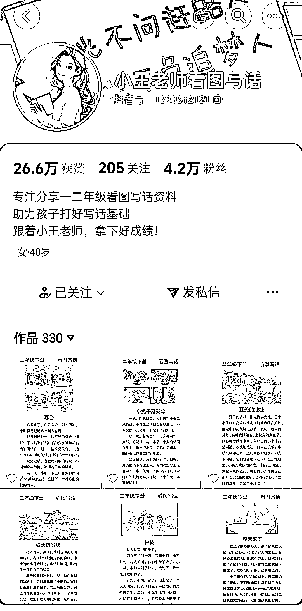
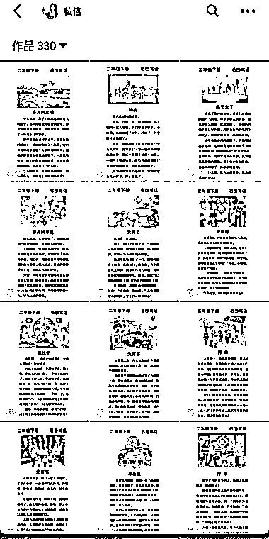
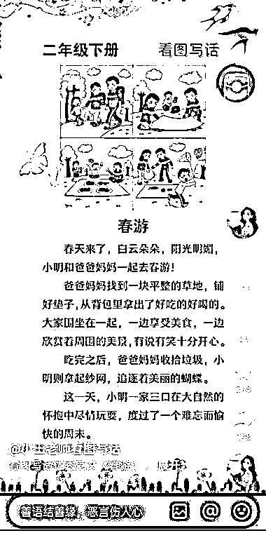

# 抖音小学一二年级看图写话资料高流量，小红书二创变现玩法揭秘

> 原文：[`www.yuque.com/for_lazy/wind/rvos1krgqipa3ukp`](https://www.yuque.com/for_lazy/wind/rvos1krgqipa3ukp)

作者： 馆主

日期：2025-09-26

点赞数：**9**

* * *

正文：

流量/产品｜异常值 在抖音上看到一位博主发小学一二年级的看图写话［模板］资料，流量非常的好，而且很多家长在评论区留言：求分享
1/账号定位：K12 小学（虚拟资料） 2/赛道人群：小学一二年级的家长 3/产品：把这些资料打包成 PDF 文档存到网盘
4/变现方式：把家长引流到微信，然后以 19.9 的价格售卖给家长，以网盘链接分享，并开通网盘拉新权限（赚网盘拉新的佣金）
如果我们想做这个赛道，可以以客户的身份去添加这个博主并购买她的资料，然后学习一下她的成交话术，然后到小红书上进行二创发布笔记，并引流家长到微信成交

* * *

评论区：

亦仁 : 感谢分享，已中标

* * *

公众号懒人搜索，[懒人专属群分享](https://lazybook.fun/#/blog/group)