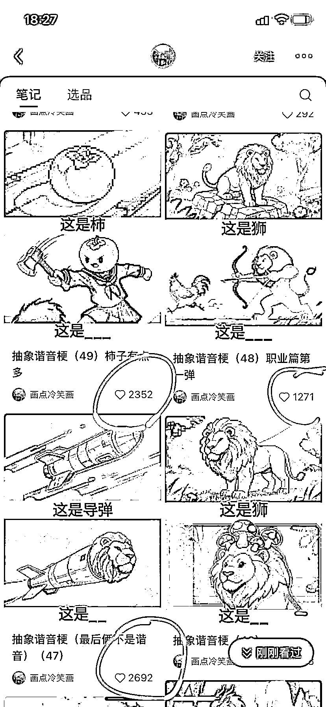
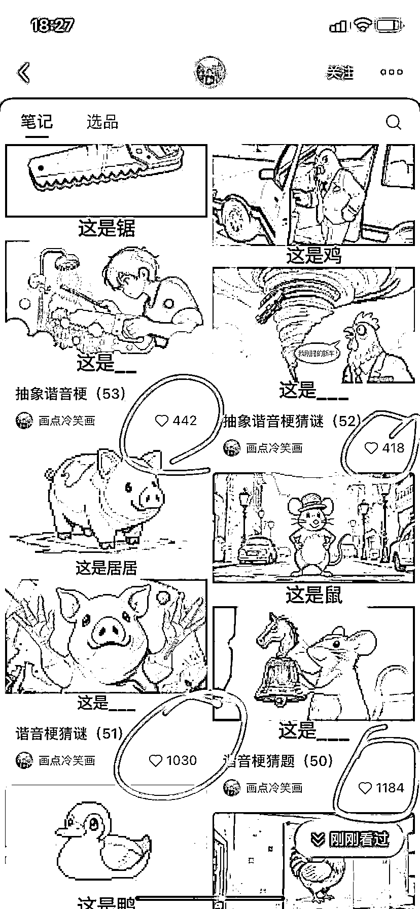
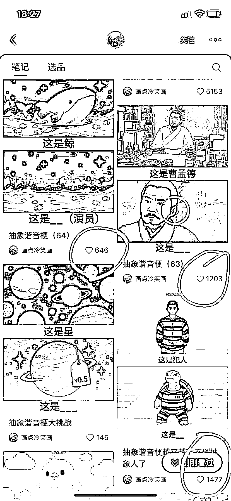
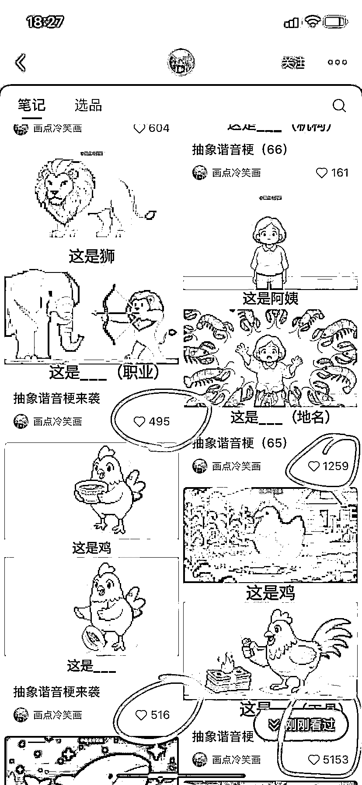
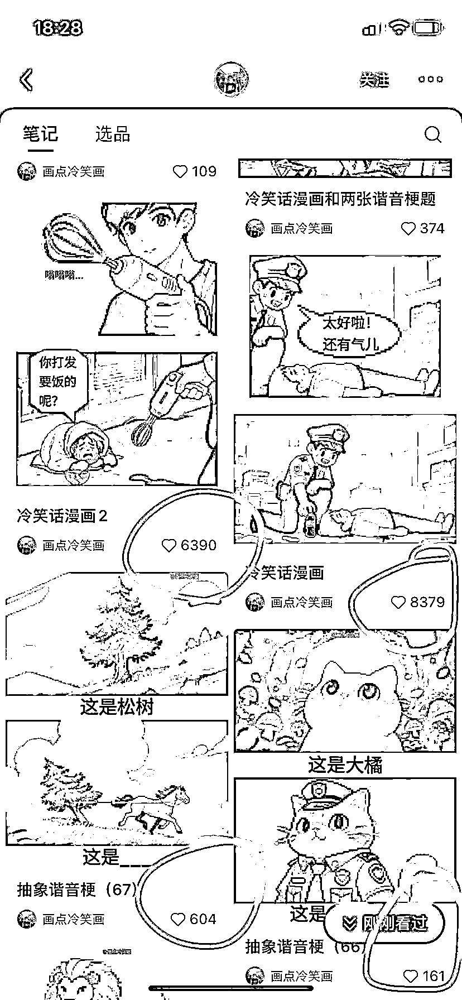
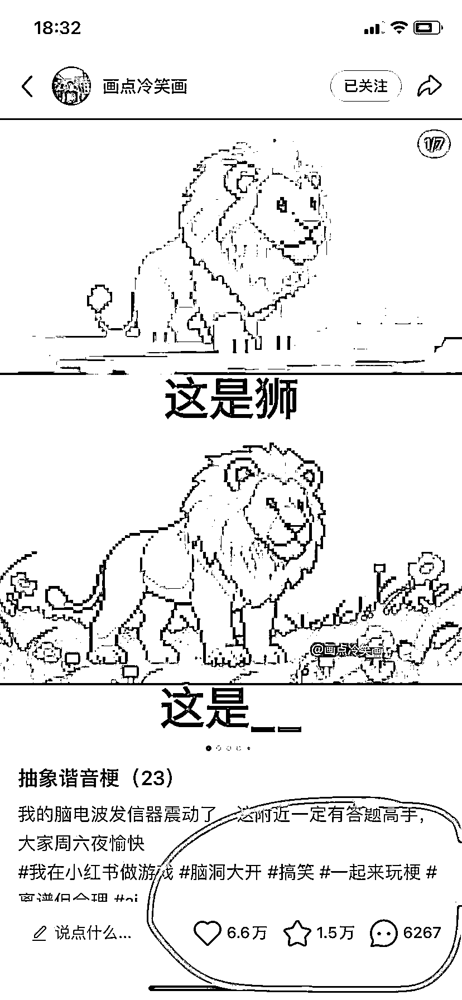
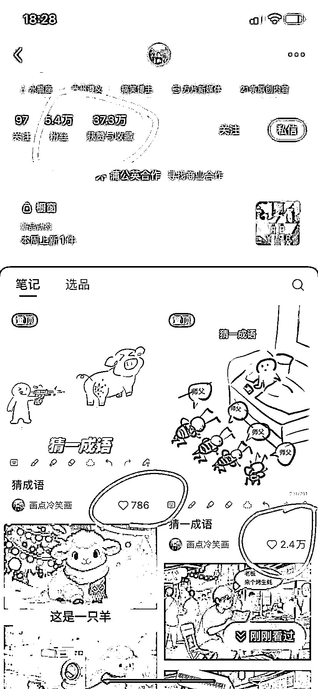
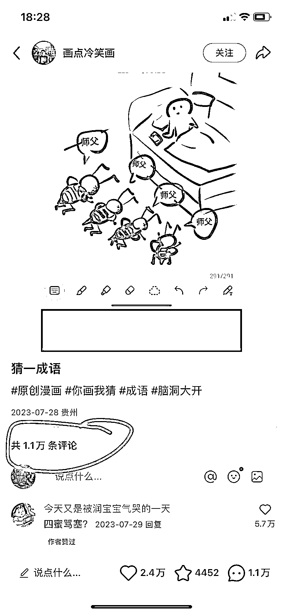
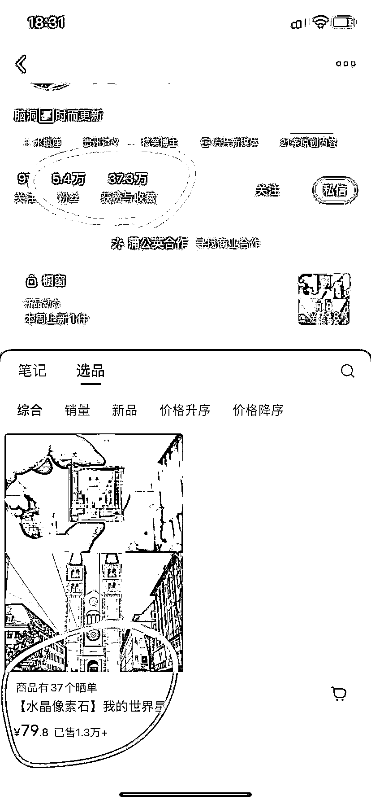

# AI 做冷笑话漫画，GMV 竟然有 100 多万！

> 原文：[`www.yuque.com/for_lazy/wind/xdzg54mz16a65tlk`](https://www.yuque.com/for_lazy/wind/xdzg54mz16a65tlk)

作者： 飞掌柜

日期：2025-09-04

点赞数：**45**

* * *

正文：

一、案例描述 1、该账号主要用 AI 做冷笑话漫画，发布 100 多个作品涨粉 5.4 万，小红书数据相当爆火！销售额 100 多万！
2、搞笑对比图加上让用户猜谜的动作，吸粉+留粉效应显著！ 二、数据表现
1、该博主利用 AI 工具做冷笑话漫画，模板非常统一，上面一张原图，下面一张让猜，激发用户评论，留言非常多！
2、发了 100 多个作品，涨粉 5.4 万，获赞与收藏 37.3 万，简直是一套模板打天下、一套思路涨粉快！
3、每个作品点赞最少一两百，播放量好几万；点赞最多六七万，播放量六七百万了；平均点赞两三千。主要用户一旦关注，几乎不会离开，粘性很强。
4、开通商品带货，并且选品只有一个【水晶像素石】，客单价 79.8 元，卖了 1.3 万份，GMV103.74 万！ 三、机会剖析
1、利用即梦 AI、可灵 AI 可以生成 2 张图片，然后用稿定设计模板拼成一张图片，增加文字，一个作品就做好了，每个步骤标准化，可以提升效率，成本很低！
2、采用单一爆款销售思路：商品带货水晶像素石也是好玩有趣的物品，和粉丝画像一致。100 多个作品，卖了 100 多万，ROI 还是很高的！
3、除了商品带货，未来我觉得还可以尝试开通蒲公英，以及多账号矩阵化玩法，一个跑通迅速复制，甚至可以带团队一起放大！

* * *

评论区：

多闻 : 不是他卖的

李澈 : 橱窗里是别的商家的商品

亦仁 : 感谢分享，已中标

* * *

公众号懒人搜索，[懒人专属群分享](https://lazybook.fun/#/blog/group)