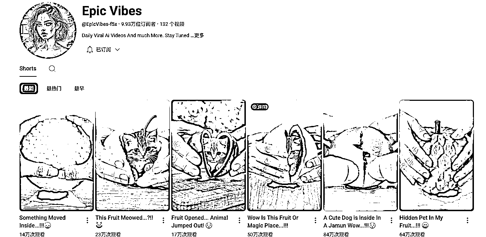
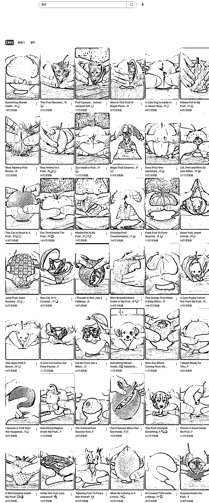
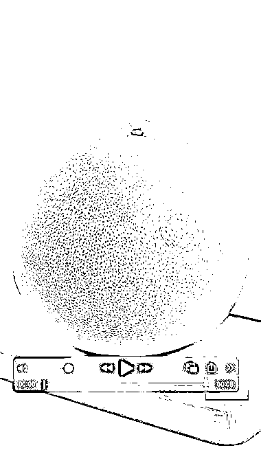

# youtube5 秒短视频，AI 水果开出小动物，3 个月涨粉近 10 万

> 原文：[`www.yuque.com/for_lazy/wind/kudxloi6q7r0k265`](https://www.yuque.com/for_lazy/wind/kudxloi6q7r0k265)

作者： 小 Q

日期：2025-09-01

点赞数：**28**

* * *

正文：

youtube short 的短视频 1、模式很简单：不同的水果掰开出现一个动物+配音，很治愈 2、视频只有 5 秒 3、2025 年 6 月 8 日注册
9.93 万位订阅者 132 个视频 245,602,429 次观看，效率很高 总之是一个：简单可复制的好赛道：
可以打开各种意想不到的东西，比如一块岩石、一颗星球、一个灯泡、一本书、一个魔方等。 内部“孵化”出的东西也可以多种多样。
狗狗、小熊猫、狐狸、甚至神话生物（如小龙、凤凰）。 打开后是迷你的星空、赛博朋克城市、奇幻森林或海底世界。 打开一块面包，里面是流动的巧克力岩浆和草莓。
打开一颗破碎的心，里面是重新发芽的绿植，象征着治愈与重生。
从一个非常柔软、可爱的物体开始，比如一个毛绒球或一朵棉花糖，打开后里面却是一个结构精密的机械核心或一座冰冷的金属城堡。

* * *

评论区：

远方的诗 : 巴基斯坦是不是广告单价比较低？

亦仁 : 感谢分享，已中标

小 Q : 谢谢

小 Q : 好像是这样的。

* * *

公众号懒人搜索，[懒人专属群分享](https://lazybook.fun/#/blog/group)