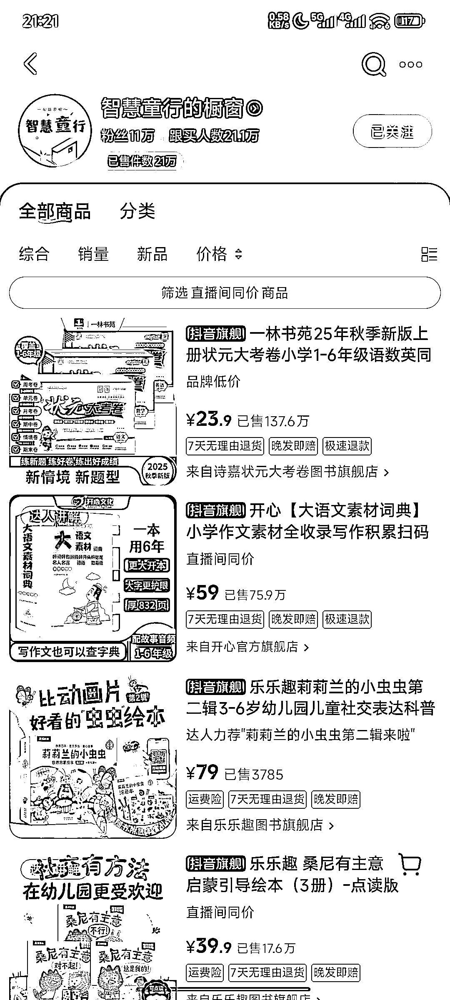
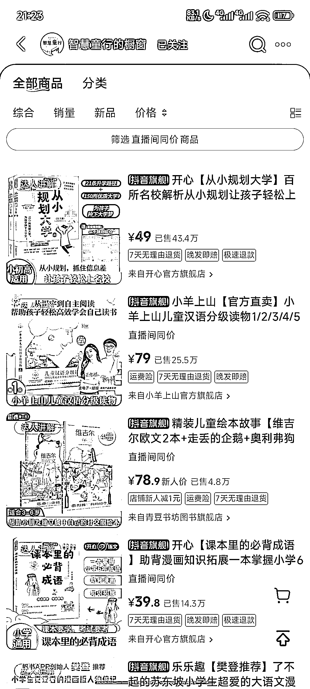
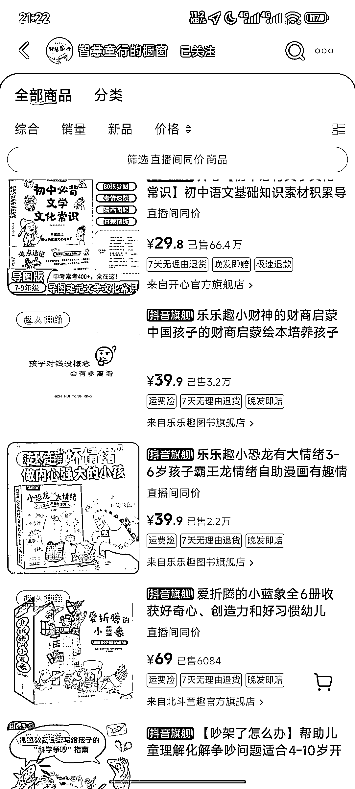
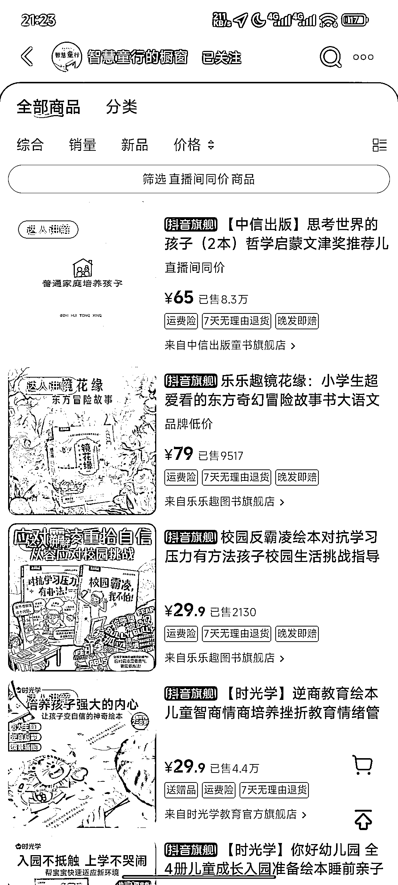
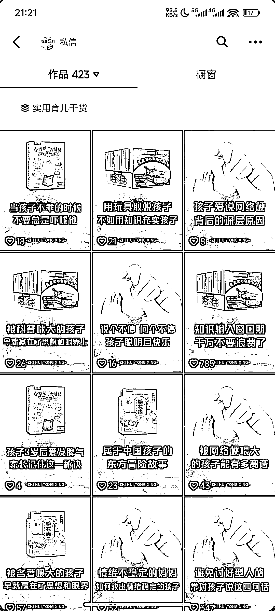
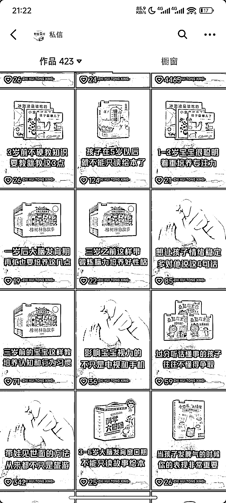

# 抖音 AI 视频卖图书变现百万

> 原文：[`www.yuque.com/for_lazy/wind/vefrmmneec8rpquy`](https://www.yuque.com/for_lazy/wind/vefrmmneec8rpquy)

作者： 枫晓陌 超强执行力

日期：2025-09-01

点赞数：**37**

* * *

正文：

抖音 AI 视频卖图书变现百万 1.卖出 21 万件，按每单平均佣金单价 5 元，利润百万起。但实际上，平均单价佣金，应该不止五元。
2.视频可以用 coze 工作流制作，中间部分书籍可以使用实拍书籍替代（或者从同行、商家那里搞来素材）。
3.AI 工作流解决了大部分人视频、脚本这些环节做的不好的问题，自己搞不了，可以买一个来提效。
4.近段时间，看到不少 AI 视频账号，包括圈友的，看起来不怎么赚钱，可以考虑一下直接用 AI 视频带货。视频内容和带货内容，高度强相关就可以。
AI 视频为那些不想实拍、混剪做不好的朋友，提供了一种新的内容创作形式。 找到对标，复刻视频，选品挂车，静待出单。
5、延伸思考，内容为交易服务。先想好自己赚谁的钱、怎么赚钱，再生产对应的内容去获客、去成交。而不是，跟风搞出来了内容，却不知道怎么变现。

* * *

评论区：

亦仁 : 感谢分享，已中标

* * *

公众号懒人搜索，[懒人专属群分享](https://lazybook.fun/#/blog/group)