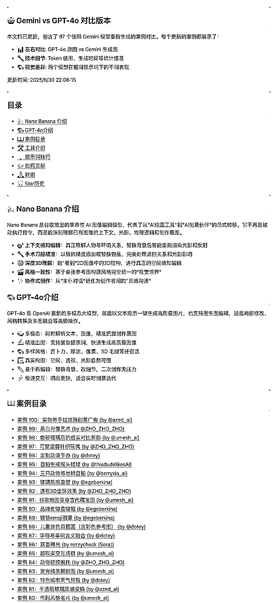

# GitHub 上 100 个 Nano Banana 精彩案例

> 原文：[`www.yuque.com/for_lazy/wind/yxgtisvch4rrahk8`](https://www.yuque.com/for_lazy/wind/yxgtisvch4rrahk8)

作者： 星城

日期：2025-09-02

点赞数：**31**

* * *

正文：

GitHub 上一份精心整理了 Nano Banana（Gemini-2.5-Flash-Image） 生成的精彩案例与提示词合集：awesome-
nano-banana。 共收录了 100 个案例，涵盖从 3D Q 版角色到复古海报、从微型场景到创意广告等各种风格。 GitHub：
每个案例都包含了详细的提示词，可直接复制粘贴使用，并且与 GPT-4o 进行同一提示词生成的图像对比。
除此之外，还整理了一些关于工具介绍、提示词技巧的分享。感兴趣的朋友可以看一下。 [`github.com/JimmyLv/awesome-
nano-banana`](http://github.com/JimmyLv/awesome-nano-banana)

* * *

评论区：

礼新 : 感谢分享

亦仁 : 感谢分享，已中标

伍拾陆 : 感谢分享👍

* * *

公众号懒人搜索，[懒人专属群分享](https://lazybook.fun/#/blog/group)