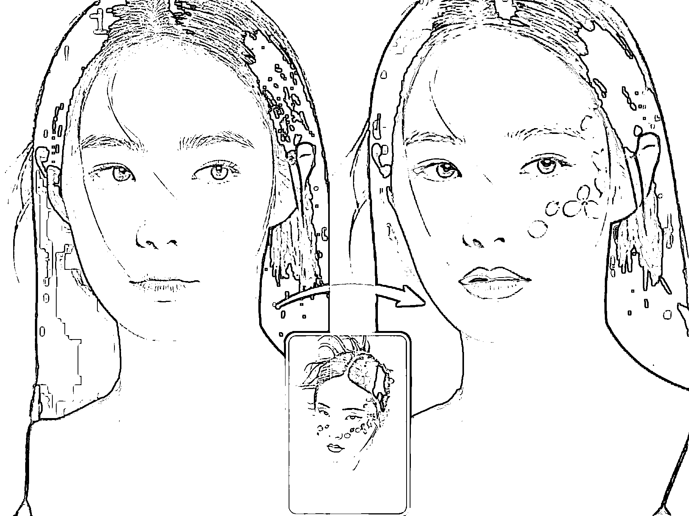

# Nano banana 玩法新挖掘，开源 40 多个 prompt 可直接复制

> 原文：[`www.yuque.com/for_lazy/wind/pxazmzcun7l40imr`](https://www.yuque.com/for_lazy/wind/pxazmzcun7l40imr)

作者： 清仔

日期：2025-09-04

点赞数：**40**

* * *

正文：

nano banana 的一致性更好，有许多玩法被进一步挖掘，感觉每个细分场景都可以做一个小产品。 -Zho-
在 X 上开源了 40 多个 prompt 和对应的效果，可以直接复制参考 网站实现上，参考 prompt 调用官方 API 应该就可以 举几个例子：
（图 2-图 6）：在小红书搜了一下，还真的有市场。3 个月 800+购买，客单价 50，就是 4w 的流水，基本只有人工成本。
另一种方式是医美主播常用的套路，开直播帮人分析脸型，粉丝牌排队、特定礼物插队，后端还能转化医美 图三的提示词：Analyze this image. Use
red pen to denote where you can improve *博主试了中文提示词效果不行，这一任务还是得用英文提示
（图 7 图 8）：prompt——图一人物按照图二的脸型设计为 q 版形象
（图 9）：可以用于追星，或者日常/旅游/朋友圈 P 图，prompt——图一人物参考/换成图二人物的表情 可以看到提示词基本都是公式化，可以发挥想象空间。 附
开源 prompt 链接： [`x.com/ZHO_ZHO_ZHO/status/1961073677681983926`](https://x.com/ZHO_ZHO_ZHO/status/1961073677681983926)

* * *

评论区：

诗语 : 海外模型生成的，国内发不打标识吗

亦仁 : 感谢分享，已中标

清仔 : 打什么标识

诗语 : ai 生成或者作者的唯一识别码

清仔 : 不清楚，我这儿说的都是海外的~

礼新 : 确实强

* * *

公众号懒人搜索，[懒人专属群分享](https://lazybook.fun/#/blog/group)