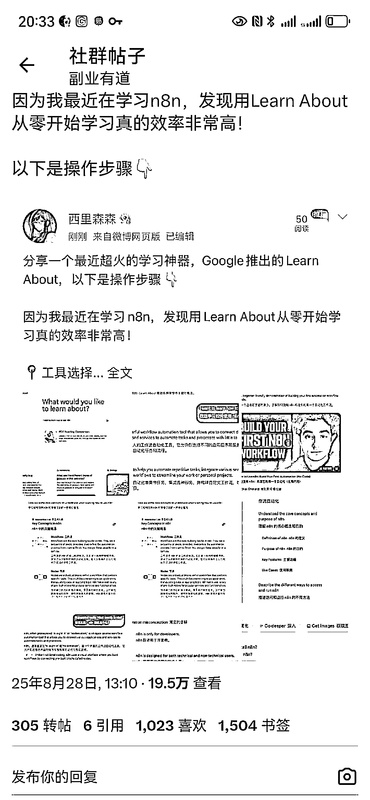
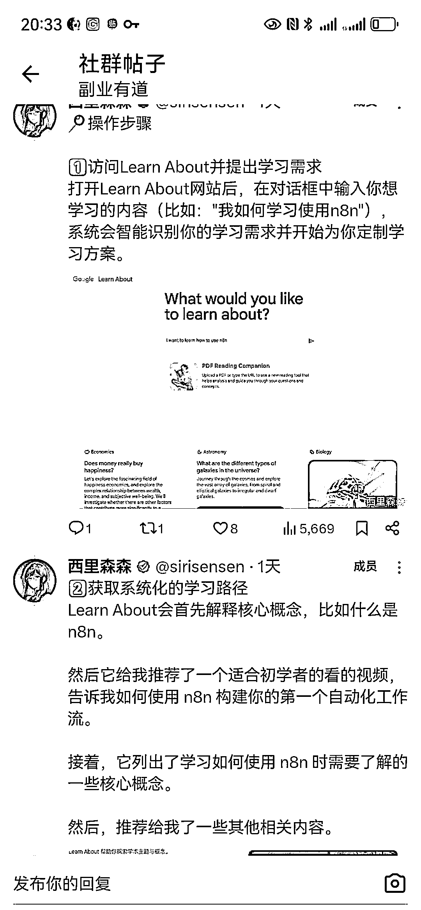
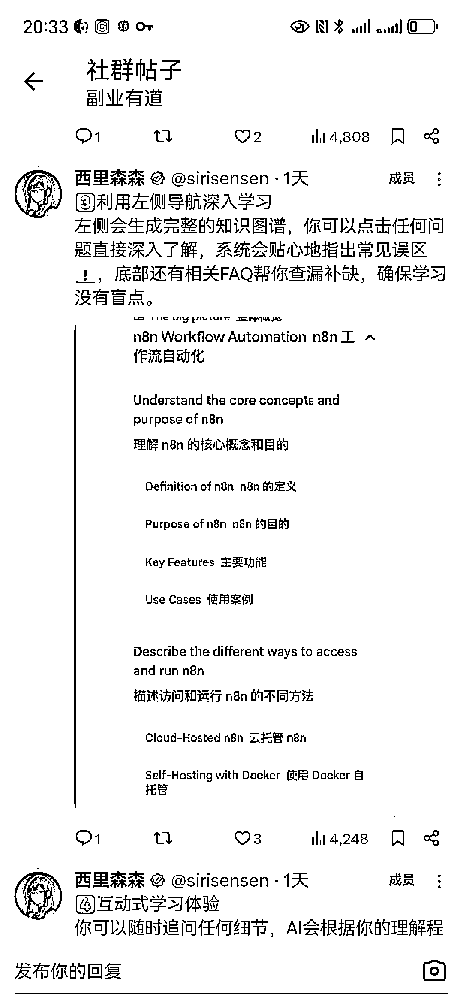
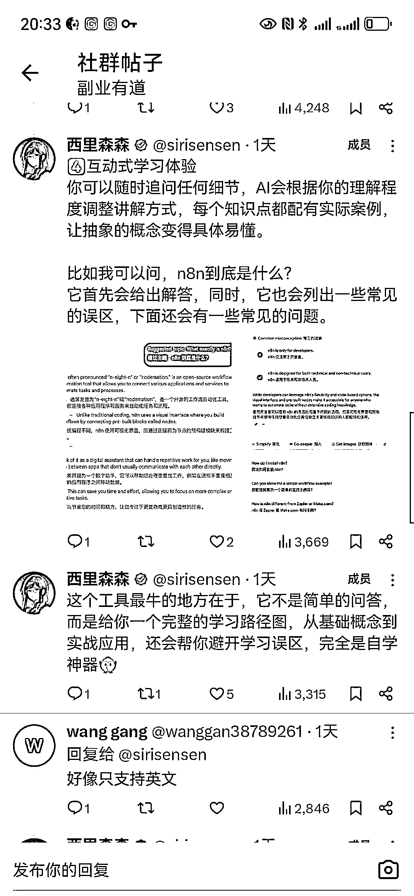

# 超级标线索——无敌自学神器——Google Learn About

> 原文：[`www.yuque.com/for_lazy/wind/gz054wtm927dro68`](https://www.yuque.com/for_lazy/wind/gz054wtm927dro68)

作者： 逸尘

日期：2025-08-29

点赞数：**40**

* * *

正文：

超级标线索——无敌自学神器——Google Learn About
有了这个，从自学层面上来看，学习 AI 编程、n8n、AI 知识库、web3、法律、流量、运营……这个世界上的任何知识都是可以自学的，这个是未来纯自学模式的苗头，或许老师真的可以不需要了……
拓展一下思维，拓展到商业领域。
卖课的，良心的那种，可以通过快速从 0-1，并在学习的过程中得到一套系统的学习资料，比如跨境、小红书、公众号、AI 自媒体、B 站好物
快速切换行业&入局某一个行业的创业者，快速学习某一领域的知识，触达这个领域的每一个细节，提高效率，专注于核心业务
自媒体创业者，补齐专业知识，构建更完善的商业系统…… “自学”就是最高贵的能力，有了 Learn
About 这一无敌的“老师”，每一个创业者，青年创业者，可以快速积累每一个领域的知识，这很恐怖

* * *

评论区：

亦仁 : 感谢分享，已中标

逸尘 : 目前只支持英文回答哈，但可以用翻译插件

* * *

公众号懒人搜索，[懒人专属群分享](https://lazybook.fun/#/blog/group)