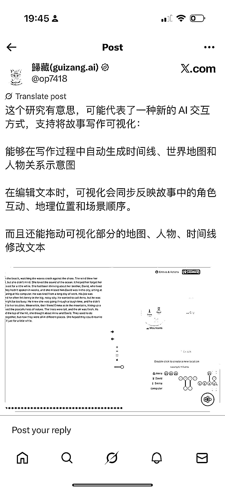

# 超有意思的工具，可用于 AI 写作让故事架构更清晰

> 原文：[`www.yuque.com/for_lazy/wind/mvk1gqb7awt5mzt3`](https://www.yuque.com/for_lazy/wind/mvk1gqb7awt5mzt3)

作者： 徐富贵

日期：2025-09-04

点赞数：**34**

* * *

正文：

一个很有意思的工具，应该可以用在 AI 写作上，比如现在很多人都在用 AI 写小说，这个工具可以让故事架构更加清晰。
或者可以将一些名著的人物关系思维导图，以这种形式来展示。 或者还有更多其他的使用场景 每日思考 [`x.com/op7418/status/1963441009121267823?s=46`](https://x.com/op7418/status/1963441009121267823?s=46)

* * *

评论区：

徐富贵 : 漏了个图

亦仁 : 感谢分享，已中标

* * *

公众号懒人搜索，[懒人专属群分享](https://lazybook.fun/#/blog/group)