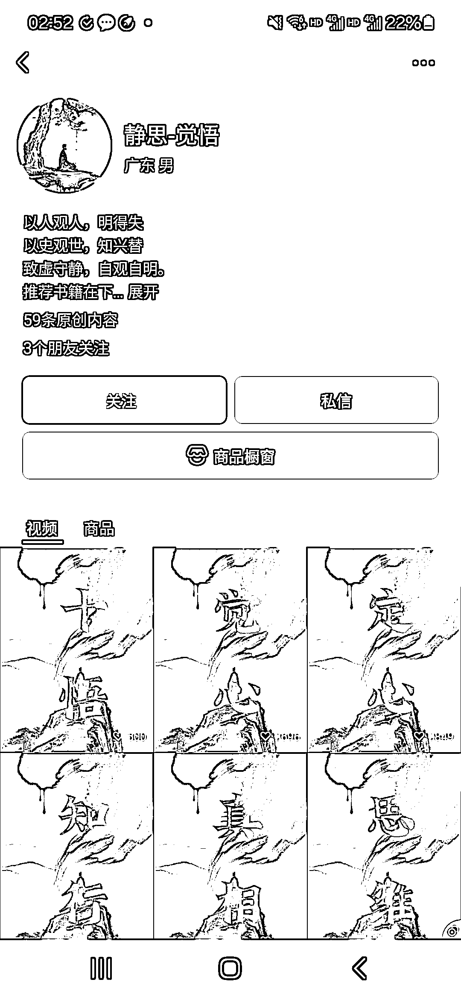
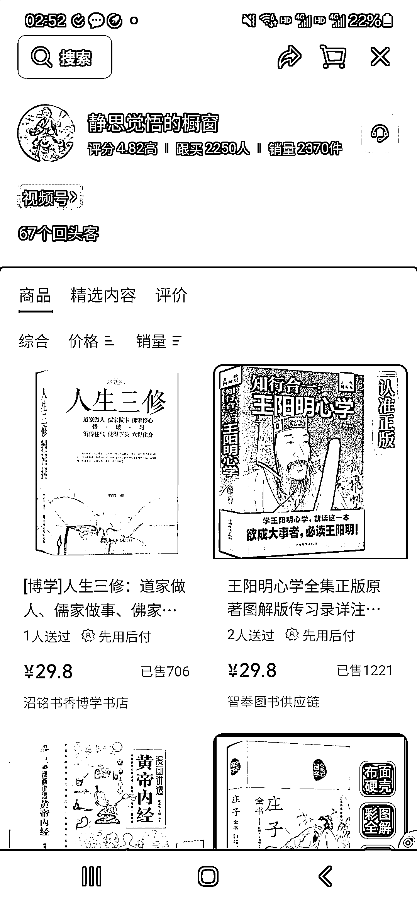
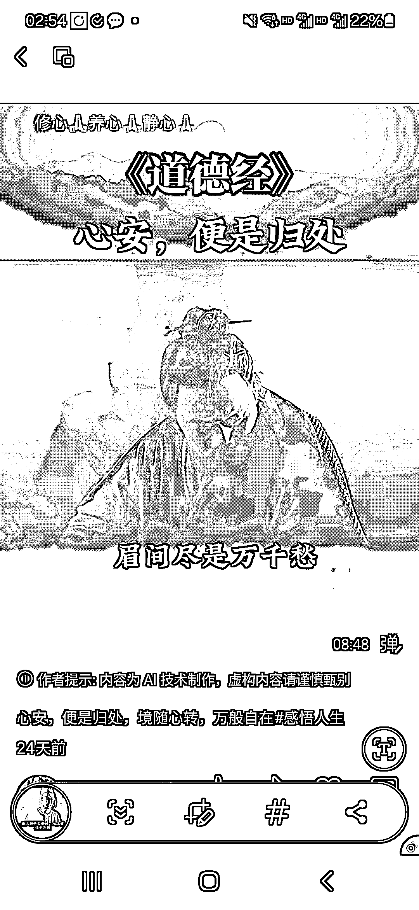
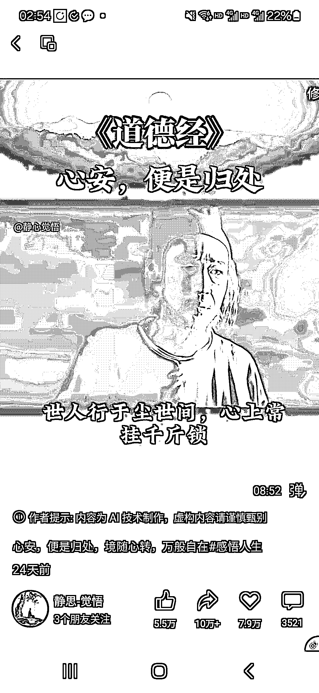

# 国学+情绪文案+风景混剪，50 多条 AI 原创视频，卖出 2000+单国学书籍

> 原文：[`www.yuque.com/for_lazy/wind/gpgfv4c32lzxqgu9`](https://www.yuque.com/for_lazy/wind/gpgfv4c32lzxqgu9)

作者： 陈皮的锚

日期：2025-08-30

点赞数：**29**

* * *

正文：

五十多条 AI 原创视频，带货挺猛的，两千多单。我刷到了三个这样的账号。 制作形式:融入了影视 IP 的混剪 价值观和内容:国学元素
带货的品是一些修身养性的书，佣金一般在 70%左右 制作难度不高，他一般是开头用了一些情绪文案对味的影视画面素材，后面多为风景混剪。
原理:因为融入了影视 IP，包括声音也是克隆的某个影视人物的声音，起号效率较高，辐射人群广。现代人情绪问题多，所以总体橱窗转化效率不错。也可以做矩阵。

* * *

评论区：

亦仁 : 感谢分享，已中标

* * *

公众号懒人搜索，[懒人专属群分享](https://lazybook.fun/#/blog/group)