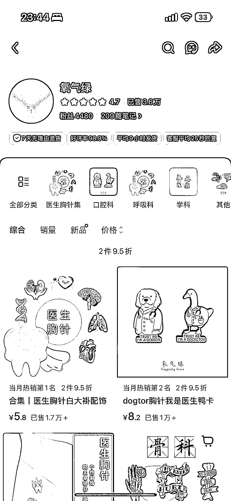
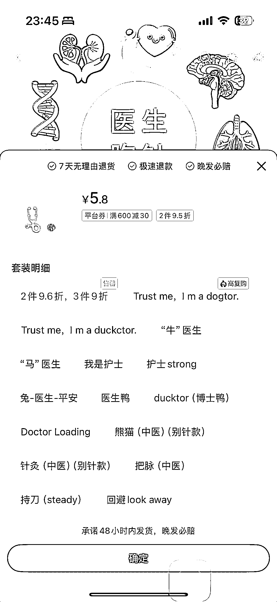
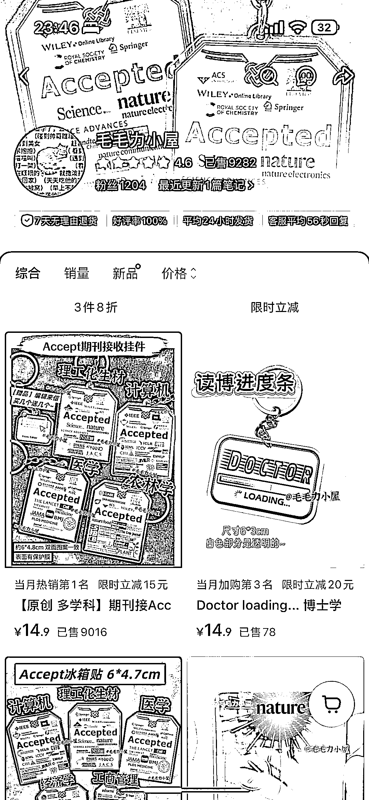
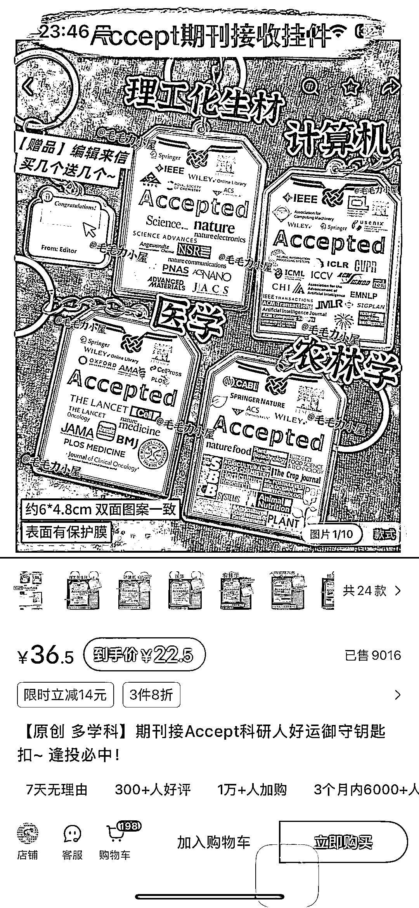

# AI 设计学科文创：一个胸针卖出 3w+

> 原文：[`www.yuque.com/for_lazy/wind/xruyzkagncywfsps`](https://www.yuque.com/for_lazy/wind/xruyzkagncywfsps)

作者： 🌟Lisa🌟

日期：2025-08-30

点赞数：**25**

* * *

正文：

【AI 设计】学科文创 【赛道/细分方向】 文创产品+学科场景+用户心理需求 【案例描述】 专门给医生的白大褂上的胸针 专门给科研学生的好运钥匙扣
【数据/截图/来源】 小红书 一个链接都有近万的销售量 【为什么是机会】 1. 垂直细分：精准切入医生、科研学生等特定职业/学科群体，受众明确。可以挖掘更多类似群体。 2. 情感驱动：产品（如胸针、挂件）不解决功能问题，而是满足身份认同、情感慰藉、美好祝愿等心理需求，溢价高。 3. 低价爆款：主打单价低（几元至十几元）、销量高（数千至上万）的商业模式，靠走量盈利。 4. 社交电商赋能：完美依托小红书等平台，通过精准关键词（如“医生胸针”、“Accept”）和用户自发分享实现冷启动和高效转化。 5. 轻资产运营：产品多为徽章、亚克力等低成本材质，模式轻、易操作。
这个赛道的核心在于用创意和共情能力，为特定圈子提供情绪价值，并通过社交电商将其变现，非常适合普通人从小做起。

* * *

评论区：

亦仁 : 感谢分享，已中标

* * *

公众号懒人搜索，[懒人专属群分享](https://lazybook.fun/#/blog/group)