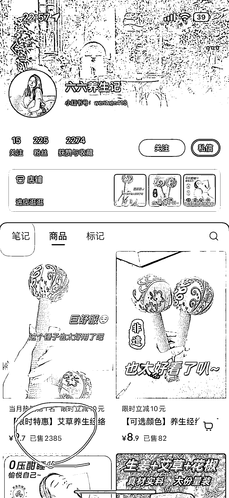
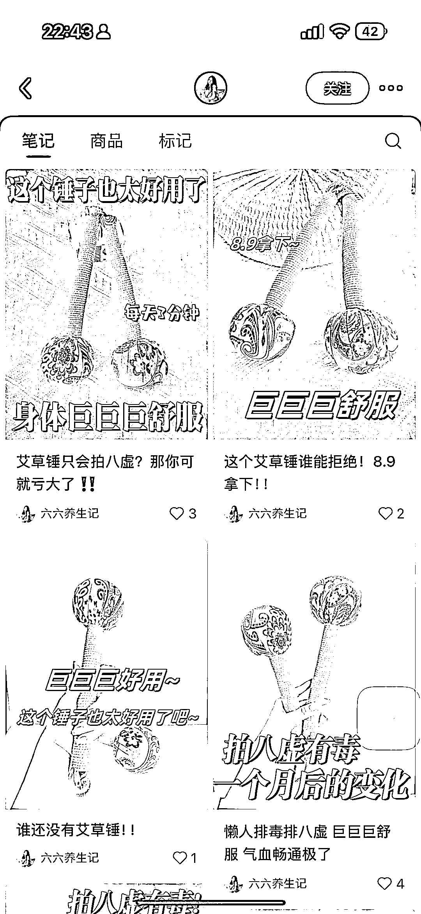
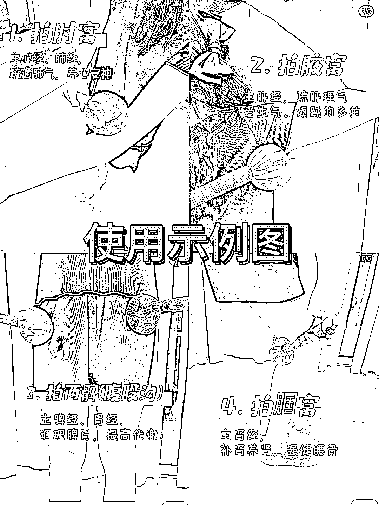
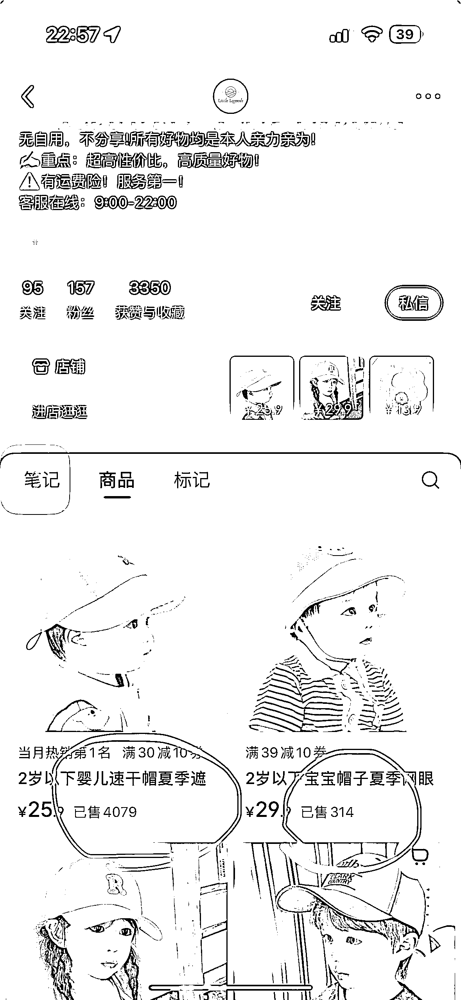

# 小红书“线上摆摊”的机会与玩法

> 原文：[`www.yuque.com/for_lazy/wind/bwh2z3z4ay73t8yr`](https://www.yuque.com/for_lazy/wind/bwh2z3z4ay73t8yr)

作者： 🌟Lisa🌟

日期：2025-09-02

点赞数：**30**

* * *

正文：

【小红书】线上摆摊 【赛道/细分方向】 小红书“线上摆摊” 【案例描述】 产品： 一个店铺只挂单一品类产品 帖文格式： - 首图为单一产品特写 - 后面几张图为使用场景 - 文字为 AI 生成产品说明 【数据/截图/来源】 低粉爆款 小红书账号示例：六六养生记、Little Legends
【为什么是机会】 1️⃣供应链极丰富 产品供应链：1688、拼多多、小红书挂车 2️⃣内容可批量生成 图片生成：Nano Banana 改场景不要太香
文字生产： Deepseek、ChatGPT… AI 各显神通 3️⃣模式可不断复制 找到特定人群的需求场景，挖掘对应产品

* * *

评论区：

亦仁 : 感谢分享，已中标

May : 是不是也有拼多多直接铺货到小红书的软件

🌟Lisa🌟 : 不是太清楚小红书是不是有 ERP 的工具

* * *

公众号懒人搜索，[懒人专属群分享](https://lazybook.fun/#/blog/group)