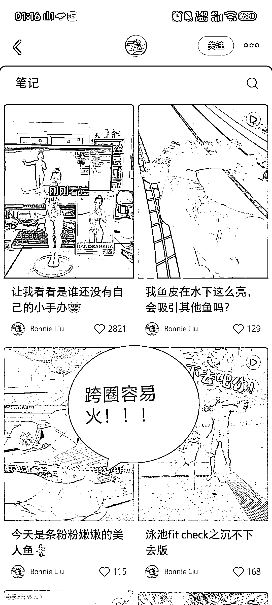
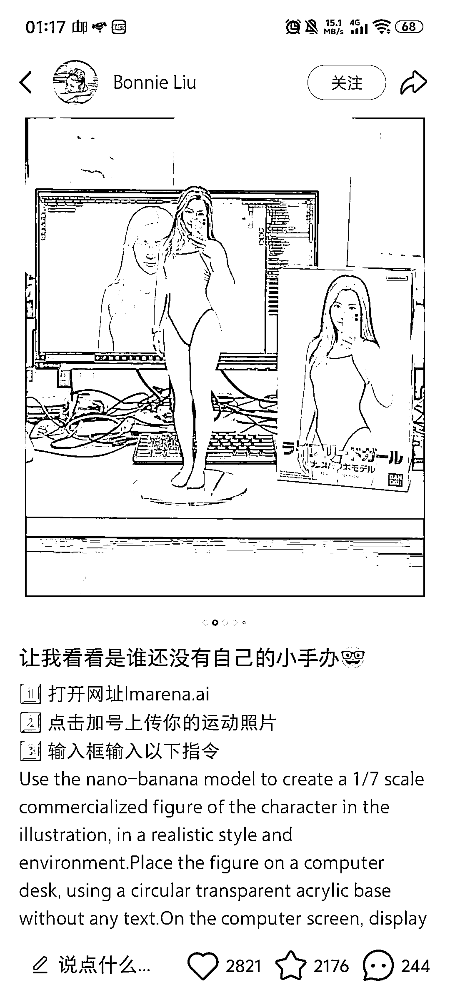
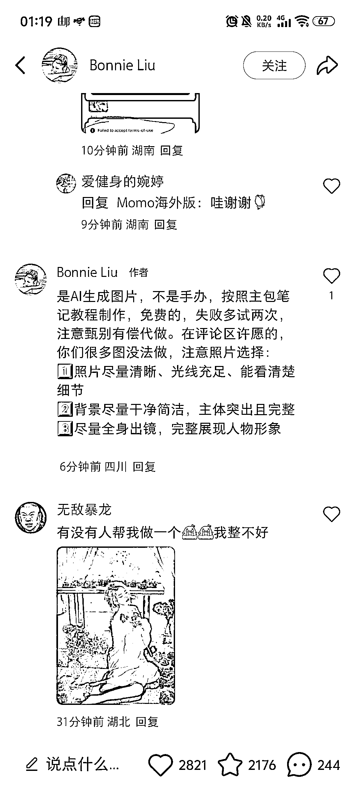
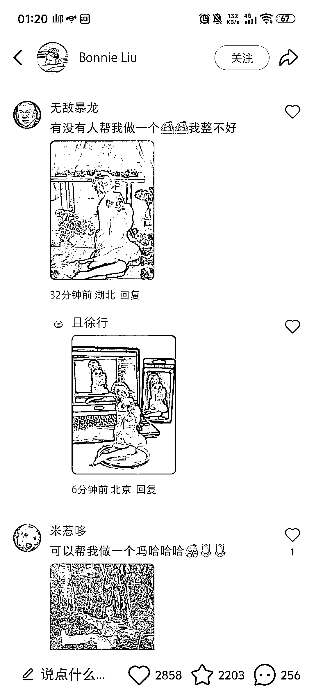
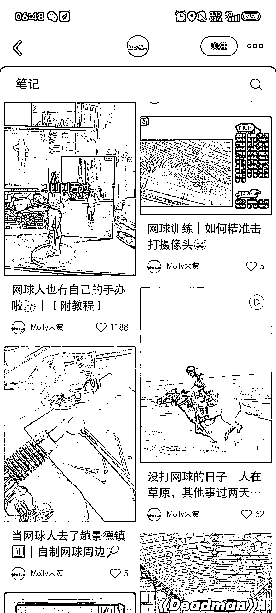

# Nano banana 很适合破圈

> 原文：[`www.yuque.com/for_lazy/wind/zo6wmh879gdlddhf`](https://www.yuque.com/for_lazy/wind/zo6wmh879gdlddhf)

作者： 清仔

日期：2025-08-30

点赞数：**24**

* * *

正文：

Nano banana 很适合破圈 以前发网球、游泳的博主，都因为发这个出了爆款。可以在自己的领域试一下 内容也很简单，自己的例子图＋提示词方法 附内容：
网球人也有自己的手办啦🥳｜【附教程】 1⃣️网址：（手机/电脑均可用） 2⃣️添加参考图 3⃣️输入指令：Using the nano-banana
model, create a 1/7 scale commercialized figurine of the characters in the
picture, in a realistic style, in a real environment. The figurine is placed
on a computer desk. The figurine has a round transparent acrylic base, with no
text on the base. The content on the computer screen is the Zbrush modeling
process of this figurine. Next to the computer screen is a BANDAI-style toy
packaging box printed with the original artwork.，The packaging features two-
dimensional flat illustrations. Please turn this photo into afigure. Behind
it, there should be a Model packaging box with the character from this photo
printed on it. In front of thebox.on a round plastic baseplace the fiqure
version of thephoto l gave you. l'd like the PVC material to be
clearlyrepresented.lt would be even better if the background is indoors. 4⃣️会生成两款任选 ‼️tips：尽量选择全身照；背景杂物尽可能少[`Imarena.ai`](https://Imarena.ai)

* * *

评论区：

亦仁 : 感谢分享，已中标

* * *

公众号懒人搜索，[懒人专属群分享](https://lazybook.fun/#/blog/group)