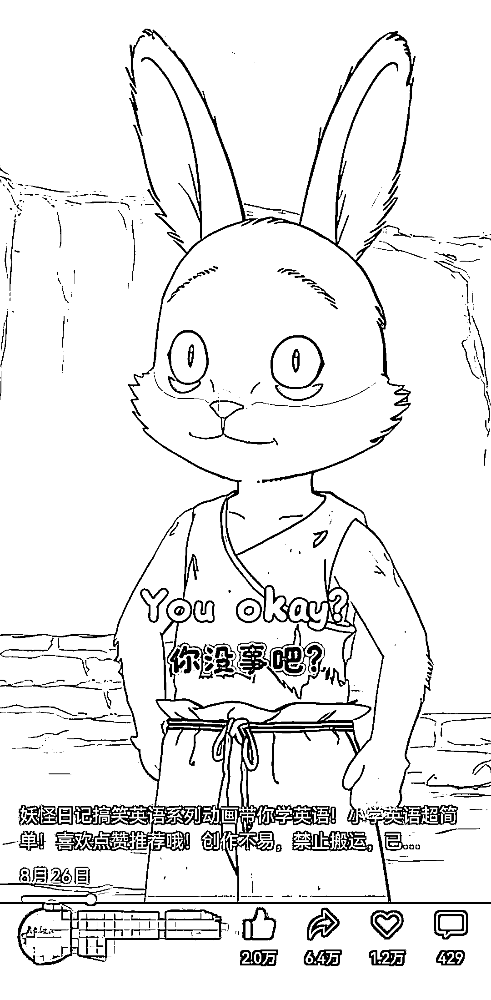
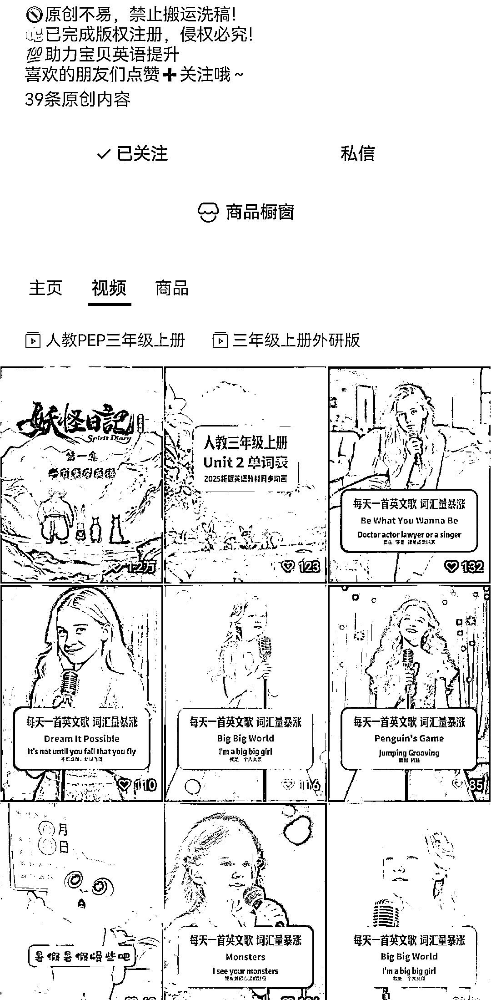
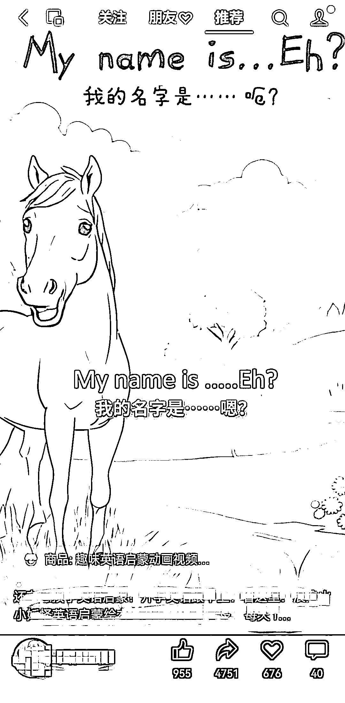
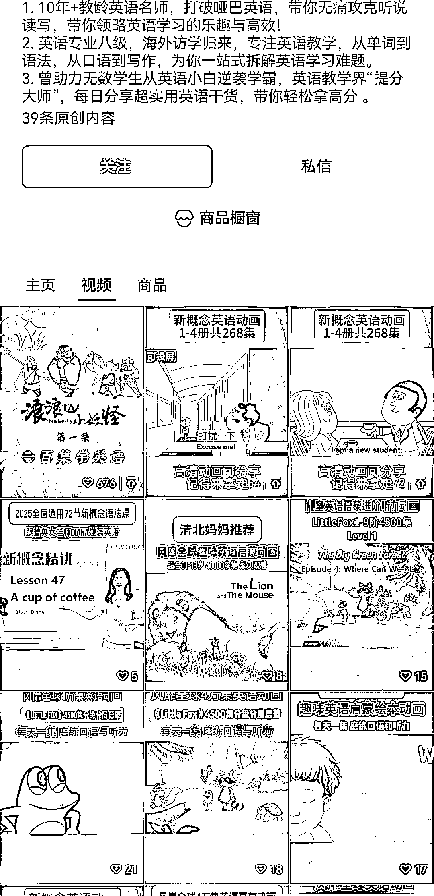
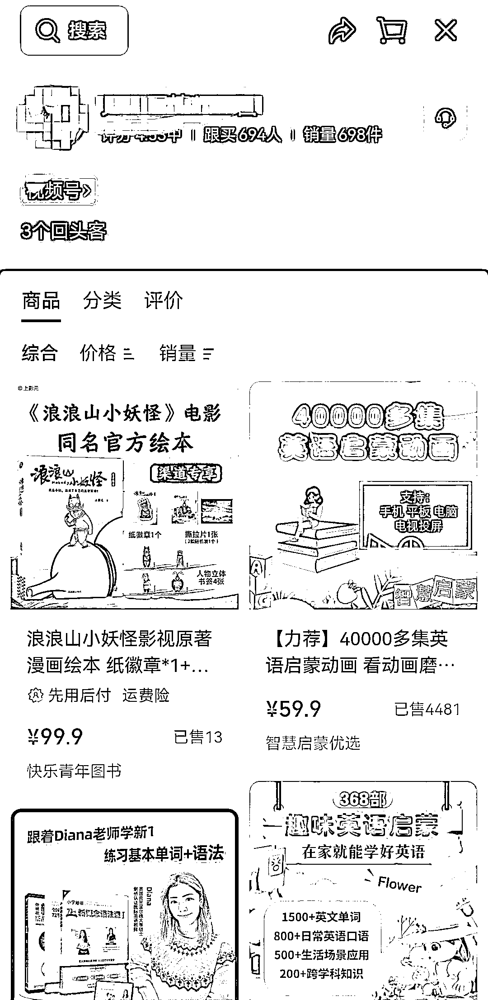

# 视频号机会：少儿英语+故事形式=流量与变现

> 原文：[`www.yuque.com/for_lazy/wind/yt6z0vii2u090g7x`](https://www.yuque.com/for_lazy/wind/yt6z0vii2u090g7x)

作者： 华仔

日期：2025-08-29

点赞数：**19**

* * *

正文：

平台:视频号 赛道:少儿英语 这刷到的第一个号，一直在做英语赛道，一开始的流量一般，后面换成了一个故事类型的，直接就爆了！
这是个异常值，应该可以考虑通过 ai 制作一些常用的，日常情景对话的故事，来视频带货！

* * *

评论区：

亦仁 : 感谢分享，已中标

* * *

公众号懒人搜索，[懒人专属群分享](https://lazybook.fun/#/blog/group)