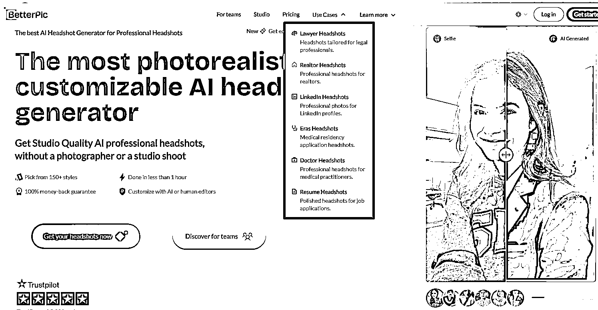
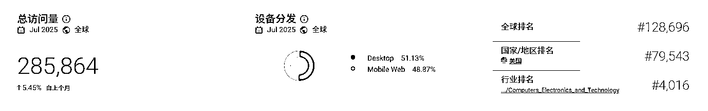
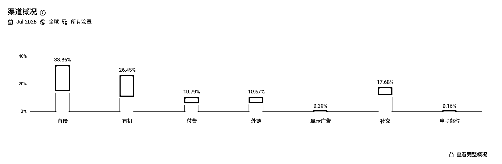
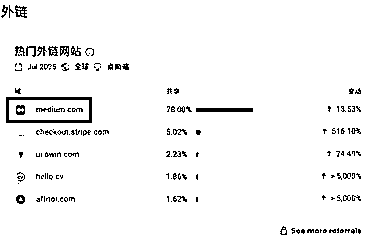
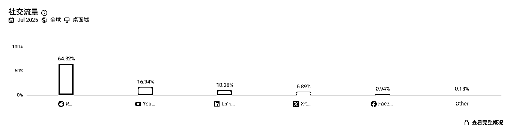

# 1 美元收购 AI 头像网站，18 个月做到$270K MRR

> 原文：[`www.yuque.com/for_lazy/wind/ioszqth6syx882y2`](https://www.yuque.com/for_lazy/wind/ioszqth6syx882y2)

作者： 向上的塔皮

日期：2025-09-01

点赞数：**17**

* * *

正文：

1 美元收购 AI 头像网站，18 个月内做到<card type="inline" name="math" value="data:%7B%22code%22%3A%22270K%20MRR%20%E8%B5%9B%E9%81%93%2F%E7%BB%86%E5%88%86%E6%96%B9%E5%90%91%20AI%E5%9B%BE%E5%83%8F%E7%94%9F%E6%88%90%20-%20%E5%95%86%E5%8A%A1%E5%A4%B4%E5%83%8F%E7%BB%86%E5%88%86%E5%B8%82%E5%9C%BA%EF%BC%88%E4%B8%BB%E6%94%BB%E5%BE%8B%E5%B8%88%2F%E6%88%BF%E5%9C%B0%E4%BA%A7%2F%E5%8C%BB%E7%94%9F%E7%AD%89%E8%81%8C%E4%B8%9A%E5%A4%B4%E5%83%8F%EF%BC%89%20%E6%A1%88%E4%BE%8B%E6%8F%8F%E8%BF%B0%5CnRicardo%20%E5%9C%A8%20SideProjectors.com%20%E4%B8%8A%E5%8F%91%E7%8E%B0%E4%B8%80%E4%B8%AA%20AI%20%E5%A4%B4%E5%83%8F%E7%BD%91%E7%AB%99%EF%BC%8C%E8%8A%B11%E7%BE%8E%E5%85%83%E2%80%9C%E6%94%B6%E8%B4%AD%E2%80%9D%EF%BC%88%E5%8E%9F%E5%88%9B%E5%A7%8B%E4%BA%BA%E7%BB%A7%E7%BB%AD%E6%8B%85%E4%BB%BBCTO%EF%BC%89%E3%80%82%5CnRicardo%E6%8E%A5%E6%89%8B%E5%90%8E%EF%BC%8C%E9%87%8D%E5%81%9A%E7%BD%91%E7%AB%99%E6%96%87%E6%A1%88%E5%92%8C%E8%90%BD%E5%9C%B0%E9%A1%B5%EF%BC%8C%E8%AE%A9%E7%94%A8%E6%88%B7%E6%9B%B4%E5%AE%B9%E6%98%93%E7%90%86%E8%A7%A3%E5%92%8C%E4%B8%8B%E5%8D%95%E3%80%82%20%E7%94%A8%20SEO%20%E5%92%8C%20Reddit%20%E5%B8%96%E5%AD%90%E5%90%B8%E5%BC%95%E8%87%AA%E7%84%B6%E6%B5%81%E9%87%8F%E3%80%82%5Cn%E7%84%B6%E5%90%8E%E6%8F%90%E5%8D%87%E5%A4%B4%E5%83%8F%E8%B4%A8%E9%87%8F%EF%BC%8C%E9%80%80%E6%AC%BE%E7%8E%87%E4%BB%8E10%25%E5%88%B02%25%E3%80%82%20%E6%8F%90%E5%8D%87%E5%AE%A2%E5%8D%95%E4%BB%B7%EF%BC%8C%E4%BB%8E%22%2C%22id%22%3A%22xg0C5%22%7D">15 涨到<card type="inline" name="math" value="data:%7B%22code%22%3A%2247%E3%80%82%20%E6%89%BE%E5%8D%9A%E4%B8%BB%E5%B8%AE%E5%BF%99%E6%8E%A8%E5%B9%BF%EF%BC%8C%E7%BB%99%E4%BB%96%E4%BB%AC%E5%88%86%E6%88%90%EF%BC%8C%E6%AF%8F%E6%9C%88%E8%83%BD%E5%B8%A6%E6%9D%A5%E7%BA%A6%20%22%2C%22id%22%3A%22T1fbE%22%7D">80K 收入，占总营收的近 30%
也做了客服、交付的自动化。 18 个月后，从<card type="inline" name="math" value="data:%7B%22code%22%3A%221.5K%E5%81%9A%E5%88%B0%22%2C%22id%22%3A%22W1wS0%22%7D">270K MRR 为什么是机会 - 28 万+月访问证明需求真实存在 - 跳出率 39%，近 60%用户有进一步行为 - 技术门槛不高，调用 AI API - 成本不高，冷启动是靠免费的 SEO 和 Reddit
推广，然后找博主推，有赚到才给钱（现在看到有 Google Ads 广告，占比 10%） - 还有更多的头像细分市场可以做，LinkedIn 头像，简历头像，社交头像、团队头像、演讲者头像、社交媒体头像、约会软件头像、游戏头像... 访谈： [`www.betterpic.io/`](https://www.betterpic.io/)[`www.youtube.com/watch?v=zYGwpWrQ-
Xs`](https://www.youtube.com/watch?v=zYGwpWrQ-Xs)</card></card></card>

* * *

评论区：

亦仁 : 感谢分享，已中标

* * *

公众号懒人搜索，[懒人专属群分享](https://lazybook.fun/#/blog/group)