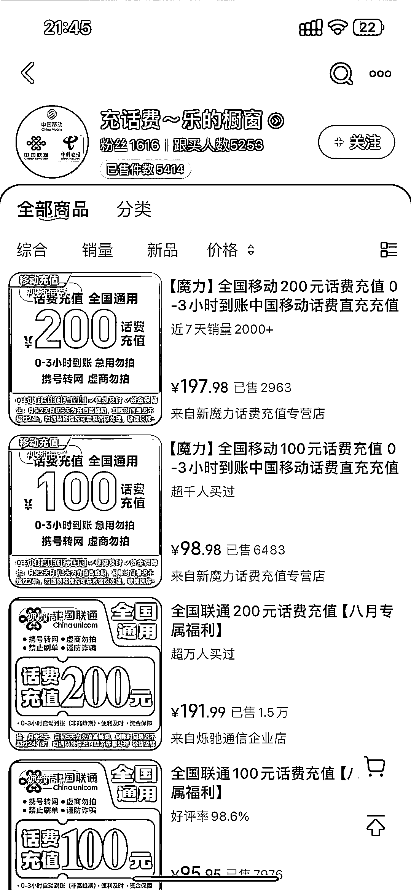
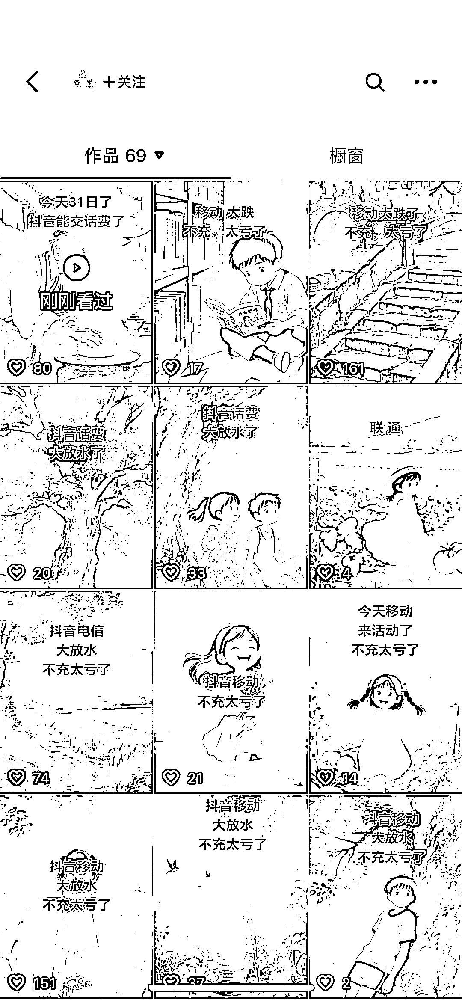
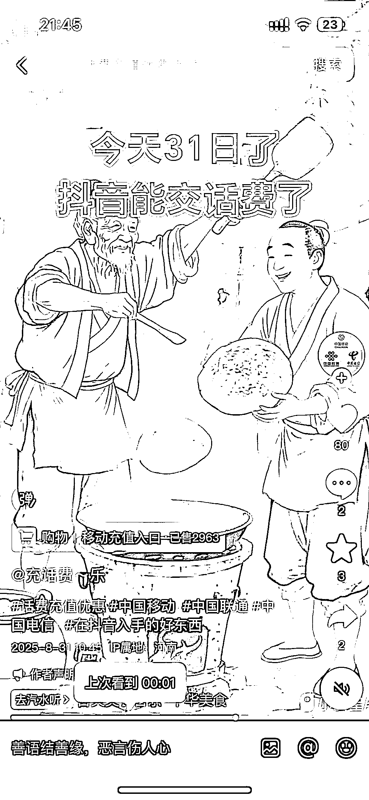

# 抖音 AI 图文带货，69 个作品，销售量 5414 单

> 原文：[`www.yuque.com/for_lazy/wind/lw7m3foqam6lp172`](https://www.yuque.com/for_lazy/wind/lw7m3foqam6lp172)

作者： 乘风

日期：2025-08-31

点赞数：**12**

* * *

正文：

抖音 ai 图文生成一些原创图 然后配上充话费便宜的文案 69 个作品橱窗已经 5414 的销量了 最近很火，刷到很多类似的账号

* * *

评论区：

搞钱萌新 : 创意无限

亦仁 : 感谢分享，已中标

大帅 : 这个是不是洗钱的呀[捂脸]

大帅 : 近 30 天，销量 1000-2500 万！

* * *

公众号懒人搜索，[懒人专属群分享](https://lazybook.fun/#/blog/group)