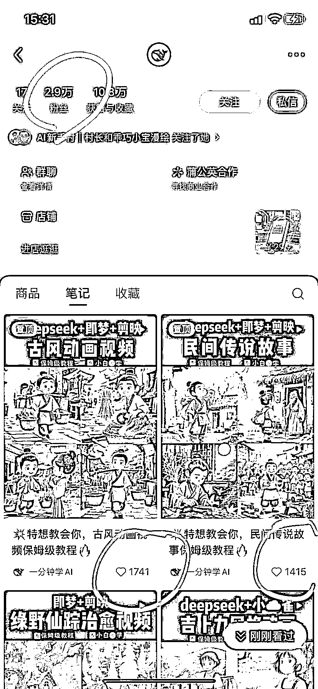
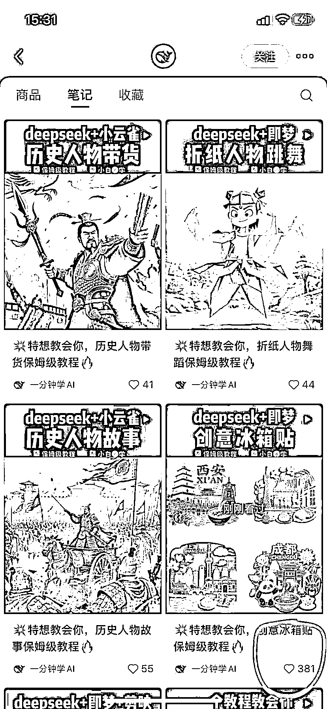
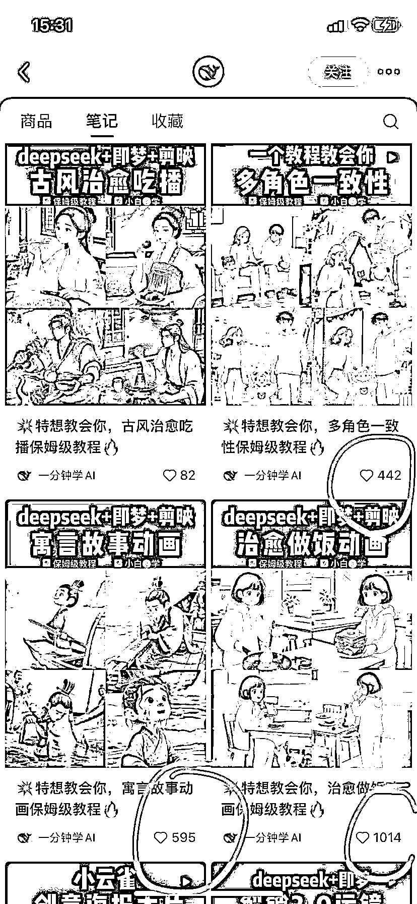
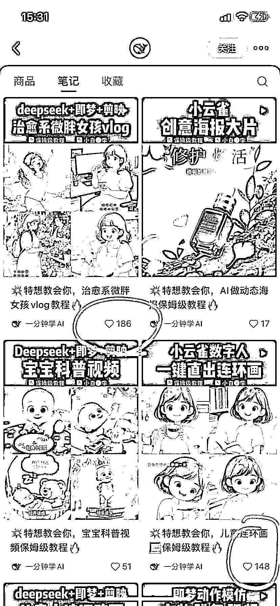
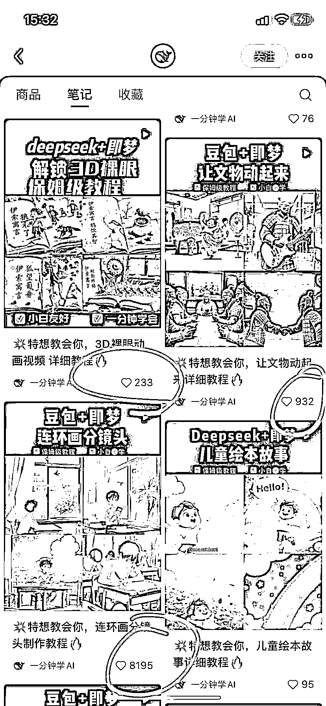
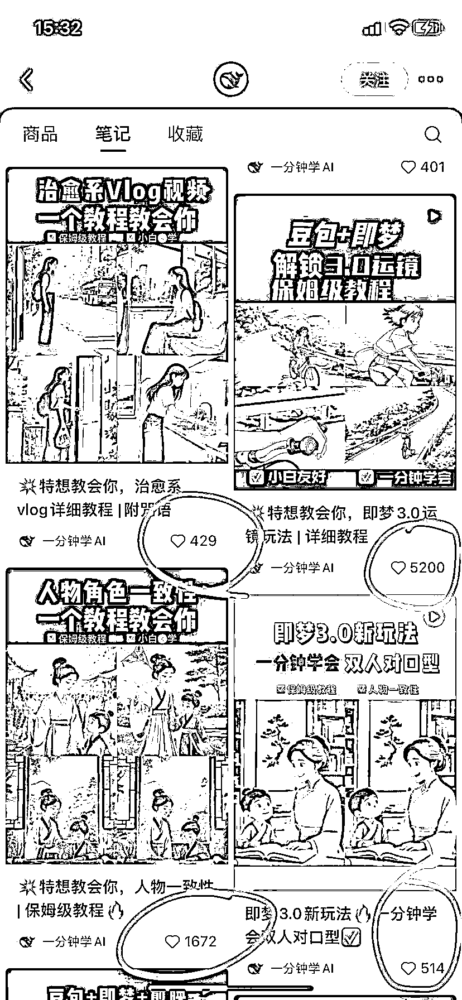
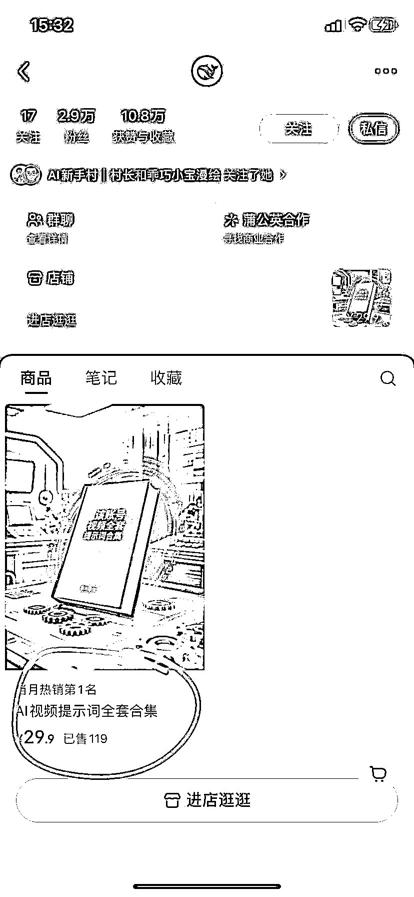
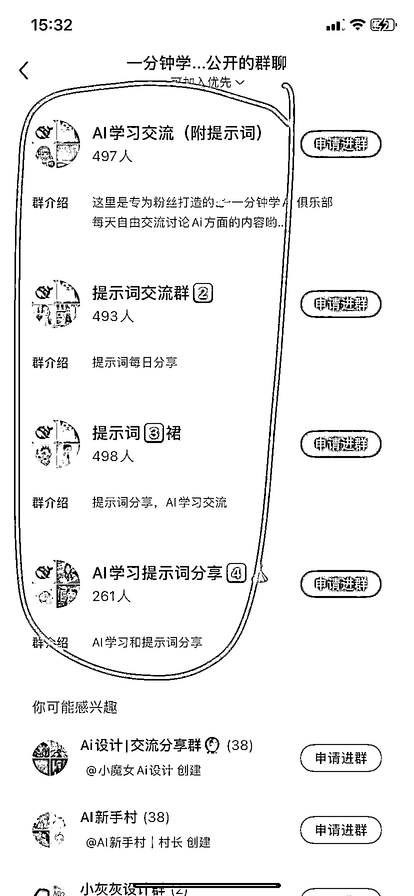

# 发 deepseek+即梦+剪映垂直教学视频，小红书也可以很火🔥

> 原文：[`www.yuque.com/for_lazy/wind/hwlbm9c7o6qhgrom`](https://www.yuque.com/for_lazy/wind/hwlbm9c7o6qhgrom)

作者： 飞掌柜

日期：2025-09-02

点赞数：**13**

* * *

正文：

一、案例描述（账号/项目/打法/现象）
1、该账号赛道非常垂直，就是教学如何用 deepseek+即梦+剪映作出爆款 AI 视频的，可以有多种组合搭配，比如 deepseek+即梦，deepseek+剪映，即梦+剪映。
2、100 多个视频涨粉 2.9 万，获赞与收藏 10.8 万！由于是教学类视频，用户很愿意收藏。 二、数据表现（播放量、GMV、截图等）
1、100 多个视频，其中有三分之二都是“deepseek+即梦+剪映”教学视频。点赞最少的几十个，平均两三百，最多的 8200 左右，播放量接近百万了。
2、已经开通商品带货功能，主要卖 29.9 的“AI 视频提示词合集”，卖了 119 份，GMV3500 多，但这仅仅是引流品，后续是通过 AI 视频私教、高阶付费会员等进行变现。
3、小红书建群已经第四个，引流 1800 人，相信有不少伙伴已经引流到微信成交。 三、机会剖析（初步判断：比如 ROI 高、成本低、可复制性强）
1、这类视频制作并不难，文案用 deepseek 生成，图片和视频片段用即梦 AI、可灵 AI 生成，剪映剪辑成教学视角的效果。
2、文案、图片和视频片段的生成，可以批量化，剪映剪辑成教学效果，这个稍微难点，毕竟很多细节要控制。因此可以部分提效。
3、整体项目成本较低，小白也可 0 成本、0 基础启动，可复制性也强。通过商品（或者小清单）带货、引流后知识付费项目变现，空间还是挺大的。

* * *

评论区：

亦仁 : 感谢分享，已中标

飞掌柜 : 感谢老大，继续挖掘！

伍拾陆 : 感谢分享，有启发收藏了🌹

飞掌柜 : 客气啦，能帮到你是我的荣幸

* * *

公众号懒人搜索，[懒人专属群分享](https://lazybook.fun/#/blog/group)