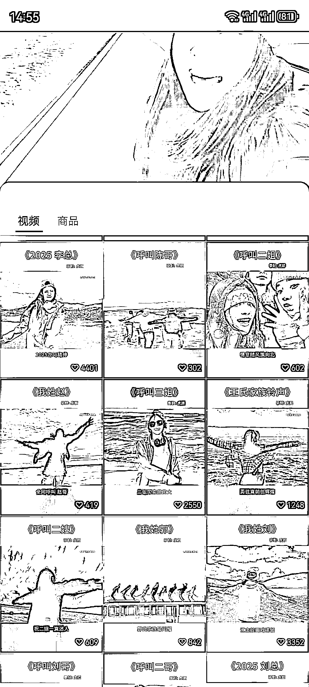
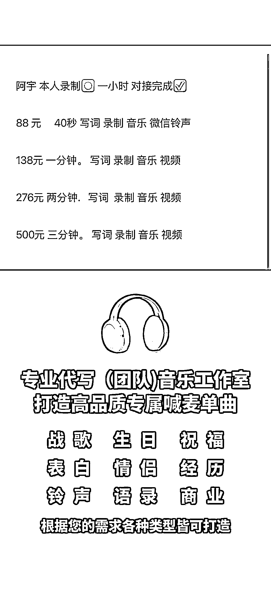
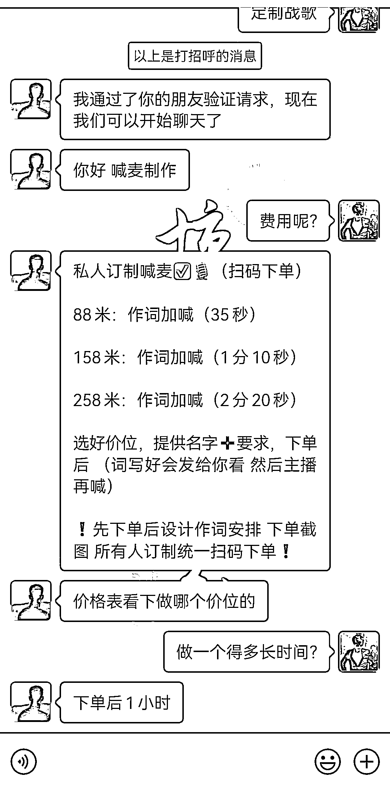
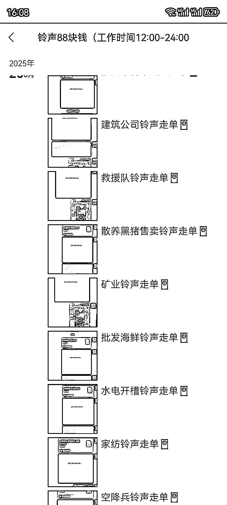
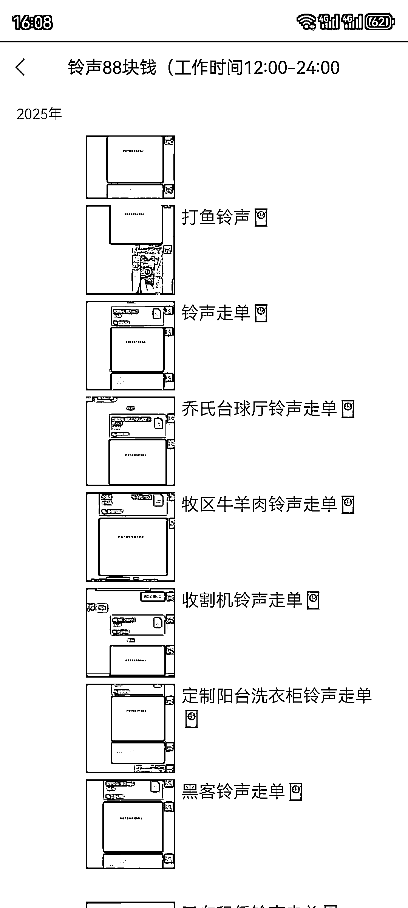
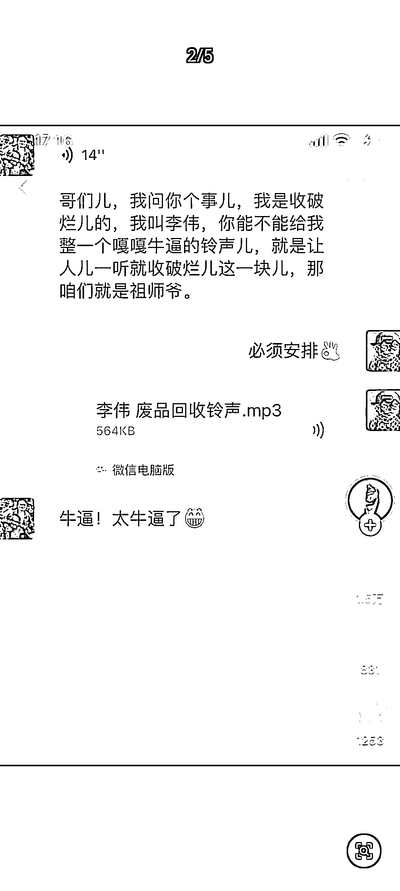
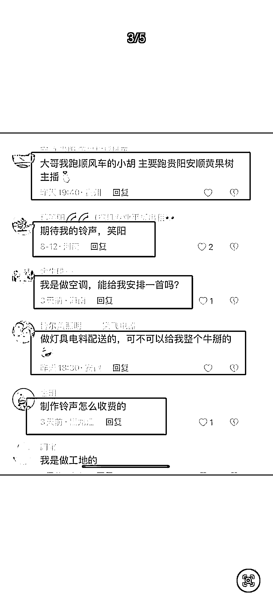
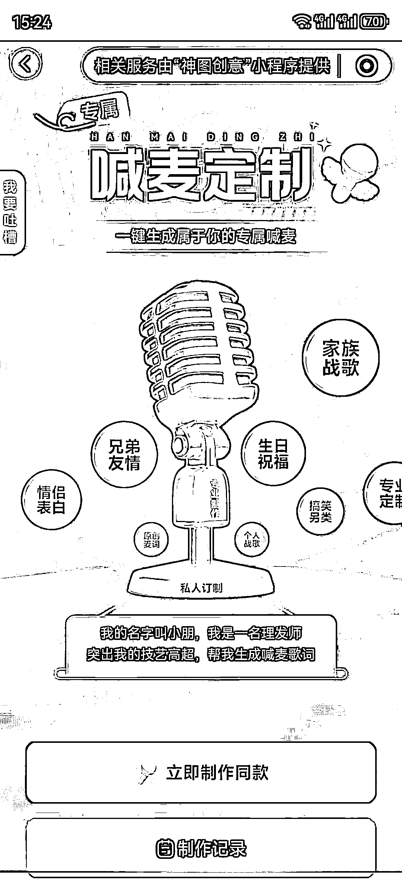

# 彩铃定制不起眼的小项目日入千元，AI 文旅喊麦彩铃音乐个性化定制服务

> 原文：[`www.yuque.com/for_lazy/wind/er2z9zy6ehflwccb`](https://www.yuque.com/for_lazy/wind/er2z9zy6ehflwccb)

作者： 阿斌

日期：2025-08-31

点赞数：**23**

* * *

正文：

彩铃定制 不起眼的小项目日入千元，AI 文旅喊麦彩铃音乐个性化定制服务 。
今天家族群里面有一位亲戚转发了一个视频，以李姓，姓氏开头的喊麦视频，挺有意思，打开看后发现视频博主是做个性化喊麦铃声定制的，加了微信，报价一单 88+，1 小时内完成，朋友圈聊天收款截图来看，一天接单至少 10 多个，顺藤摸瓜，从各大平台的视频评论区来看，互动量大，有需求的用户不少。有一个作品 3000 多点赞，评论 600 多条，成交 60 个也是大几千收入，定制个性铃声需求一直都有，10 年前电视上满屏的铃声广告，微信也推出了个性铃声设置。
玩法：在各大内容平台引流，到私域转化。视频制作不难，无需真人出镜。喊麦彩铃分为两部分，一部分写词，另一部分录制，写词部分直接投给 AI，自己再稍微优化下即可，录制方面，有喊麦功底的直接上手录制，不会录制的，在某多，某鱼平台搜索喊麦，基本上 10 元内就解决了，微信小程序也有专门的喊麦录制小程序（貌似要收费），做好的成品，发在自己的抖音，视频号上，特别是带姓氏的，还有通用行业的视频自带传播性质，形成了一个完美的成交闭环。
变现： 1.私域定制，1 首至少 88 元+，一天 10 几单，也有个小 1000 2.有其他音乐需求，打包，卖音乐 U 盘
3.吃广告主收益，特别是带姓氏的视频，还有通用行业的视频播放量比较高，转发量也很高 4.开橱窗，挂车卖产品 5.收徒卖项目 其他暂时没想到，欢迎圈友补充。

* * *

评论区：

亦仁 : 感谢分享，已中标

* * *

公众号懒人搜索，[懒人专属群分享](https://lazybook.fun/#/blog/group)