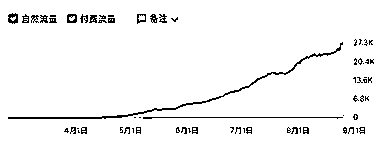
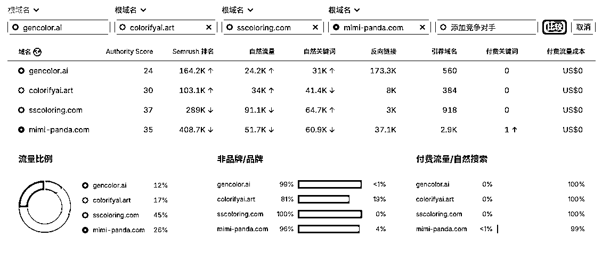
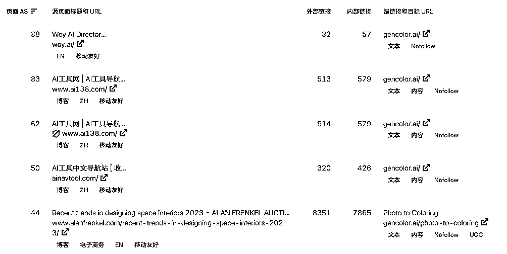

# GenColor.ai 案例：靠精准 SEO 起量，自然流量 20w+

> 原文：[`www.yuque.com/for_lazy/wind/niemxibhuugli291`](https://www.yuque.com/for_lazy/wind/niemxibhuugli291)

作者： 向上的塔皮

日期：2025-09-05

点赞数：**13**

* * *

正文：

GenColor.ai 是一个免费在线 AI 涂色图生成器，用户可以上传照片或输入文字，自动生成黑白线稿供打印或数字填色。 半年时间，而且晚于大站
ColorifyAI、Mimi Panda、SSColoring，但通过精准 SEO 快速起量
主力来自自然流量，几乎全部流量来自非品牌词，说明冷启动主要靠的而非品牌积累 还有非常显眼的：反向链接数量半年内突破 17 万条，靠 AI
工具网站、教育资源、博客等传播 见截图 自然流量月访问超 24 万，并持续上涨，说明用户需求真实且持续增长 可模仿网站找优质反向链接来做。
技术门槛不高，调用开源图像处理模型或 API 即可实现 可延展至 STEAM 教育包、心理康复工具、儿童内容订阅盒子等

* * *

评论区：

亦仁 : 感谢分享，已中标

* * *

公众号懒人搜索，[懒人专属群分享](https://lazybook.fun/#/blog/group)