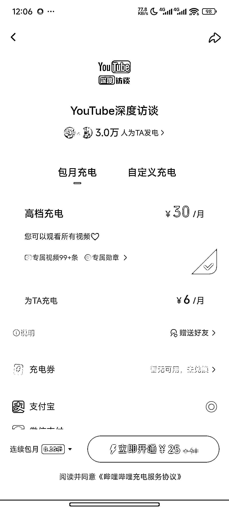
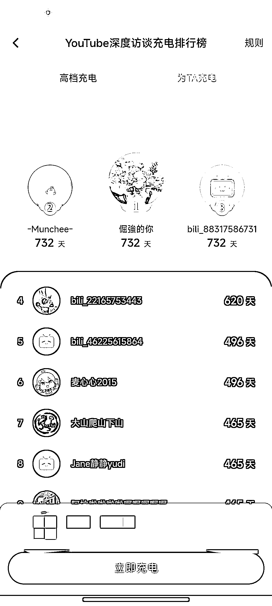

# B 站搬运油管视频变现 18 万

> 原文：[`www.yuque.com/for_lazy/wind/gg46vro9g1ras6yh`](https://www.yuque.com/for_lazy/wind/gg46vro9g1ras6yh)

作者： 枫晓陌 超强执行力

日期：2025-09-01

点赞数：**29**

* * *

正文：

B 站搬运油管视频至少变现了 18 万 1.已经有三万人为她充电，即使按最低档计算，也有 18 万。图二可以看到有很多人是铁杆粉丝，充了很多钱。
2.如何制作：爬取油管视频下载-配上中文字幕-上传到 B 站-部分视频设置充电专属。以上几个环节，都可以使用软件或者工作流搞定。
对于程序员朋友或者能开发出这些自动化工作流的圈友来说，简直是打造了一个自动赚钱系统。 3.变现延伸：小店卖货、京东淘宝的蓝链带货。
4.从小红书知识库 top1 参考答案阅览室到 B 站这么多的搬运付费内容可以看到，国内用户对于高质量稀缺的内容（外来和尚好念经），还是有很大付费意向的。

* * *

评论区：

远方的诗 : 好像投原创才能有收益吧，但这个是搬运视频，怎么投原创呢？

枫晓陌 超强执行力 : 跟着对标账号走一遍就知道了。

亦仁 : 感谢分享，已中标

* * *

公众号懒人搜索，[懒人专属群分享](https://lazybook.fun/#/blog/group)