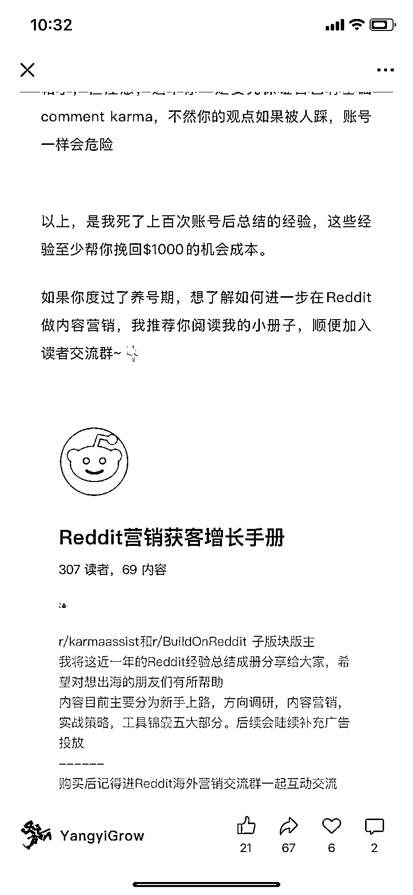
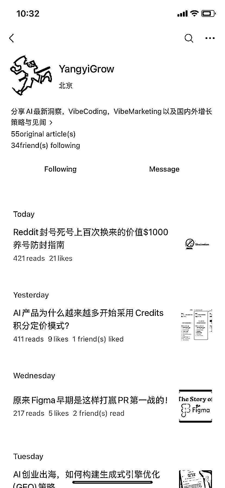

# 垂直小号，靠写 Reddit 付费卖出 300+份

> 原文：[`www.yuque.com/for_lazy/wind/lmhrhu675f5hig32`](https://www.yuque.com/for_lazy/wind/lmhrhu675f5hig32)

作者： 周彦充（同公众号）

日期：2025-09-05

点赞数：**10**

* * *

正文：

YangyiGrow，典型的垂直小号，写 reddit，卖 reddit 小报童付费内容，卖了 300 多份了，效果不错，很垂直精准流量，竞争不大，出海赛道值得做，一直有增长的赛道。

* * *

评论区：

亦仁 : 感谢分享，已中标

* * *

公众号懒人搜索，[懒人专属群分享](https://lazybook.fun/#/blog/group)