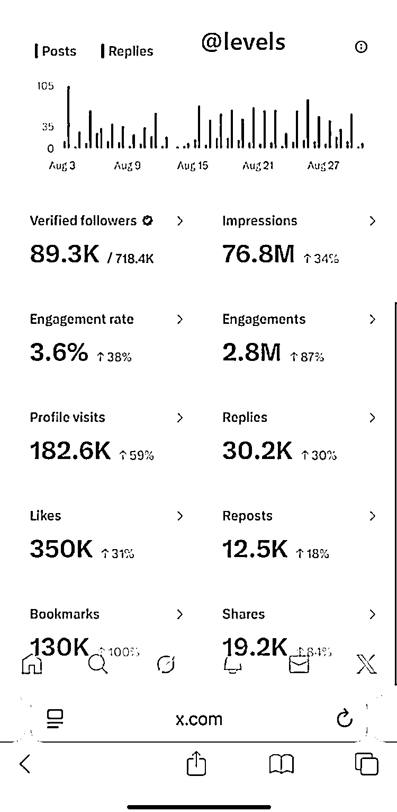

# X 广告收入太迷：同样高互动，有人赚几千，有人 0 收入，但大多数人至少能回本

> 原文：[`www.yuque.com/for_lazy/wind/knfcd5ouwnsdtt07`](https://www.yuque.com/for_lazy/wind/knfcd5ouwnsdtt07)

作者： 向上的塔皮

日期：2025-08-31

点赞数：**16**

* * *

正文：

昨天很多 X 博主分享他们的 X 广告收入。 @levelsio 大佬（719k 关注，76M 阅读，互动 3.6%），一个月收入 <card type="inline" name="math" value="data:%7B%22code%22%3A%2211%2C496%5Cn%40Jamyies%20%E5%A4%A7%E4%BD%AC%20%EF%BC%88110.2k%E5%85%B3%E6%B3%A8%EF%BC%8C2.7M%E9%98%85%E8%AF%BB%EF%BC%8C%E4%BA%92%E5%8A%A8%E7%8E%876.2%25%EF%BC%89%EF%BC%8C%E4%B8%80%E4%B8%AA%E6%9C%88%E6%94%B6%E5%85%A5%E6%89%8D%20%22%2C%22id%22%3A%22nLKPn%22%7D">54
@RiaaDass（2k+关注，200.1k 阅读，互动率有 9%），2 个星期收入有<card type="inline" name="math" value="data:%7B%22code%22%3A%22175.17%5Cn%40nazeefavisuals%EF%BC%886k%2B%E5%85%B3%E6%B3%A8%EF%BC%8C%E6%B2%A1%E5%87%BA%E6%95%B0%E6%8D%AE%EF%BC%89%EF%BC%8C%E4%B8%80%E4%B8%AA%E6%9C%88%E6%94%B6%E5%85%A5%E6%9C%89%22%2C%22id%22%3A%22uCxbN%22%7D">140
@weswinder（7k+关注，2.4M 阅读，互动率大概 5%-7%），一个月收入只有$92
@ChrisFeliii（2k+关注，6M 阅读，互动率有 1.5%），0 收入 很多人搞不明白马克斯到底是怎么算的。 有的人很多粉丝，但没有多少钱。
有的人说是互动问题，但有的人也有互动，但也没多少钱。 有人指出平台对金融类内容变现不友好 真是个迷。
不过，X 自媒体还是值得尝试，看起码多数会员费是回本的。感觉互动率不太差的，都会有收入。</card></card>

* * *

评论区：

亦仁 : 感谢分享，已中标

* * *

公众号懒人搜索，[懒人专属群分享](https://lazybook.fun/#/blog/group)