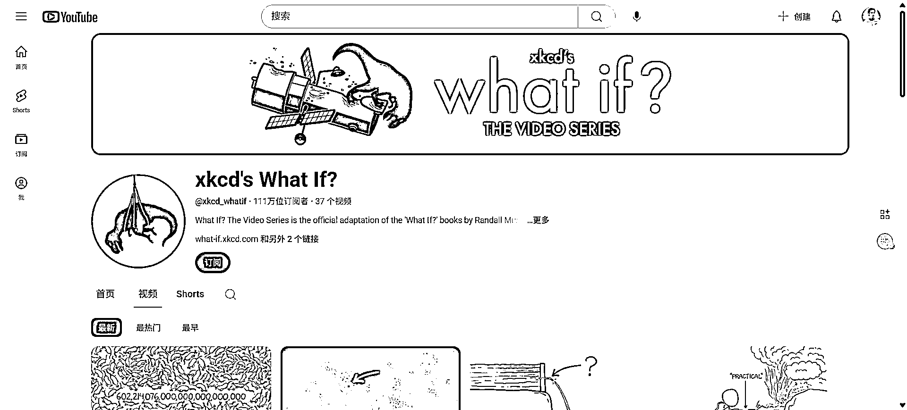
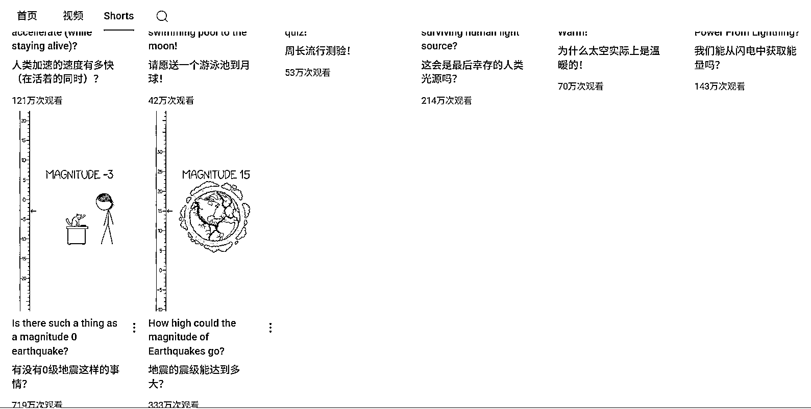
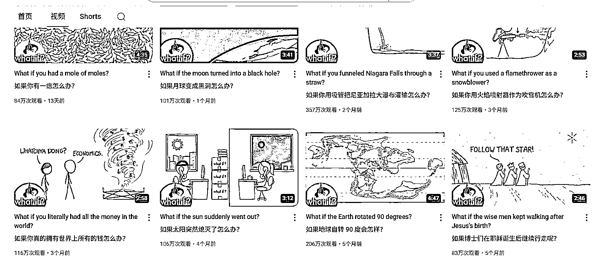

# YouTube 变现思路：脑洞问题 + ChatGPT + 短视频，37 个视频涨粉 100w+

> 原文：[`www.yuque.com/for_lazy/wind/wyl69aaqbidvih5m`](https://www.yuque.com/for_lazy/wind/wyl69aaqbidvih5m)

作者： 大米

日期：2025-09-02

点赞数：**25**

* * *

正文：

油管 youtube 发展一个有趣的频道，发的都是一些脑洞问题，但是播放量很高。37 个视屏涨粉 111 万。
它的视屏制作也没有很难，基本 ppt 式的讲解。它也有长视屏，但是时长只有 2-4 分钟左右，这种也适合短视频。
这些脑洞问题，完全可以用 chatgpt 生成，让后再挑一个，生成短视频文案。

* * *

评论区：

礼新 : 有点意思

亦仁 : 感谢分享，已中标

三猫 L : 有一本书就叫 What If，就是这种脑洞类型的，很早之前看过

伍拾陆 : 有趣🤗

* * *

公众号懒人搜索，[懒人专属群分享](https://lazybook.fun/#/blog/group)