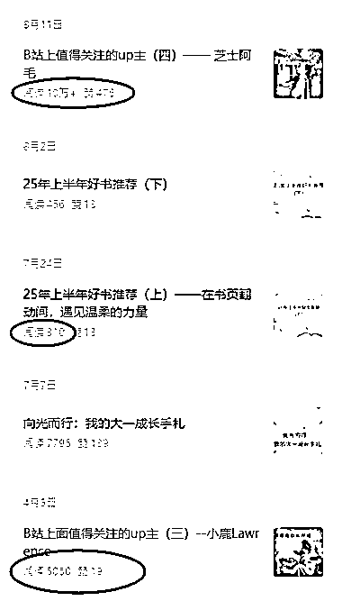
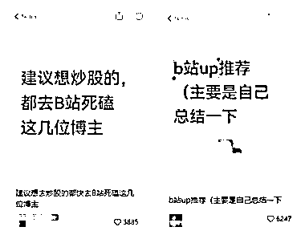
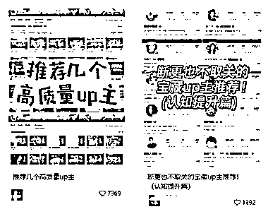

# 公众号流量异常值：分享 B 站 UP 主合集，一篇就 10w+

> 原文：[`www.yuque.com/for_lazy/wind/rfwn2d5vyp7ep3hx`](https://www.yuque.com/for_lazy/wind/rfwn2d5vyp7ep3hx)

作者： 大锅

日期：2025-09-01

点赞数：**15**

* * *

正文：

公众号异常值-分享博主合集 . 看到分享 b 站 up 主的文章阅读量 10w+ 作者之前的文章普遍在几百的阅读量 小红书上搜了一下，也有一些爆款笔记
素材很多，且博主本身就自带流量 评论区讨论很激烈 . 提供个思路，也可以分享小红书博主，YouTube 博主之类的

* * *

评论区：

亦仁 : 感谢分享，已中标

* * *

公众号懒人搜索，[懒人专属群分享](https://lazybook.fun/#/blog/group)