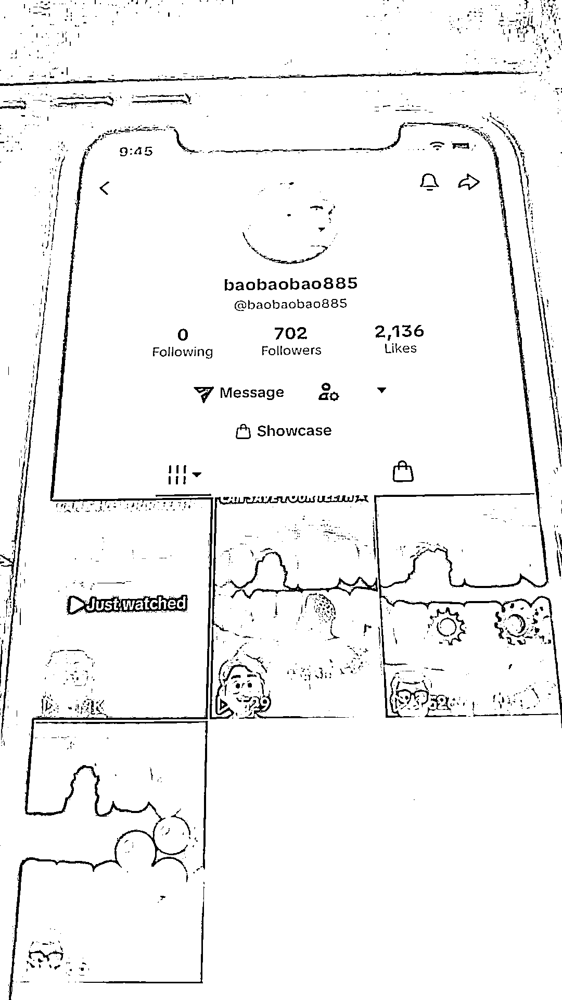
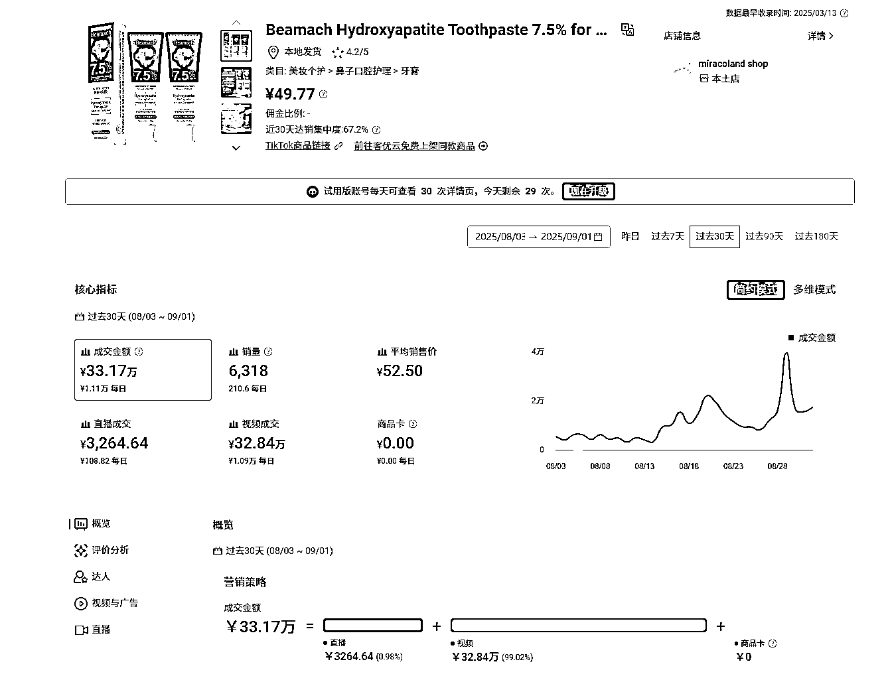
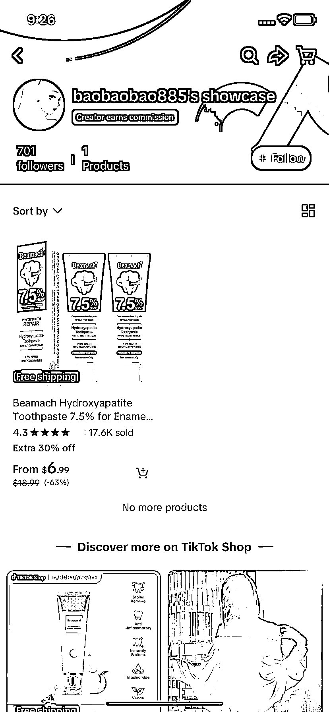
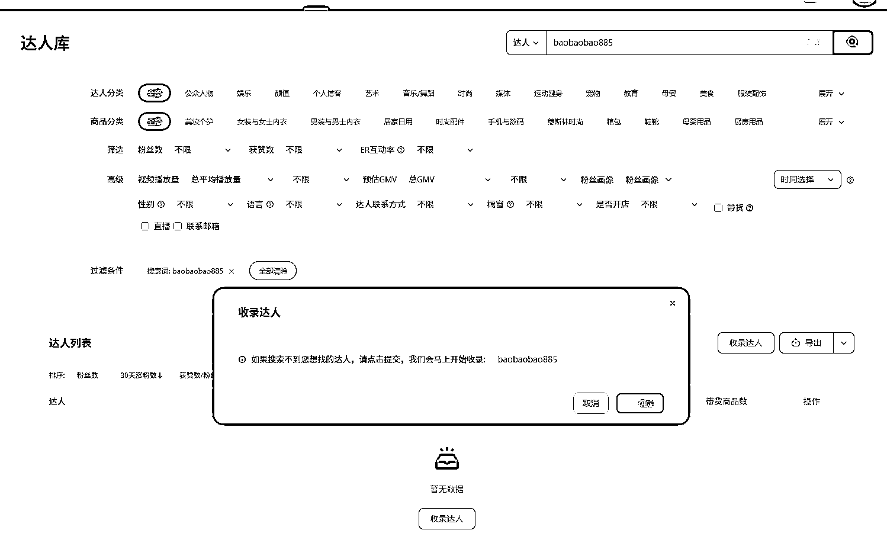
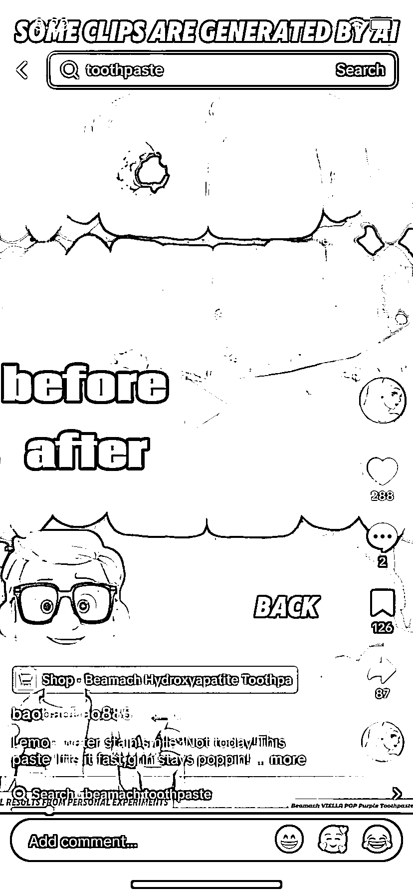
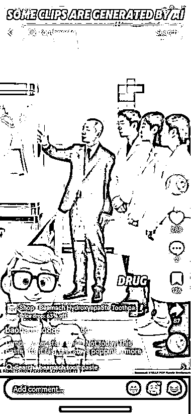
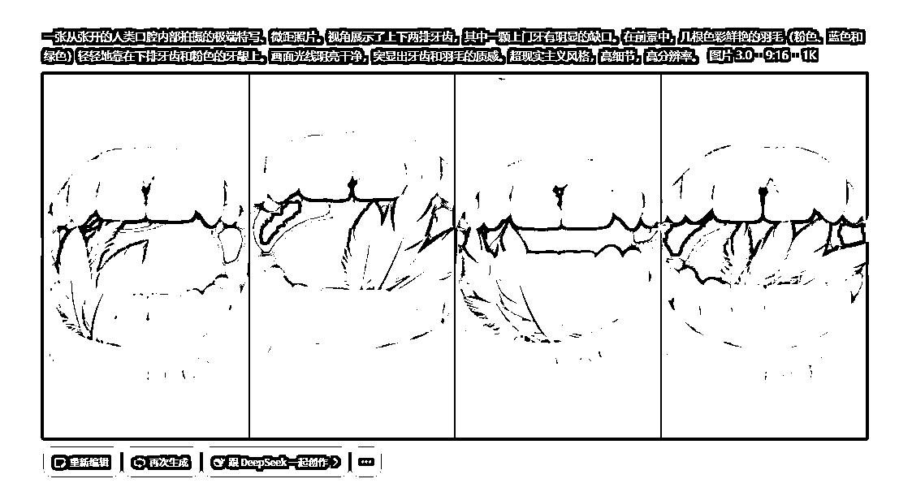
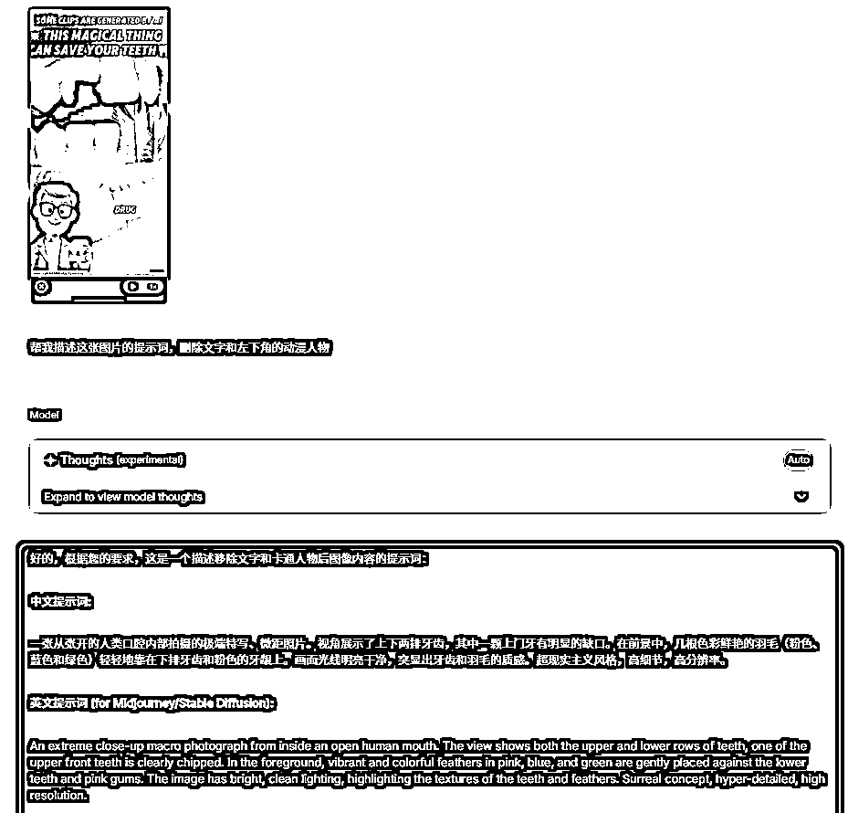
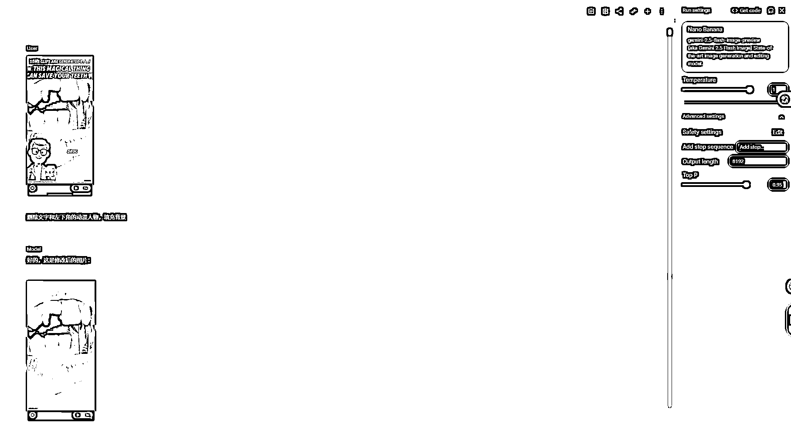

# 发现 Tiktok shop 渠道号带货新动向：产品内容都是 ai 生成，30 天成交量 6000+

> 原文：[`www.yuque.com/for_lazy/wind/vk8obdfrv9x6wa8y`](https://www.yuque.com/for_lazy/wind/vk8obdfrv9x6wa8y)

作者： 叶落影

日期：2025-09-03

点赞数：**14**

* * *

正文：

今天发现一个 Tiktok
shop 渠道号@baobaobao885 在带的一个品，内容大部分是 AI 生成的，用即梦测试了下生成难度不高，做些调整就能出，带货数据还不错，但是数据平台还没收录，所以暂时看不到这个账号具体数据，这个产品最近 30 天成交量还不错，发现 google 的模型可以很好的理解语义，描述图片可以特意加一些指令，让他描述我们需要的部分。Tiktok 现在很多优质的带货账号都在涌现，是个很好的方向
图一为账号主页 图二图三为这个产品的一些粗略的销售数据 图五图六是视频内容截图 图七八九为即梦 以及谷歌 nano banana 的简单测试

* * *

评论区：

亦仁 : 感谢分享，已中标

* * *

公众号懒人搜索，[懒人专属群分享](https://lazybook.fun/#/blog/group)