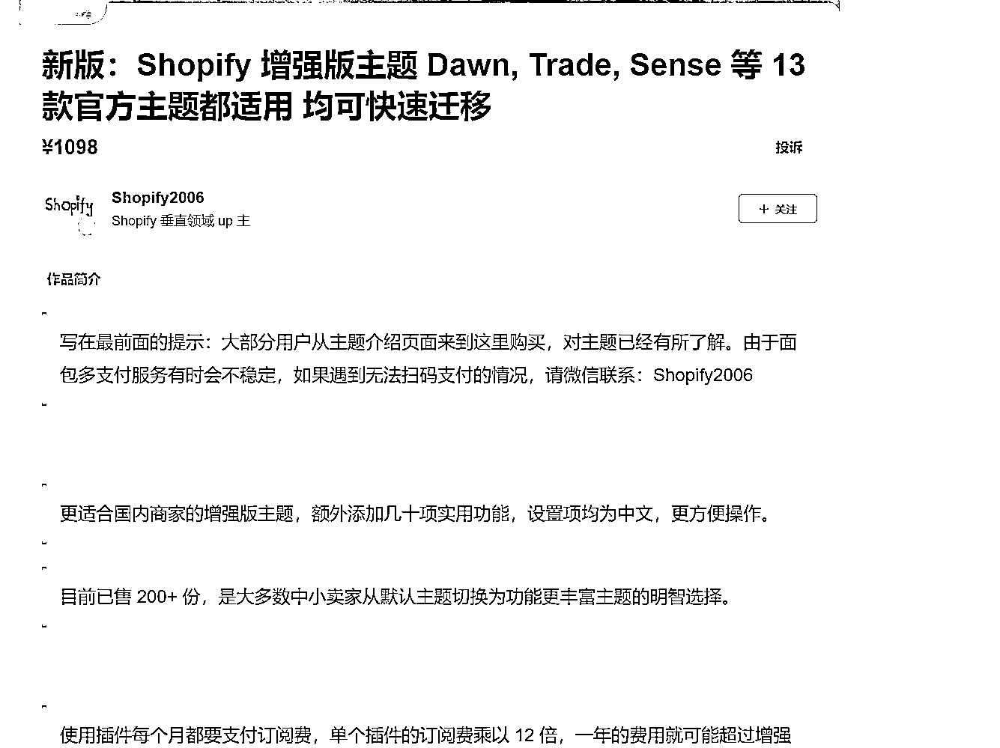
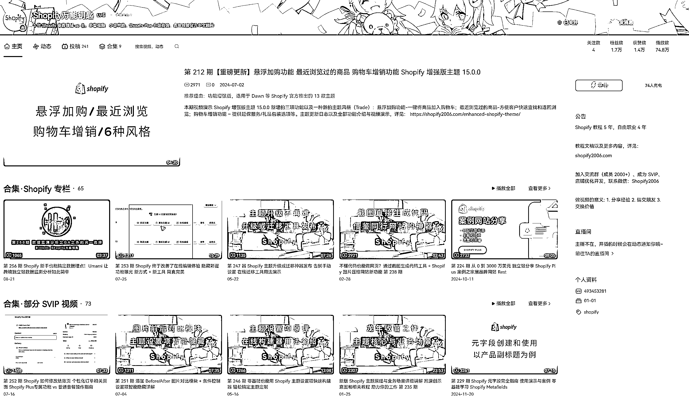

# UP 主靠讲解 Shopify 小功能，收费 1.5K 销量可观

> 原文：[`www.yuque.com/for_lazy/wind/unt3xd9itzd6mdnx`](https://www.yuque.com/for_lazy/wind/unt3xd9itzd6mdnx)

作者： 郭先生 0505

日期：2025-09-05

点赞数：**10**

* * *

正文：

shopify 模板常用功能开发
这个 UP 主专注于 Shopify 模板功能的开发与优化。早在 2019 年，Shopify 的官方插件生态尚未成熟，许多付费插件价格高昂，因此我们常通过前端技术实现一些小功能。由于公司通常不会专门设置相关岗位，这类工作多由运营人员掌握基础前端代码后完成。而这个 UP 主正好针对这些小功能的实现方法和代码应用进行了详细讲解。他将一些对转化率提升效果显著的功能设置为 SVIP 专属内容，并收取费用。最初每人收费 1.5K，后来延伸出模板售卖服务，每个模板售价 1K，同时针对额外需求的调整服务，收费最低从 500 起步，而且根本做不完

* * *

评论区：

亦仁 : 感谢分享，已中标

郭先生 0505 : 感谢老大🙏

* * *

公众号懒人搜索，[懒人专属群分享](https://lazybook.fun/#/blog/group)