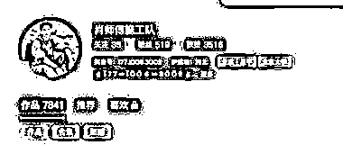
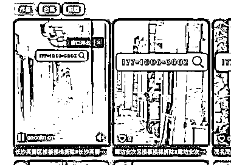

# 抖音利用信息差为拆墙师傅派单赚差价玩法

> 原文：[`www.yuque.com/for_lazy/wind/hgqlnq0kp9ymwzcf`](https://www.yuque.com/for_lazy/wind/hgqlnq0kp9ymwzcf)

作者： 艺豪别墅—王哥

日期：2025-09-01

点赞数：**17**

* * *

正文：

有客户需要拆墙，我去搜索了一下抖音，打了两三个电话，都是让当地师傅联系我，；
就详细看了一下他们的抖音内容，基本都是拆墙的视频，重复用，直接打搜索流量，一面铺货十条视频；直接怼量； 所有的关键词+地点，全覆盖 估计是赚差价，这个妙啊
抖音信息差+不会做抖音的体力活师傅+全域运营爱+多账号+免费搜索流量，nb 每日思考 跟过去货运电话中心差不多的逻辑，派单；

* * *

评论区：

亦仁 : 感谢分享，已中标

艺豪别墅—王哥 : [呲牙]

* * *

公众号懒人搜索，[懒人专属群分享](https://lazybook.fun/#/blog/group)