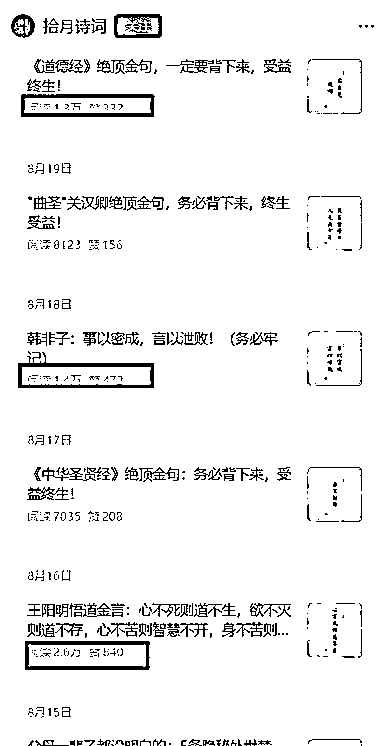

# （拾月诗词）帐号分析：读书金句赛道，中老年流量变现，单价 80-200

> 原文：[`www.yuque.com/for_lazy/wind/cwvln6yatzzzd08r`](https://www.yuque.com/for_lazy/wind/cwvln6yatzzzd08r)

作者： 林途

日期：2025-09-04

点赞数：**51**

* * *

正文：

垂直赛道【读书，金句赛道】 ：【拾月诗词】 61 原创内容，平均每篇点赞量都比较高，7 月 4 日注册，两个月非常快，稳定流量，中老年单价比较高。
针对中老年，爱学习的，爱读书，比如道德经，还有传统文化的，都可以围绕着去做，形式更新了而已，
流量主单价不算低，大概在 80-200 左右，点赞率很高，粉丝粘性特别高，这个可以后面导入私域流量等变现。 其他的等待各位圈友挖掘~

* * *

评论区：

四目相对 : 圈友，从哪或者用什么工具能估算到这个账号或者赛道的单价呢[流泪]

亦仁 : 感谢分享，已中标

* * *

公众号懒人搜索，[懒人专属群分享](https://lazybook.fun/#/blog/group)