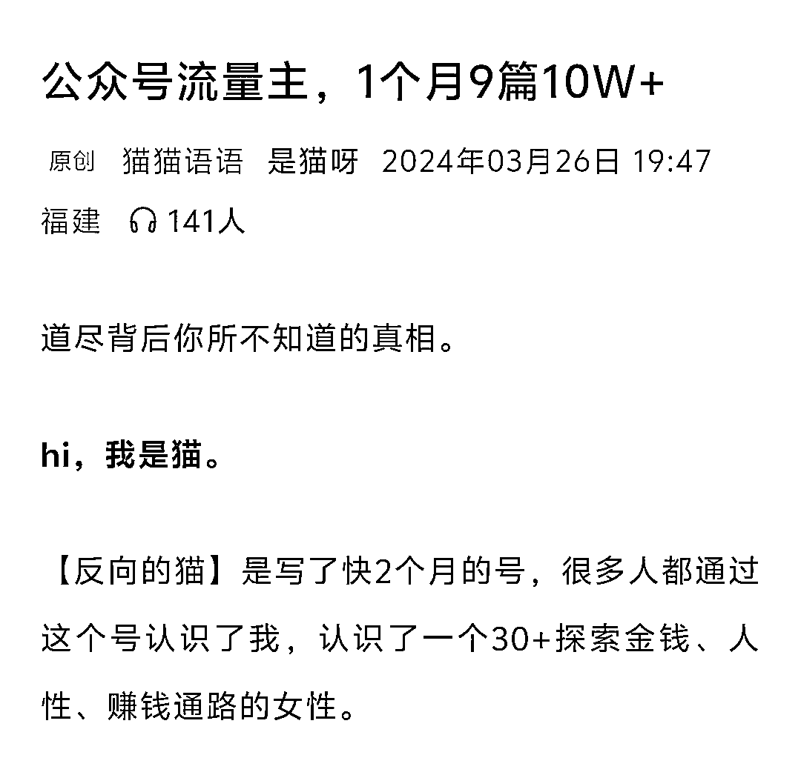

# 拆解“反向的猫”：公众号垂直小号持续耕耘的价值与玩法

> 原文：[`www.yuque.com/for_lazy/wind/skxvs2ygdzldz7ql`](https://www.yuque.com/for_lazy/wind/skxvs2ygdzldz7ql)

作者： 嘻嘻姐

日期：2025-09-03

点赞数：**31**

* * *

正文：

公众号垂直小号持续耕耘的价值，远超你想象！今天拆解一个有体系的账号玩法。 赛道：人性/钱与两性 对标账号：反向的猫
数据：从 2024 年 1 月份开始更新，2 月份入池，一直到现在，账号都始终在池子里，10w+频出，是我见过最持久的账号之一了。 为什么是机会？
1）这个账号的变现路径值得学习，除了流量主，主要是靠课程和赞赏变现，但是课程从来不在大号上宣传，而是末尾放小号，因为一旦有了营销内容，入池的大号很容易掉池；
2）找离钱最近的道路，写钱、两性就最容易戳人心。

* * *

评论区：

亦仁 : 感谢分享，已中标

* * *

公众号懒人搜索，[懒人专属群分享](https://lazybook.fun/#/blog/group)