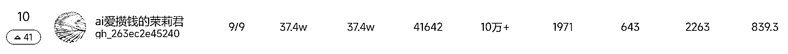
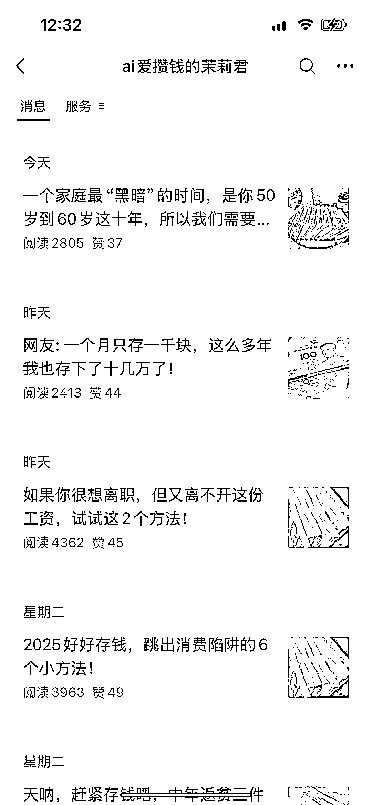

# 新榜惊现：排名从 41 升至 10 的攒钱垂直小号，无排版却很突出

> 原文：[`www.yuque.com/for_lazy/wind/er1k3d92pghht2cg`](https://www.yuque.com/for_lazy/wind/er1k3d92pghht2cg)

作者： 几道

日期：2025-09-04

点赞数：**35**

* * *

正文：

在新榜找对标的时候，看见这个账号的排名从第 41 上升到第 10，在一众大号中显得有点突兀。看了一下内容全是讲怎么攒钱的，排版几乎是没有的。
这个账号也很好诠释了什么是垂直小号。

* * *

评论区：

亦仁 : 感谢分享，已中标

大帅 : 变现方式都有哪些呢？

四目相对 : 感觉也是纯 ai 生成的文字流

stoneLee : 很奇怪的地方就是，用朱雀检测人工 100%....

四目相对 : 感觉不具备参考价值，很多大 v 的文章 ai 也很高。可能他的这些文章运用了什么独特结构规避了 ai 率

* * *

公众号懒人搜索，[懒人专属群分享](https://lazybook.fun/#/blog/group)