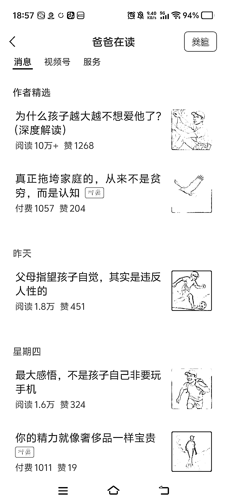
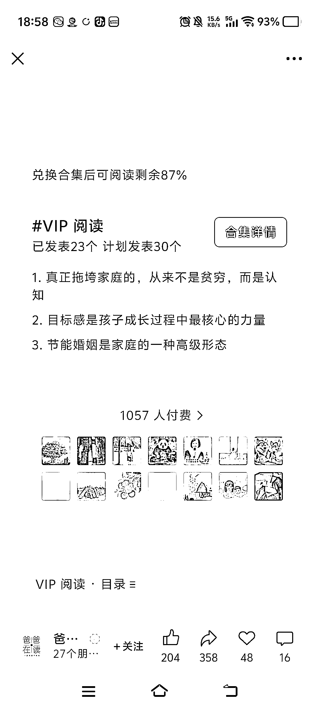

# 亲子垂直小号《爸爸在读》：399 付费文章，1057 人买单

> 原文：[`www.yuque.com/for_lazy/wind/eu8x1xideylz0hfe`](https://www.yuque.com/for_lazy/wind/eu8x1xideylz0hfe)

作者： 亦小亮

日期：2025-08-30

点赞数：**32**

* * *

正文：

爸爸在读 - 赛道/细分方向：亲子 - 案例描述
这个账号的流量基本上都是 5 位数，目前变现主要靠流量主和付费文章，而且 399 的微信豆付费文章居然有 1057 个人付费。基本上是一个普通人年收入啦，而且这样的付费文章还有几个合集。
我看了不少他的文章，评论区非常多，广告也是很多，我相信他的单价也很高。 - 为什么是机会（初步判断：比如 ROI 高、成本低、可复制性强）
这样的账号，做垂直 IP，认证的效果比较好，对于做家庭教师或者教育从业者来说，都非常简单。

* * *

评论区：

亦仁 : 感谢分享，已中标

* * *

公众号懒人搜索，[懒人专属群分享](https://lazybook.fun/#/blog/group)