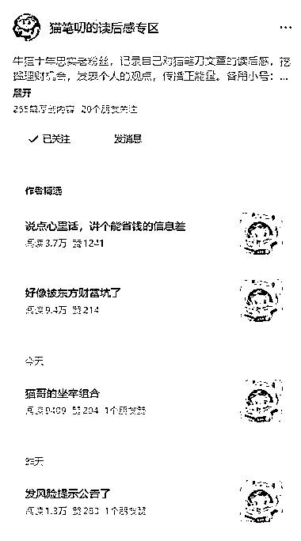
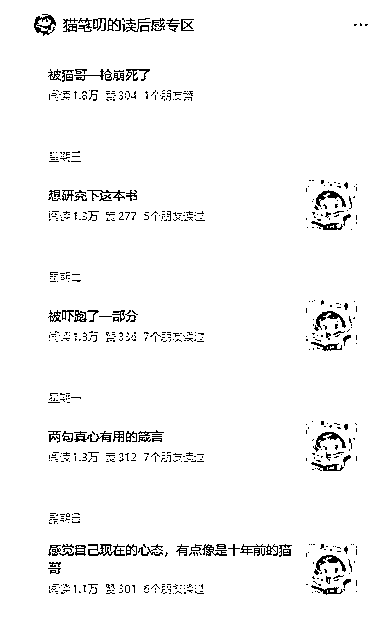
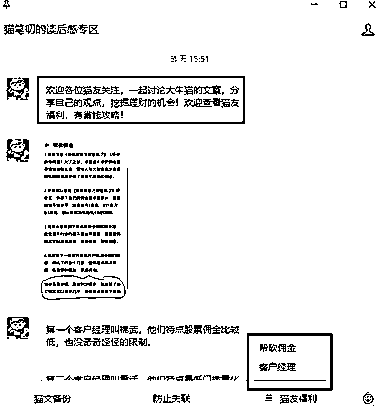

# 垂直小号机会：解读金融大号猫笔刀，文章稳定 1w+

> 原文：[`www.yuque.com/for_lazy/wind/rvbpbc8s1ohseug0`](https://www.yuque.com/for_lazy/wind/rvbpbc8s1ohseug0)

作者： 赵高明·多行

日期：2025-08-30

点赞数：**27**

* * *

正文：

垂直小号 【赛道方向】解读大号
【案例描述】猫笔刀是国内金融圈比较有名的大号，日更了十几年，粉丝粘性非常强。这个号从去年开始解读金融大号猫笔刀的文章——提供一些增量信息，以及给众多猫笔刀的忠粉们提供多一个讨论交流的地方。很简单的操作，用一个小号来承接一些大号的流量，短短一年时间就已经初具规模，每篇文章阅读量 1w 起，也有一些爆文。
变现方式包括流量主，和券商和银行合作等，这个号后续变现空间还挺大的，主要做起来不费劲，只要跟着大号的内容走就行了。 【为什么是机会】
不要什么时候一上来就想做大事做大号，基于一些已有的稳定的盘子，做一些支撑性、辅助性的内容，也可以很香。盘点一下，自己常年关注的有哪些大 IP，寻找类似的生态位切入，也可以很舒服地做公众号内容变现。

* * *

评论区：

亦仁 : 感谢分享，已中标

* * *

公众号懒人搜索，[懒人专属群分享](https://lazybook.fun/#/blog/group)