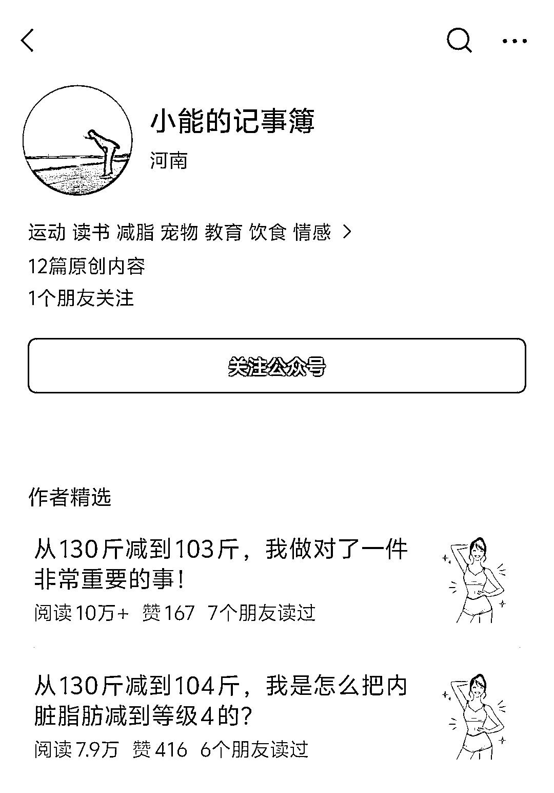
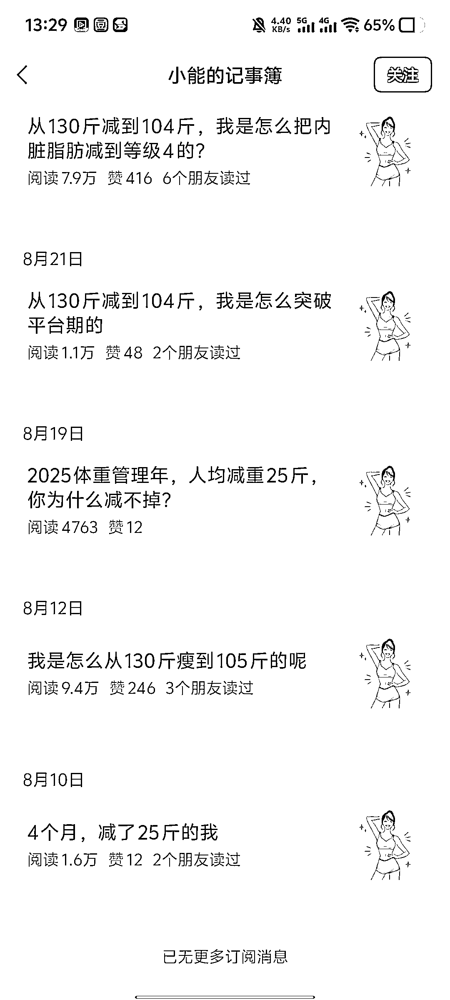
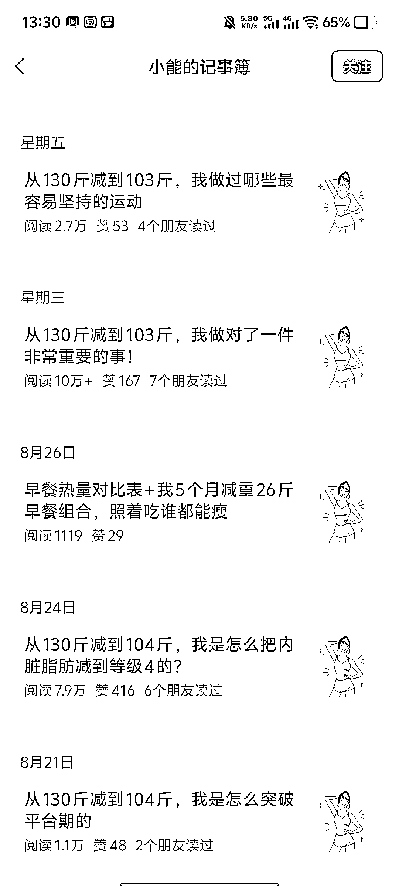
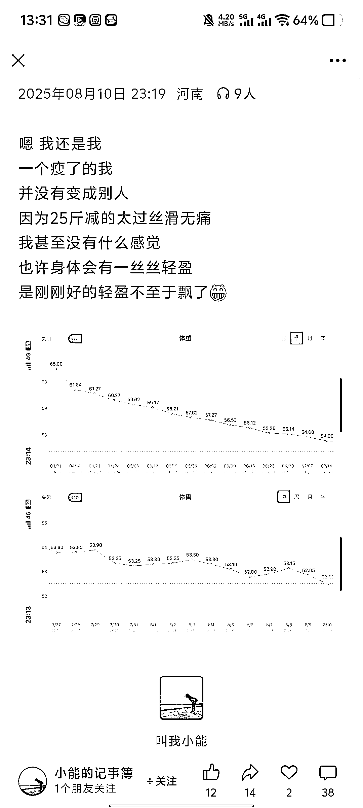
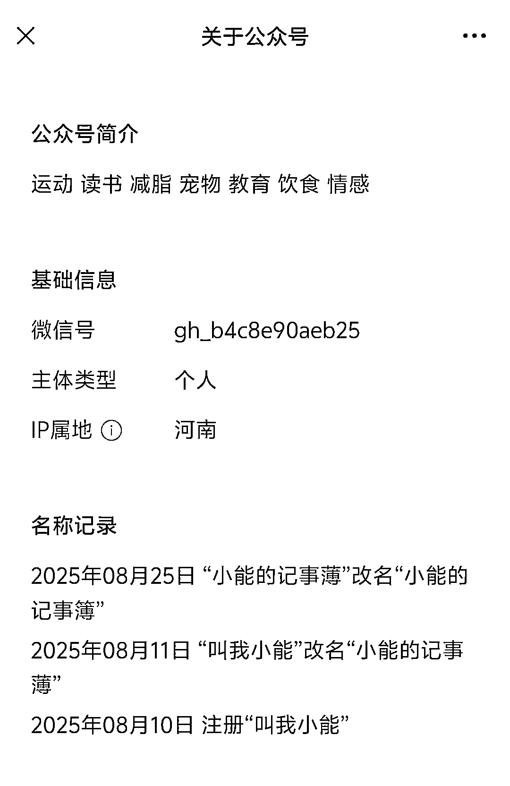

# 公众号“小能的记事簿”一篇起号，健康减肥赛道一篇文章阅读量 9w+

> 原文：[`www.yuque.com/for_lazy/wind/sic4gyzp22wm780d`](https://www.yuque.com/for_lazy/wind/sic4gyzp22wm780d)

作者： 嘻嘻姐

日期：2025-09-03

点赞数：**33**

* * *

正文：

这个号太牛了，几乎是一篇起号！ 赛道：健康/减肥 对标账号：小能的记事簿
数据：8 月 10 日注册的账号，第 1 篇就开始阅读量就上万，第 2 篇 9w+……开通了流量主。 为什么是机会？
1）今年国家开始重视健康和减肥相关的内容了，明显感觉到平台对这个方向也有推流； 2）可复制性很强，这个号主的内容纯纯就是吃喝运动作息的记录为主，非常简短；
3）变现前期以流量主为主，单价还可以，后面可以陪练，或者拉打卡营之类的产品。

* * *

评论区：

亦仁 : 感谢分享，已中标

* * *

公众号懒人搜索，[懒人专属群分享](https://lazybook.fun/#/blog/group)