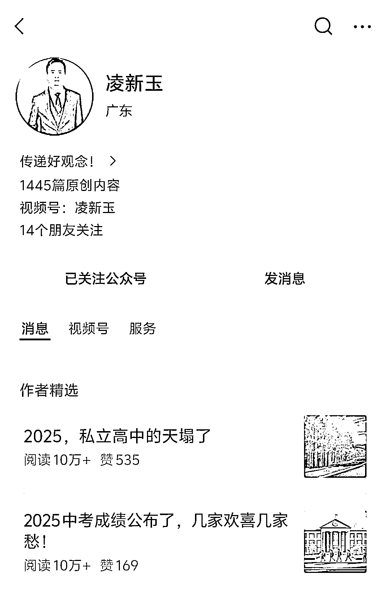
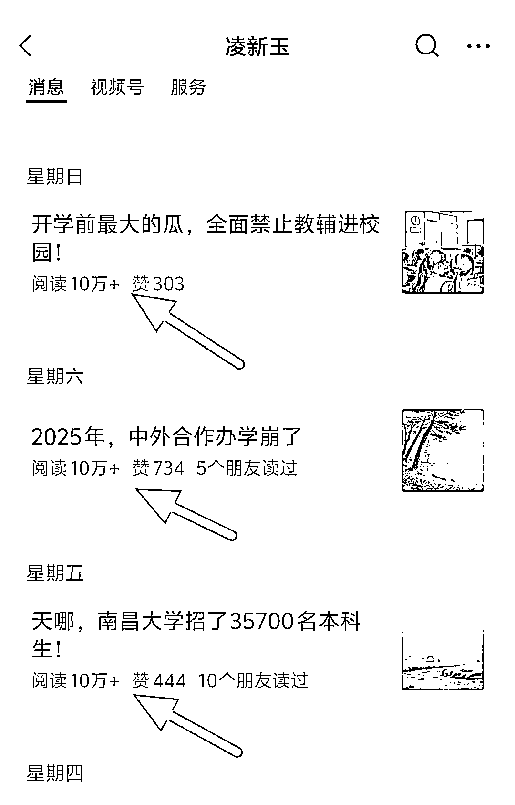
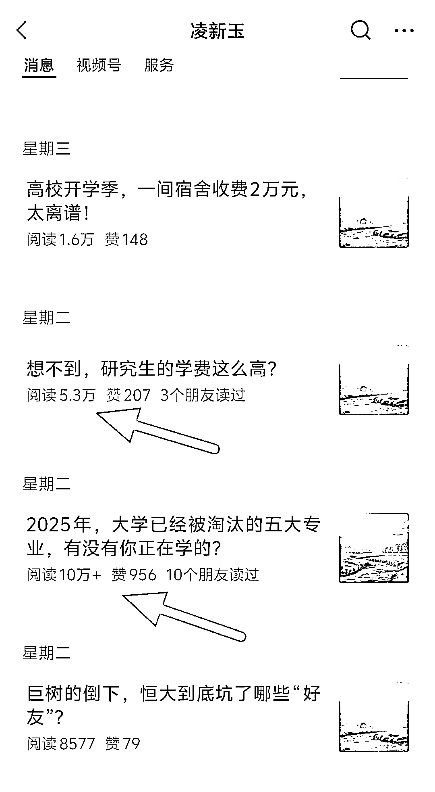
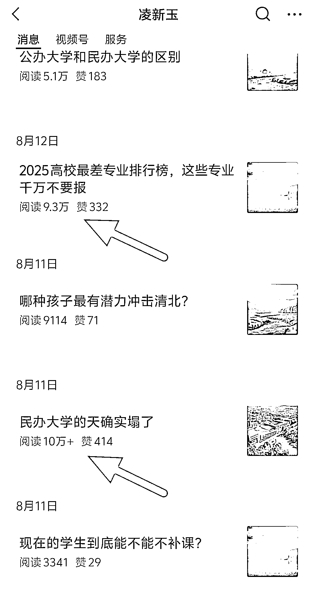
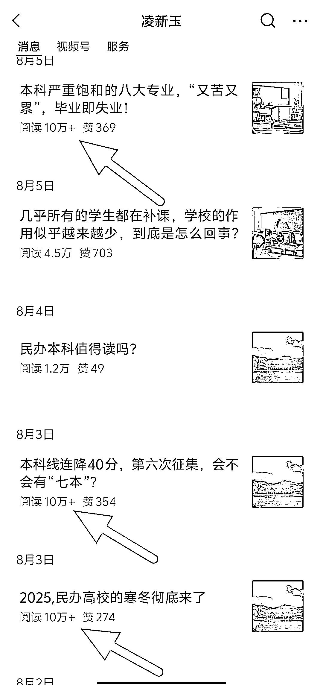

# 志愿填报，专业盘点+学校热点，8 月以来 10w+爆文频出

> 原文：[`www.yuque.com/for_lazy/wind/uy5svphe6h713fd6`](https://www.yuque.com/for_lazy/wind/uy5svphe6h713fd6)

作者： 嘻嘻姐

日期：2025-09-02

点赞数：**26**

* * *

正文：

这个号最近数据真的异常的好！ 赛道：教育/专业盘点、学校热点相关 对标账号：凌新玉
数据：7 月份之前数据还是停在两三位数为主，8 月份入池后，每天更新 2-3 篇，10w+爆文非常多。 为什么是机会？
学历贬值是近些年的社会共识，大家对专业、学校相关的事情都比较关注，再加上近期民办学校的倒闭、裁员，这些内容的异常值会比较高。 主要变现路径： 1.流量主
2.志愿填报、大学规划相关的咨询（类似于张雪峰的业务）

* * *

评论区：

亦仁 : 感谢分享，已中标

* * *

公众号懒人搜索，[懒人专属群分享](https://lazybook.fun/#/blog/group)