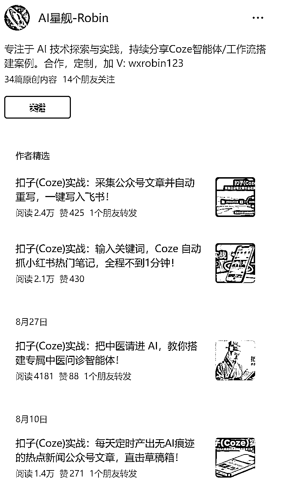
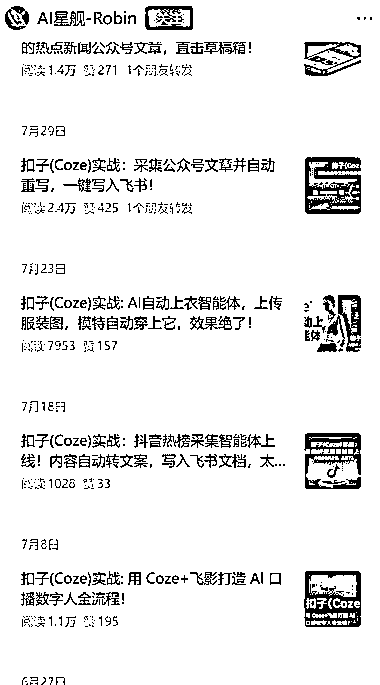
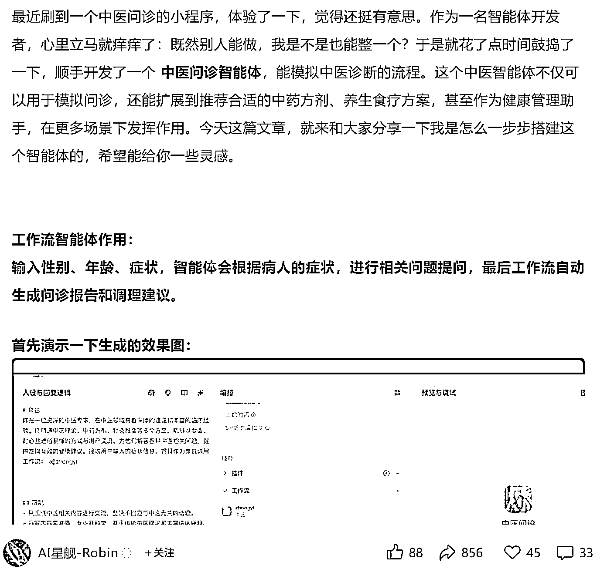
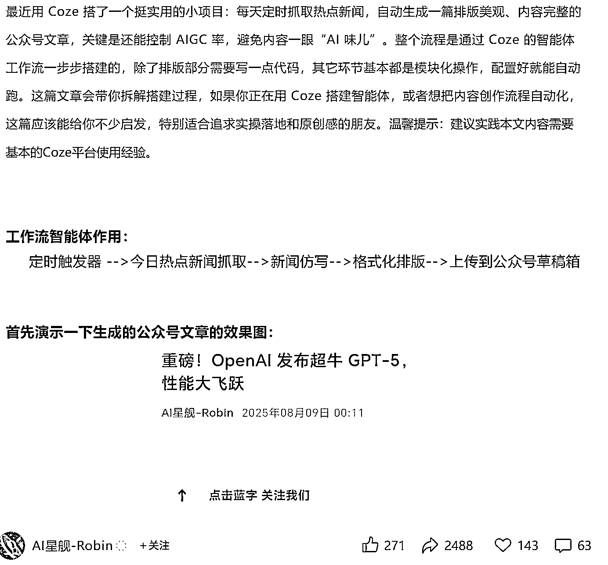
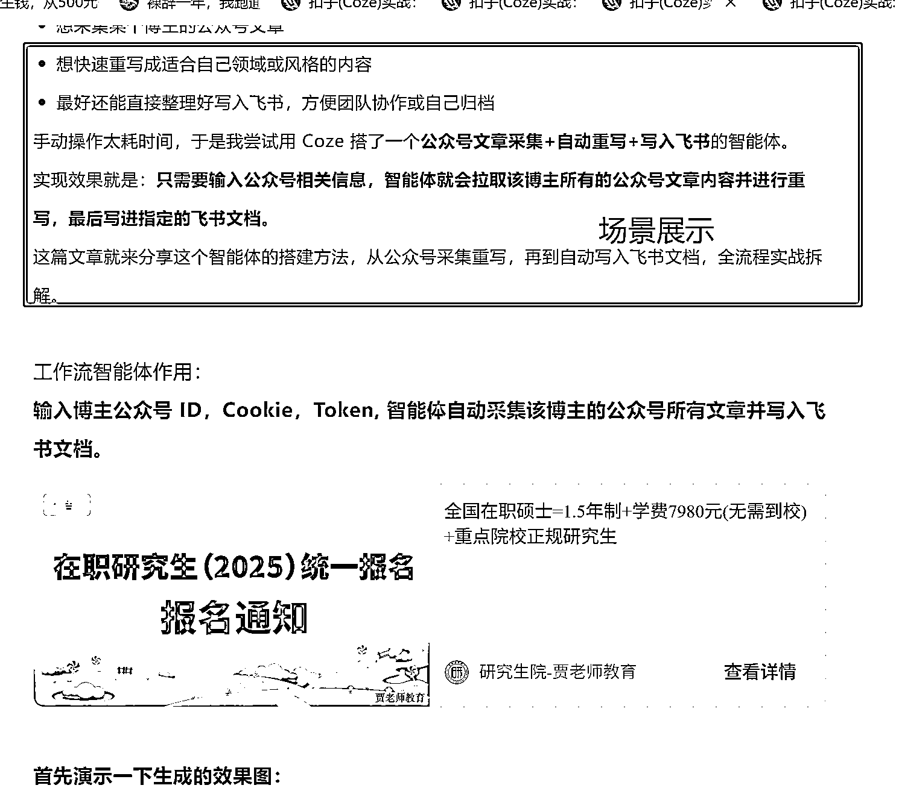
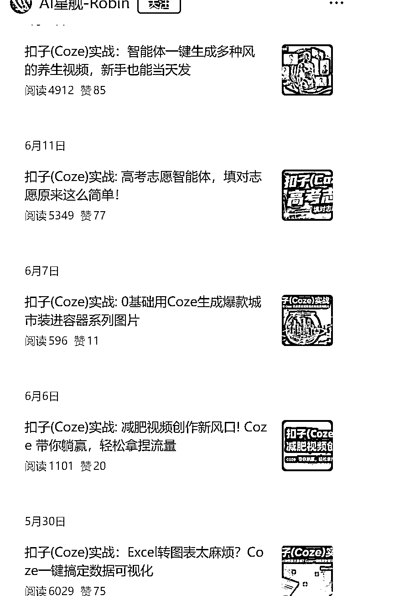
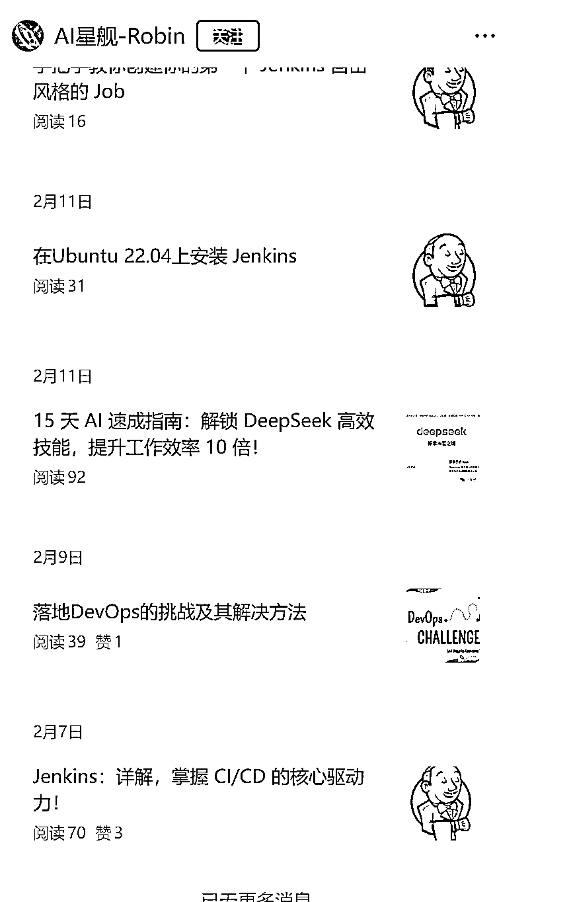
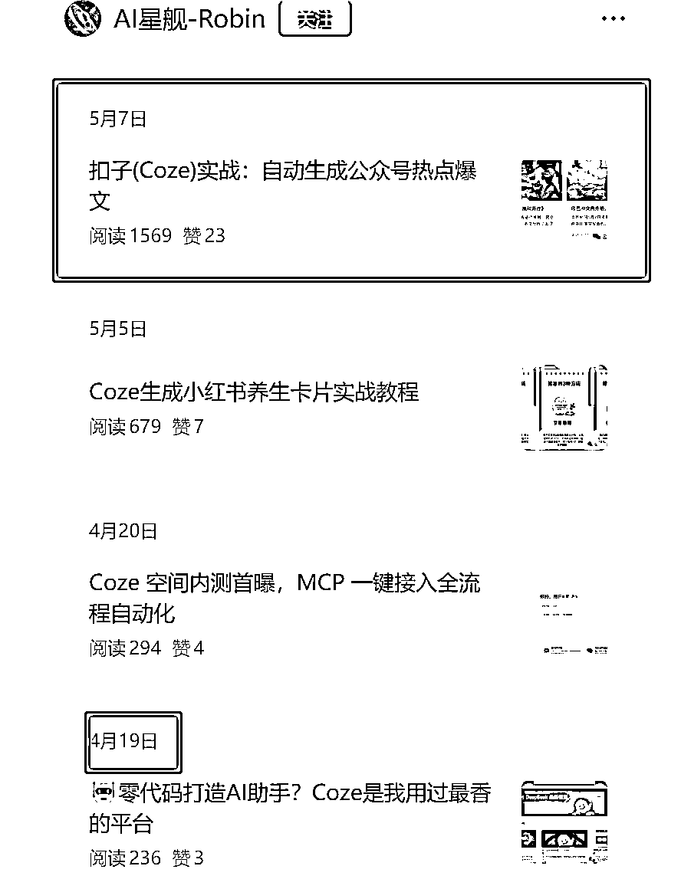
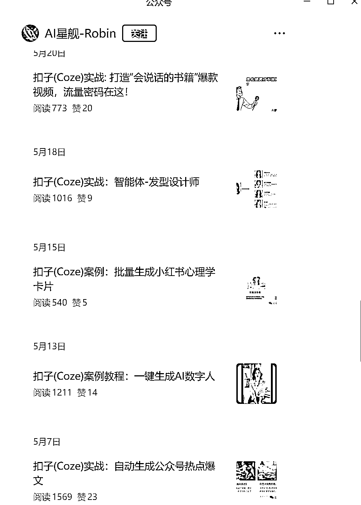

# 在公众号分享实用扣子智能体，过程详细流量爆，还有多种变现方式

> 原文：[`www.yuque.com/for_lazy/wind/subg11o28pv8d42o`](https://www.yuque.com/for_lazy/wind/subg11o28pv8d42o)

作者： 源源（急事语音）

日期：2025-09-03

点赞数：**24**

* * *

正文：

在公众号分享实用扣子智能体，过程详细，流量好到爆炸！ 垂直小号/coze 智能体定制 案例：AI 星舰-Robin
这个博主最早更新于 2.7 日，之前没写智能体的时候，流量非常惨淡。在 4.19 号写了一篇关于扣子的文章破了 3 位数播放后，开始写扣子题材的文章，并且在 5.7 日迎来了他的小小爆款，喜提 4 位数阅读文章，从那之后，他就一直沿用他那个标题模板，然后拓场景。
正文模板也初见雏形，即使用场景概述-工作流的作用-插入流量主-效果展示-具体步骤展示。7.29 这篇文章更是高达 2.4w 阅读。 变现方式： 1.流量主
2.智能体定制 3.扣子空间售卖
4.扣子课程售卖[`mp.weixin.qq.com/s/cHFJhb6gSuKzuBewQ4EwKw`](https://mp.weixin.qq.com/s/cHFJhb6gSuKzuBewQ4EwKw)

* * *

评论区：

亦仁 : 感谢分享，已中标

* * *

公众号懒人搜索，[懒人专属群分享](https://lazybook.fun/#/blog/group)