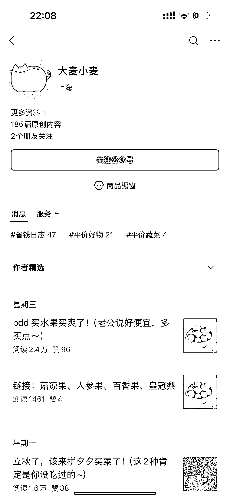
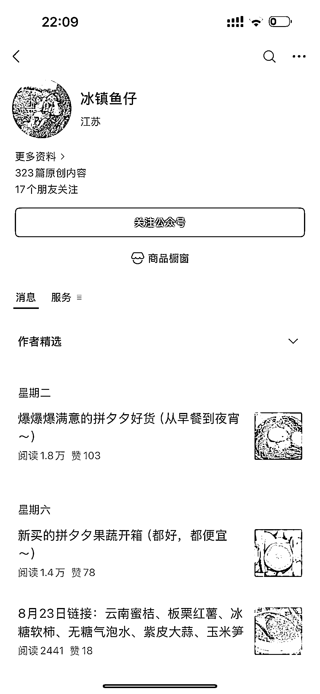
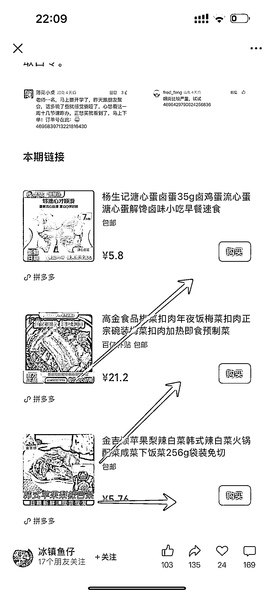
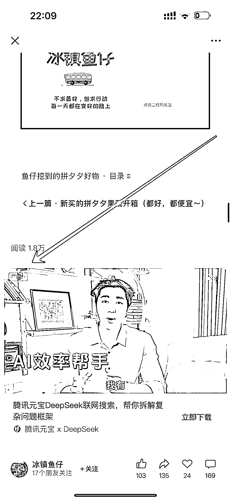
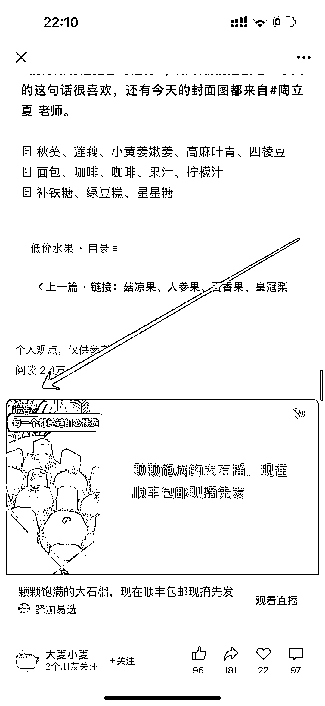
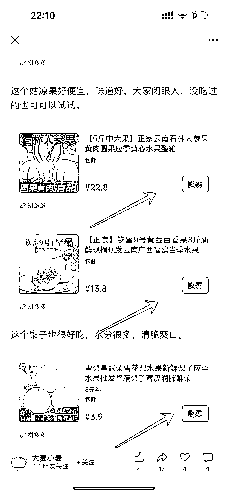

# 公众号垂直小号：拼多多打折信息号篇篇 1 万+阅读量

> 原文：[`www.yuque.com/for_lazy/wind/gi1yzw8qfdmfp6t3`](https://www.yuque.com/for_lazy/wind/gi1yzw8qfdmfp6t3)

作者： 吴泽承

日期：2025-08-29

点赞数：**27**

* * *

正文：

公众号垂直小号/拼多多商品打折信息 案例描述
账号@大麦小麦，冰镇鱼仔，内容形式均为，围绕拼多多，零食，蔬菜等商品打折信息，来发布文章，文章中带有购买链接，也就是说，这两个账号不仅仅赚流量主的收益，还赚分销佣金，并且这两个账号的阅读很高，几乎每篇都有几万的阅读，这个佣金加上流量主收益，还是非常可观的。
数据/截图/来源 冰镇鱼仔 大麦小麦 为什么是机会 1：制作简单，搜集整理拼多多平台的打折信息排版发布即可 2：可多账号进行，发布不同产品即可 3：转发率高
（13）[`mp.weixin.qq.com/s/IsQQyQE7jUZMqK7h393FQA`](https://mp.weixin.qq.com/s/IsQQyQE7jUZMqK7h393FQA)[`mp.weixin.qq.com/s/K6eByOF-
sJHXK9mqO9Ni0w`](https://mp.weixin.qq.com/s/K6eByOF-sJHXK9mqO9Ni0w)

* * *

评论区：

觉知 : 我也关注了，还在不断建群，她们有几十个微信群，我进的是第 30 群，不到一个月就 400 人了。群里会发她找到的性价比高的产品，有时效，销量达到优惠就没了

吴泽承 : 这个号我关注蛮长时间的[呲牙]

亦仁 : 感谢分享，已中标

* * *

公众号懒人搜索，[懒人专属群分享](https://lazybook.fun/#/blog/group)