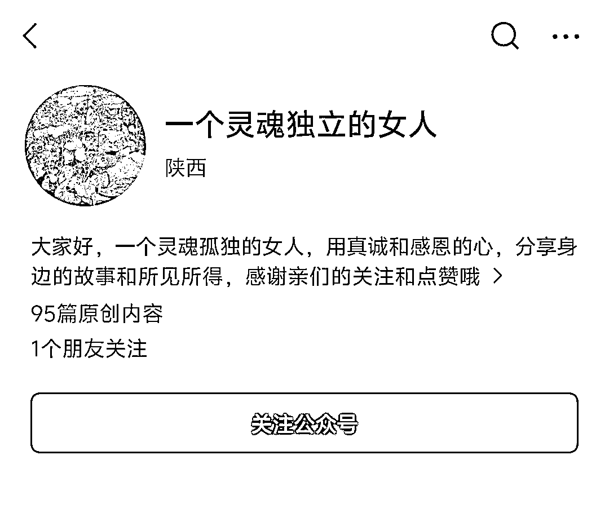
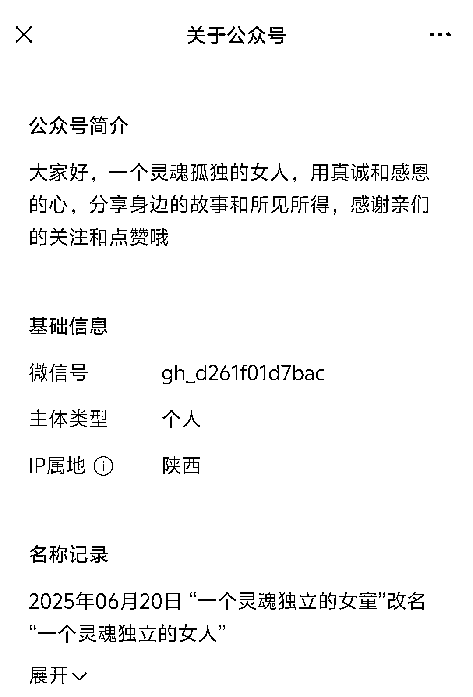

# 人生感悟公众号：涨粉 500，稳定更新就能跑起来

> 原文：[`www.yuque.com/for_lazy/wind/zou1zzh7gkxoqgaw`](https://www.yuque.com/for_lazy/wind/zou1zzh7gkxoqgaw)

作者： 嘻嘻姐

日期：2025-09-01

点赞数：**23**

* * *

正文：

又发现一个很神奇的账号，它让我看到了带父母辈做公众号的潜力以及小绿书起号的优势！ 赛道：人生感悟/故事连载 对标账号：一个灵魂独立的女人
账号 6 月 19 日注册，注册后先用发小绿书涨粉到 500，然后开始发身边故事连载。
因为要符合定位，不管排版，也不管错别字，就一直更新，一天一到两篇，用手机就能写，写完数据都非常稳定，粉丝粘性非常高。
变现方式：读者都是看着作者一步一步走出来的账号，如果后面她发副业相关的产品，大概率能轻松变现，因为这就叫『养成系』。
可复制性也很强，给家里爱写作的父母看看，说不定就起号成功了[呲牙]。

* * *

评论区：

亦仁 : 感谢分享，已中标

* * *

公众号懒人搜索，[懒人专属群分享](https://lazybook.fun/#/blog/group)