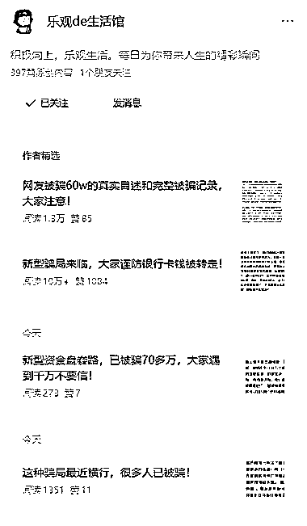
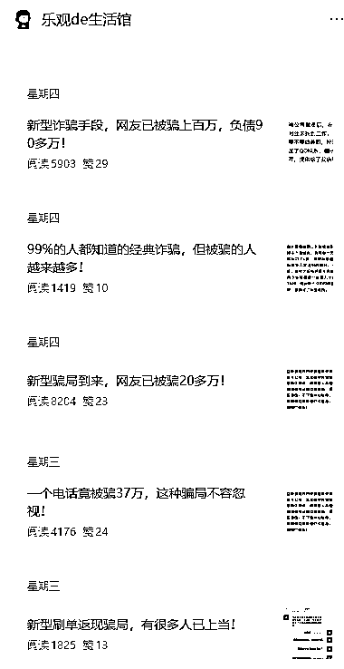
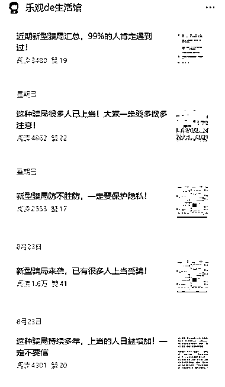

# 垂直小号机会：反诈内容一年持续推流，流量主收益稳定

> 原文：[`www.yuque.com/for_lazy/wind/rv00744ygbo2w73w`](https://www.yuque.com/for_lazy/wind/rv00744ygbo2w73w)

作者： 赵高明·多行

日期：2025-08-30

点赞数：**27**

* * *

正文：

垂直小号 【赛道方向】反诈
【案例描述】2024 年 6 月开始更新的号，一开始 2 个月写鸡汤和职场内容没流量，8 月开始更新反诈相关内容，第一篇系统就推流到 1w 阅读，后面持续更新反诈内容，至今一年左右，持续有推流。
【为什么是机会】
相对小众，没什么竞争，因为商业化方向不是很明确。我看了下作者的文章虽然标了原创，但不说 100%，但基本 99%都是从其他平台搬运过来的。变现来源，主要是流量主，每天发布 3 条，流量主收益应该也有小几百。这种账号胜在小众和长期可持续。
我们不一定要去做反诈，但可以思考类似【有一定社会价值、网络上分布着零散内容、只要会搜索素材发布】的内容方向，先从流量主开始赚起。

* * *

评论区：

晓俊同学 : 最后的思路总结得很棒！

亦仁 : 感谢分享，已中标

* * *

公众号懒人搜索，[懒人专属群分享](https://lazybook.fun/#/blog/group)