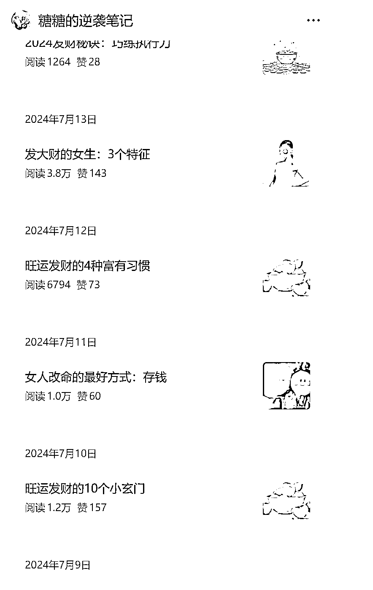

# 博主垂直小号负债上岸日更金钱干货，手机简单排版也能获得 6000 浏览量

> 原文：[`www.yuque.com/for_lazy/wind/ktyu2bbqmou1s1k5`](https://www.yuque.com/for_lazy/wind/ktyu2bbqmou1s1k5)

作者： 源源（急事语音）

日期：2025-09-03

点赞数：**22**

* * *

正文：

垂直小号/金钱、负债上岸等相关话题 案例账号：糖糖的逆袭笔记
这个博主，一边自己学习，一边努力负债上岸。她很早就开始写作了，而且频率基本上是日更，金钱相关的话题本来就自带流量，她在她的公众号有去分享，关于金钱的干货。比如“让你负债越来越少的 5 个黄金秘诀”等，早在 2024 年 6 月以前，她就开始更新了，目前更新了 281 篇，内容实在太多了，没翻到底。
不过可以看到她早期的内容阅读量都是很好的，而且我看了一下她早期的内容，甚至是现在的内容，都是没怎么花心思去排版的，对于普通人来说，简直没有太好上手。不用电脑精细排版，手机上的公众号助手，写了就可以发了，加粗加黑区别一些重点的词汇，大小标题就可以了。
大家可以看一下她这篇，甚至是一张图片都没有的，浏览量也是 6000 多。 变现方式：
主要是流量主收益。[`mp.weixin.qq.com/s/wMJhr27HHw-x384W-cjqyg`](https://mp.weixin.qq.com/s/wMJhr27HHw-x384W-cjqyg)

* * *

评论区：

亦仁 : 感谢分享，已中标

* * *

公众号懒人搜索，[懒人专属群分享](https://lazybook.fun/#/blog/group)