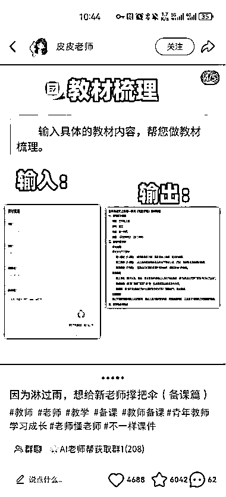
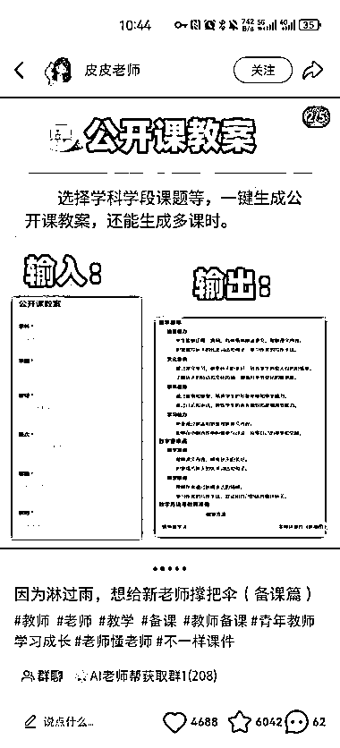
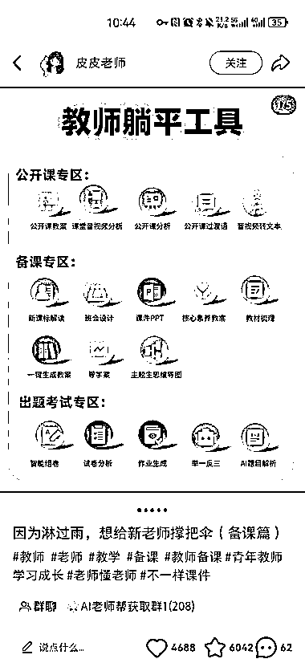

# 小红书教务赛道，热度很高，需求量很大

> 原文：[`www.yuque.com/for_lazy/wind/uunlh3a9giug1azs`](https://www.yuque.com/for_lazy/wind/uunlh3a9giug1azs)

作者： 凌州

日期：2025-08-30

点赞数：**23**

* * *

正文：

教务赛道细分垂类 这个网站涵盖教学过程中几乎所有场景，教案、备课、ppt、公开课、试卷生成等场景，评论区需求热度很高，还有些看到名字直接去用的

* * *

评论区：

亦仁 : 感谢分享，已中标

凌州 : 欧耶！谢谢老大！

能量满满的宗宗 : 弱弱的问一句这个中标的原因在吗[流泪][流泪][流泪]没看懂生财点 大佬能不能再说的详细一点

发达 : 产品：提效工具网站，教师快速备课的需求。

江大虾 : 有效信息

* * *

公众号懒人搜索，[懒人专属群分享](https://lazybook.fun/#/blog/group)