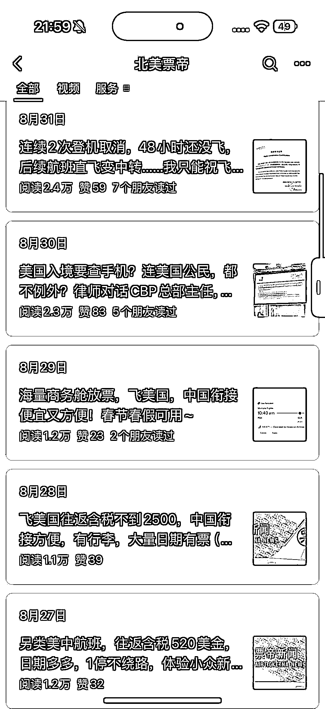

# 北美票帝垂直小号：北美留学生和旅客的机票雷达，靠实时情报实现多路径变现

> 原文：[`www.yuque.com/for_lazy/wind/ptc8a4ck8a3t5mrb`](https://www.yuque.com/for_lazy/wind/ptc8a4ck8a3t5mrb)

作者： 临渊垂钓

日期：2025-09-04

点赞数：**18**

* * *

正文：

赛道：北美机票 / 留学生出行情报 **北美票帝 = 北美留学生和旅客的机票雷达。**专注于航班动态、票价波动、入境政策、购票避坑，定位精准，内容实用。 •
即时性：航班票价和政策变化快，内容更新高频、直击痛点。 • 真案例：用户实录 + 官方截图，信息真实可靠。 •
强需求：留学生、探亲客群的刚需，票价、行李、政策全是高关注话题。 • 变现路径：机票代购/订票平台导流 + 会员群（实时票务情报）+
广告合作（航空/旅游相关）。
这是一个“机票情报局”式垂直小号，核心是快、准、用。抓住跨境出行刚需，凭借真实票价与政策播报积累高粘性用户，商业化可通过代购、广告和付费群延伸。

* * *

评论区：

亦仁 : 感谢分享，已中标

向日葵充电站 : 这个号做了很多年了啦，疫情的时候靠卖机票估计赚了不少。疫情的时候很多卖机票旅游的退出了市场他检查下来了，沉淀了很多用户的，很多年前就关注过了

* * *

公众号懒人搜索，[懒人专属群分享](https://lazybook.fun/#/blog/group)