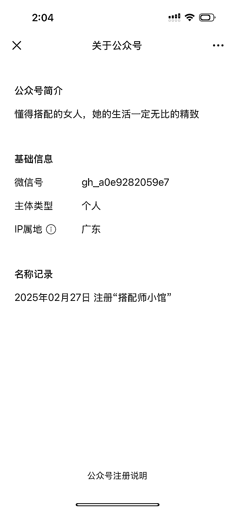
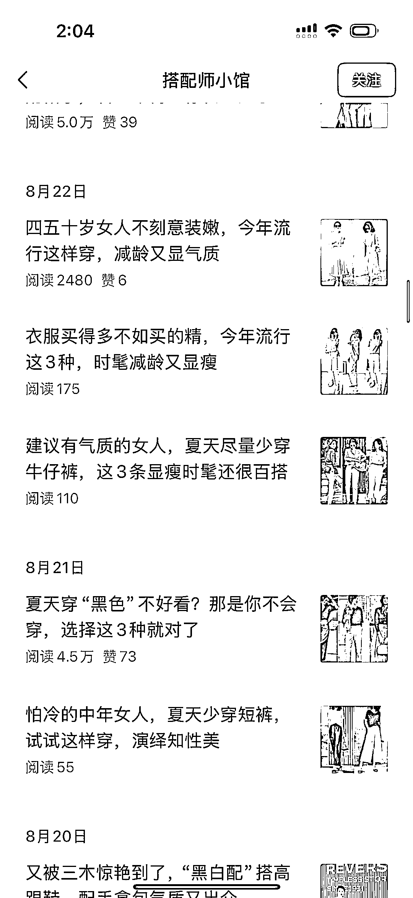
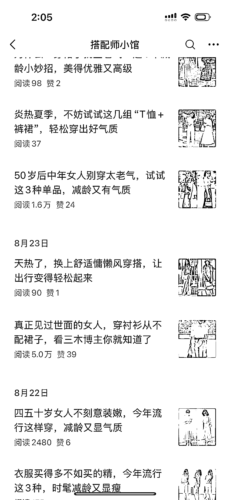
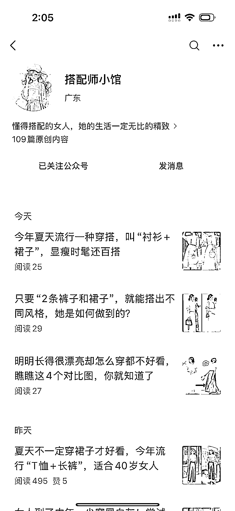
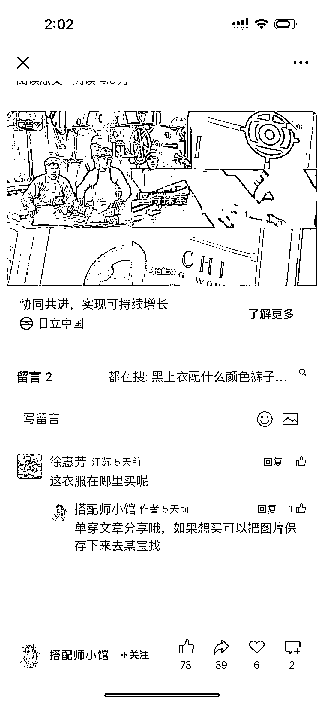

# 不到 1k 粉的公众号，靠中年女性穿搭内容做出 10w+爆文

> 原文：[`www.yuque.com/for_lazy/wind/lpqie0l636dfk5ch`](https://www.yuque.com/for_lazy/wind/lpqie0l636dfk5ch)

作者： 云帆

日期：2025-08-31

点赞数：**19**

* * *

正文：

赛道：微信公众号垂直小号。穿搭搭配 案例描述：搭配师小馆。粉丝数不到 1k，但是最近一个月有 7 篇阅读量 2w 以上，并且流量越来越大，最近一周一篇已经有
10w+的阅读量了。把小红书里面穿搭博主的内容，变成中年女性的穿搭就容易火。而且留言区有读者问在哪里买。 为什么是机会：
容易生产：小红书上有无数穿搭，都可以发到公众号，素材无限多。
人群有购买力：前期是流量主收益，后面可以挂购买链接。最后一张图留言区已经有人想要购买，只是公众号还没挂商品。
流量扶持：这个号注册才半年，流量越来越好。之前几千阅读就是比较好的了，一路走好，最近一周已经有 10w+阅读的了。

* * *

评论区：

亦仁 : 感谢分享，已中标

* * *

公众号懒人搜索，[懒人专属群分享](https://lazybook.fun/#/blog/group)