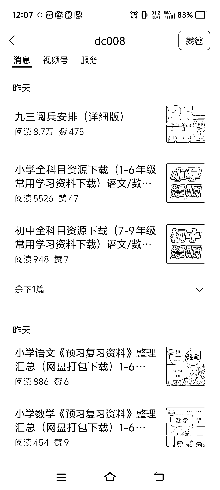
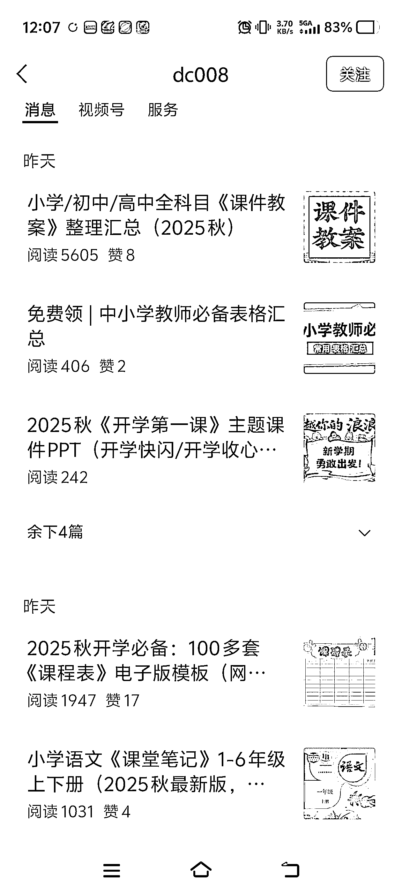
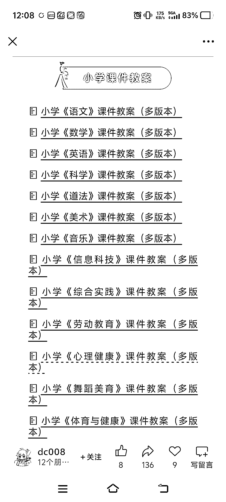

# 做小红书虚拟资料收益不可估量，可同步公众号一鱼多吃

> 原文：[`www.yuque.com/for_lazy/wind/vbgg3vwmkk3trrf8`](https://www.yuque.com/for_lazy/wind/vbgg3vwmkk3trrf8)

作者： 亦小亮

日期：2025-09-03

点赞数：**28**

* * *

正文：

虚拟资料 - 赛道方向：教育 - 案例描述：
账号 dc008 内容都是围绕教辅资料展开，提供下载渠道，所以资料来源均为官方的，领取都是免费的，账号流量基本上每天都在 5 位数，账号变现是文章底部广告的流量主及网盘拉新及转存，后者的收益不可估量，非常大，一般转存一个几毛钱，但是一天的流量按照 10%的话，就是 1000 个人啊领，差不多 400-700 之间。 - 为什么是机会？ 像这种虚拟资料，如果你做小红书虚拟资料都可以一起做，一鱼多吃。
不限于教辅资料，还可以提供更多虚拟资料赛道，不仅把流量主收益赚了，还可以直接在账号引流私域，做付费社群或者有偿提供虚拟资料，更小红书开店铺买虚拟资料一样。
主流思维是在小红书店铺上做，公众号平台很少人做，机会很大，所以有做小红书虚拟资料的，直接开一个公众号账号，完美承接。
每天更新不同的内容，也是一分钟就能搞定的事儿，完全没有日更的难度，都是固定开头+图片+链接。

* * *

评论区：

亦仁 : 感谢分享，已中标

* * *

公众号懒人搜索，[懒人专属群分享](https://lazybook.fun/#/blog/group)