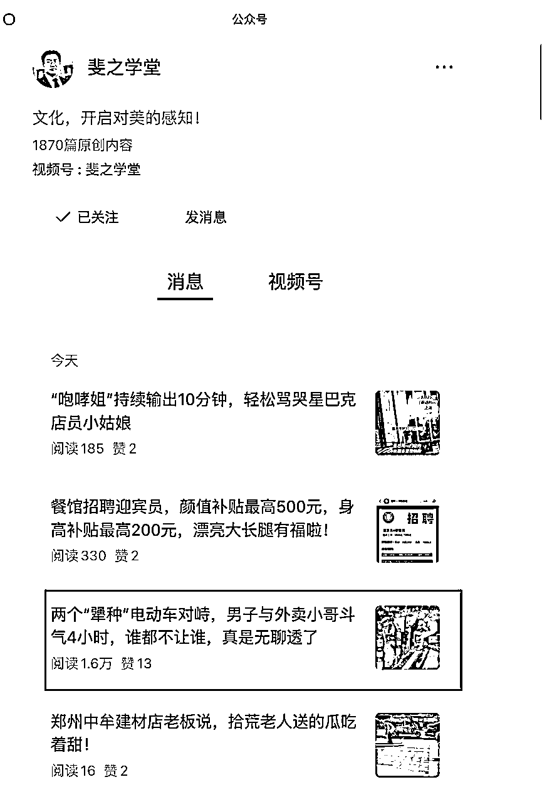
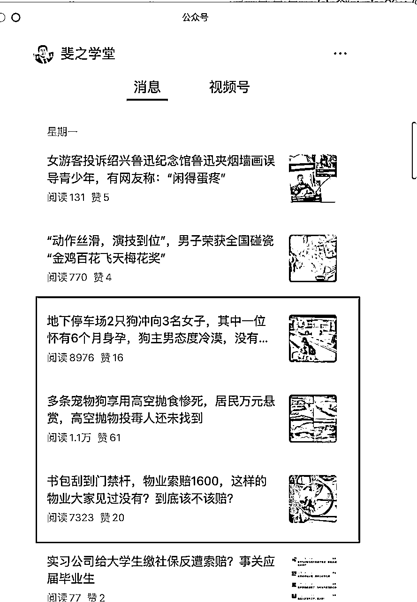
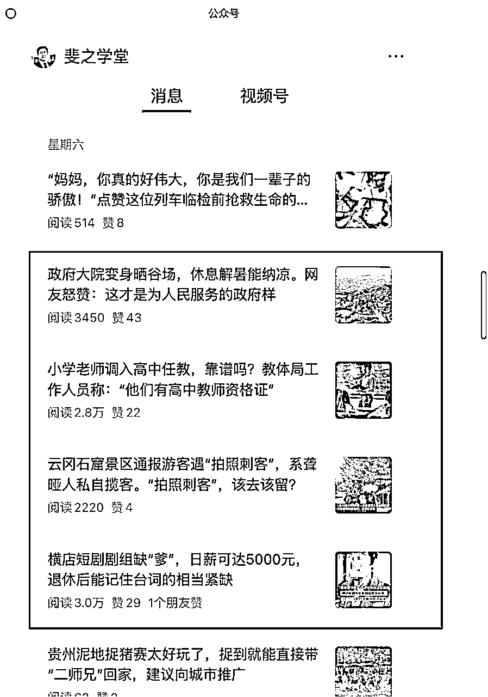
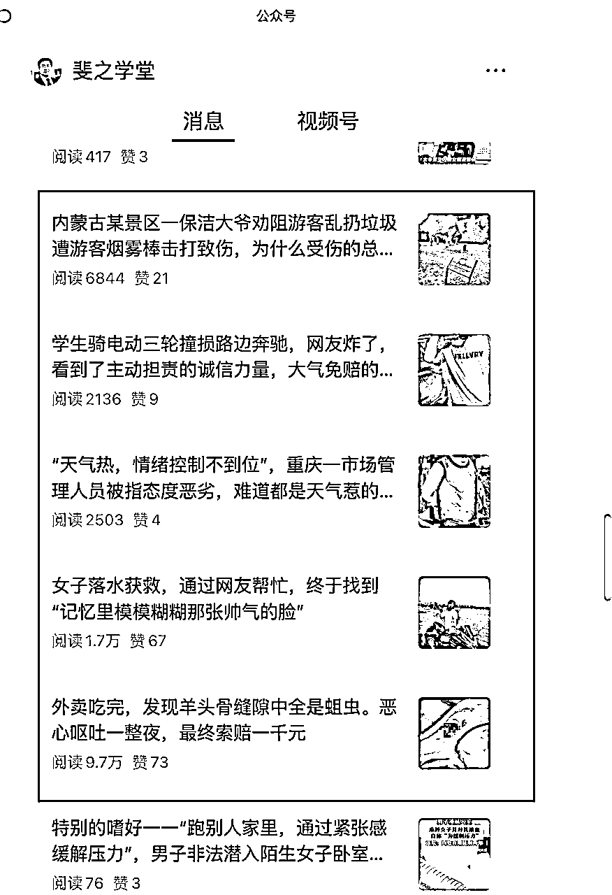

# 垂直小号的机会，头条不火，非头条却多次 10 万+

> 原文：[`www.yuque.com/for_lazy/wind/uaareoi15gl99ta7`](https://www.yuque.com/for_lazy/wind/uaareoi15gl99ta7)

作者： 曾丽@丽丽曾

日期：2025-08-29

点赞数：**15**

* * *

正文：

头条一直不火，但非头条出现多次 10 万+ ：在这个账号 中，我看到了大力出奇迹。 ：
它是一天推送一次、一次推送多篇文章，但经常出现头条流量很低、非头条流量是头条几十倍甚至数百倍的情况（10 万+阅读量），这说明多篇非头条被平台推荐。如果它和其他日更账号一样，一天只更新一篇，那它很难获得如此可观的阅读量。
： 在日更基础上，进行一日多更，是只要坚持就能做到的事，剩下的交给时间、平台。

* * *

评论区：

亦仁 : 感谢分享，已中标

* * *

公众号懒人搜索，[懒人专属群分享](https://lazybook.fun/#/blog/group)