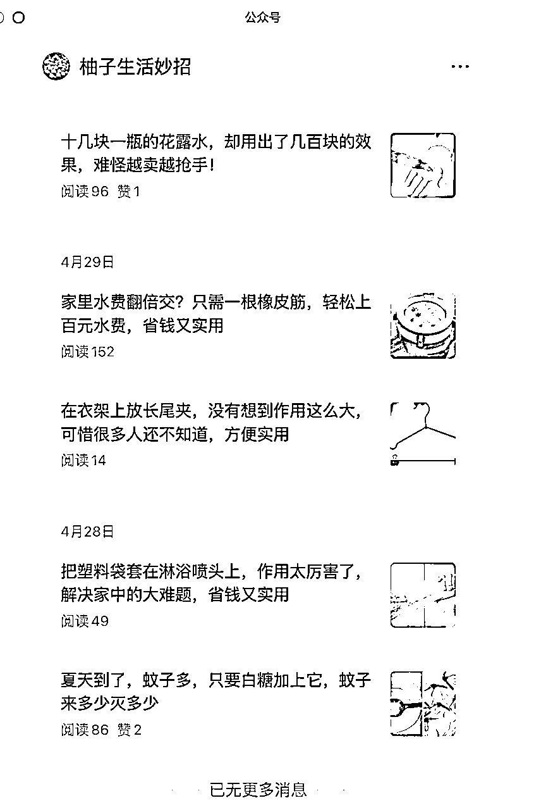
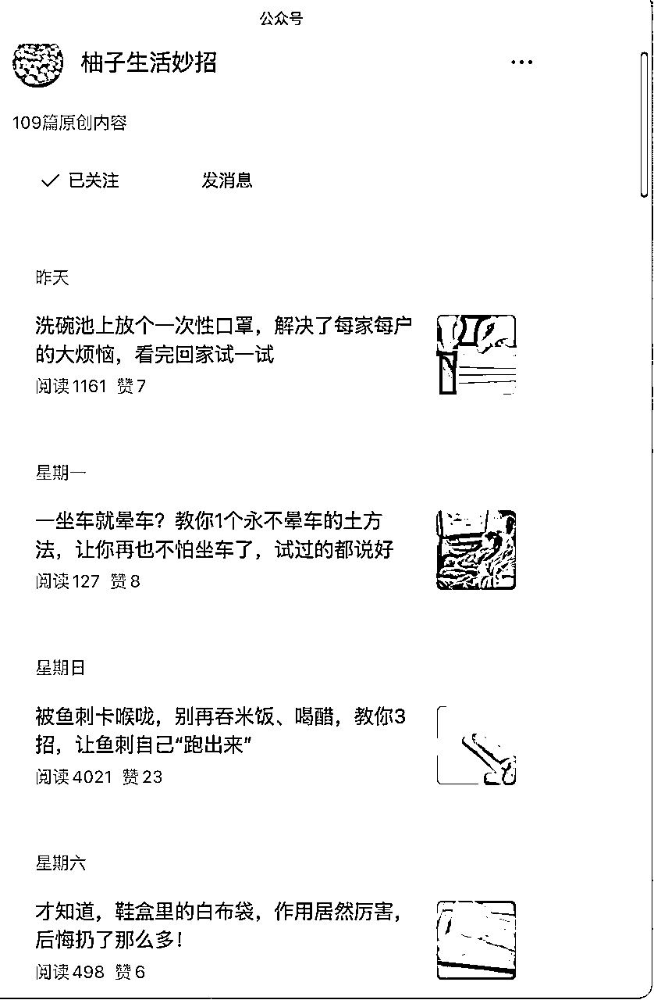
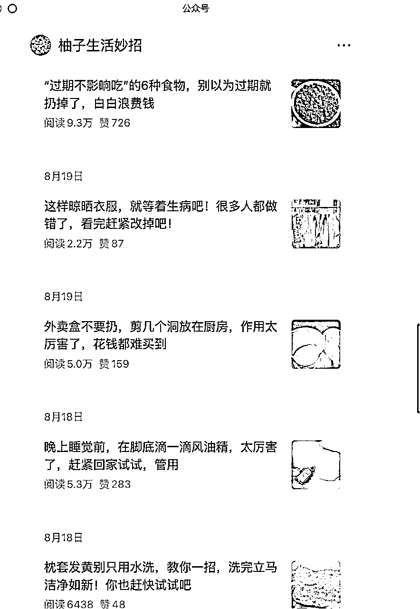

# 公众号生活常识号，4 个月更 109 篇，36 篇过万

> 原文：[`www.yuque.com/for_lazy/wind/rvsce2xaypqsgvyc`](https://www.yuque.com/for_lazy/wind/rvsce2xaypqsgvyc)

作者： 曾丽@丽丽曾

日期：2025-08-29

点赞数：**12**

* * *

正文：

公众号中小生活常识的大流量 ：账号 通过发布生活常识，吸引用户阅读。 ：
4 月 23 日起号，仅四个月时间，发布 109 篇原创内容，36 篇阅读量过万，占比 30%以上。 ： 各个平台火过的生活常识素材丰富，获取内容成本低；
昵称+垂直定位，可批量化打造个人品牌、增加用户对昵称的记忆、认可。 内容覆盖用户广泛，潜在目标阅读者多。

* * *

评论区：

亦仁 : 感谢分享，已中标

* * *

公众号懒人搜索，[懒人专属群分享](https://lazybook.fun/#/blog/group)