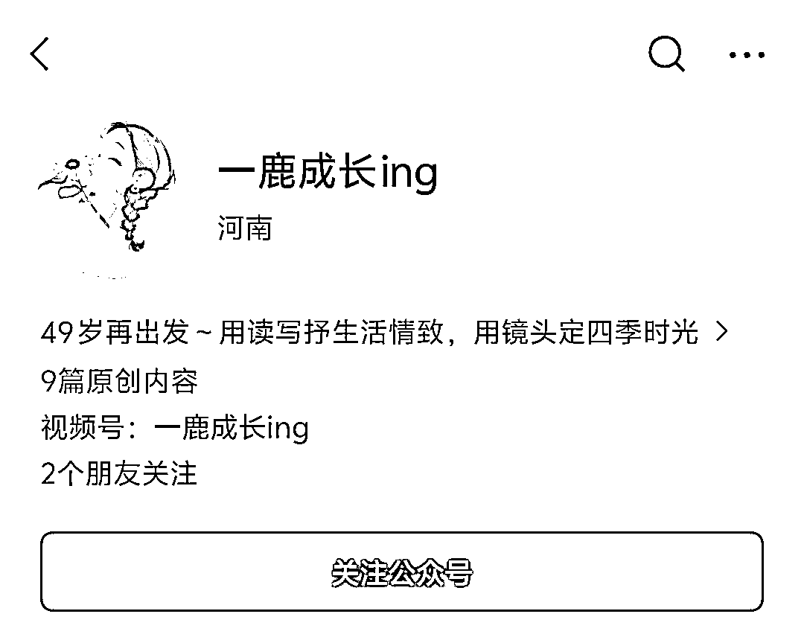
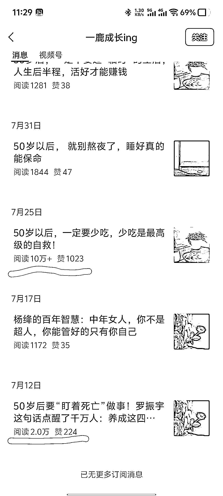
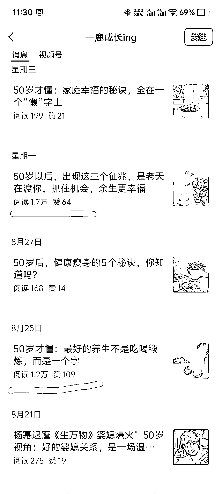
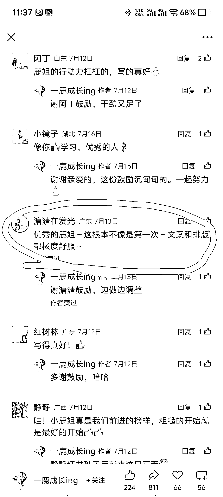

# 50 岁后生活=养生+健康+鸡汤，3 篇万阅，1 篇 10w+

> 原文：[`www.yuque.com/for_lazy/wind/zd4l7ufeb7mu3a3n`](https://www.yuque.com/for_lazy/wind/zd4l7ufeb7mu3a3n)

作者： 嘻嘻姐

日期：2025-09-05

点赞数：**24**

* * *

正文：

这个阿姨的号很牛，写 50 岁以后的生活，爆款不少！ 赛道：老年生活 对标账号：一鹿成长 ing
数据：老号重启，但是 7 月份才发第一篇文就爆了，9 篇原创，出了 3 篇万阅，还有 1 篇 10w+。 为什么是机会？
银发经济时代，以中老年的口吻写作，结合养生、健康、鸡汤等领域，都是创新的爆文好方向。 变现：1.流量主；2.私域变现（每篇文末尾都有微信二维码引流）。

* * *

评论区：

亦仁 : 感谢分享，已中标

* * *

公众号懒人搜索，[懒人专属群分享](https://lazybook.fun/#/blog/group)