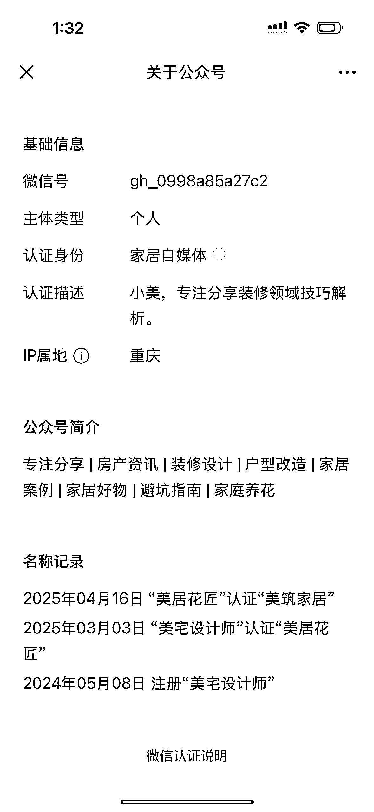
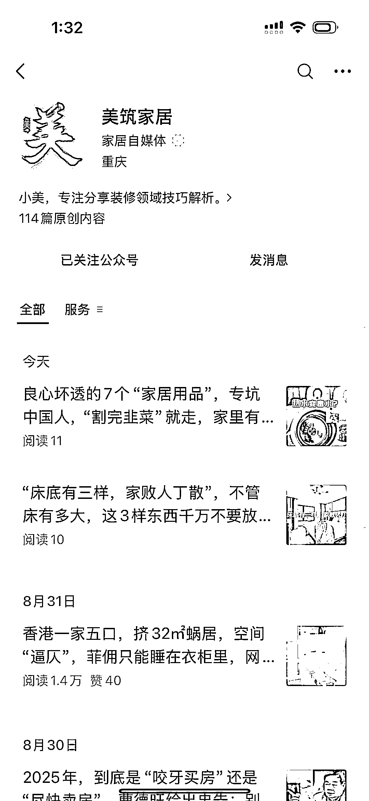
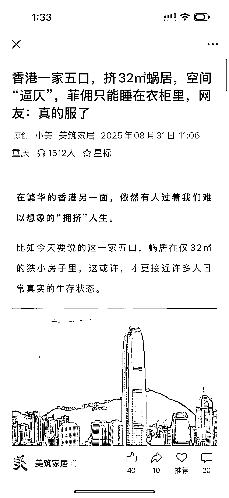
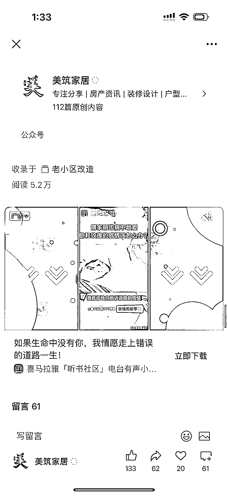
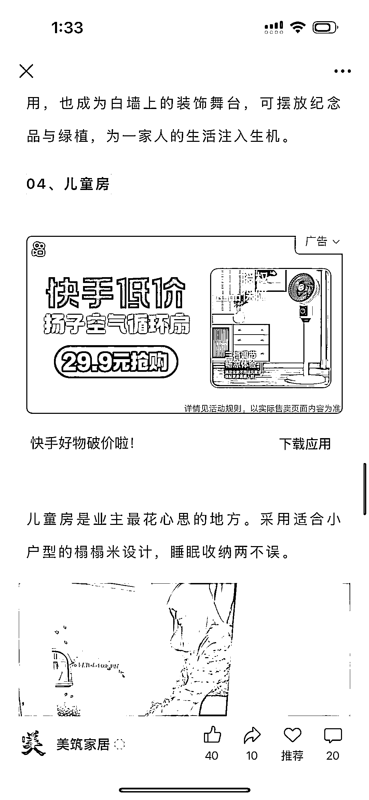

# 垂直小号装修赛道，20 篇+阅读量 2w

> 原文：[`www.yuque.com/for_lazy/wind/gvr5bmm2c45nnu7q`](https://www.yuque.com/for_lazy/wind/gvr5bmm2c45nnu7q)

作者： 云帆

日期：2025-09-01

点赞数：**11**

* * *

正文：

赛道：微信公众号。垂直小号。 案例：公众号 美筑家居。从今年 4 月份改成专注于家居住房情况展示和房间装修案例以后。已经 20+篇阅读量 2w 以上的。
机会：公众号的流量在不断地给到这种小而美的账号，在一个领域持续输出，流量会越来越多，越来越精准。
大家可以结合自己的专业能力，在公众号上进行输出，推荐流量也会越来越多。

* * *

评论区：

亦仁 : 感谢分享，已中标

* * *

公众号懒人搜索，[懒人专属群分享](https://lazybook.fun/#/blog/group)