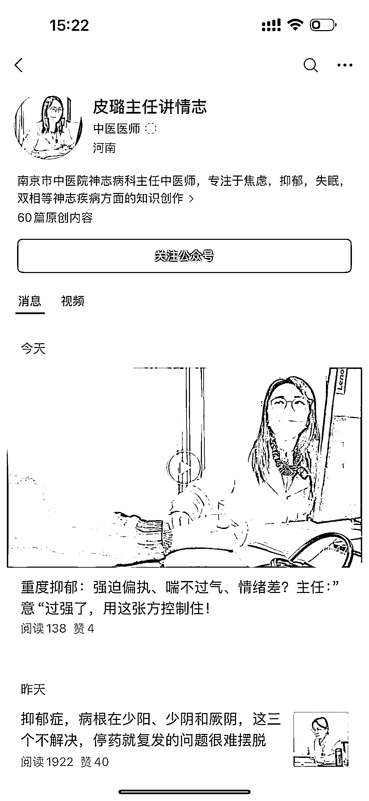
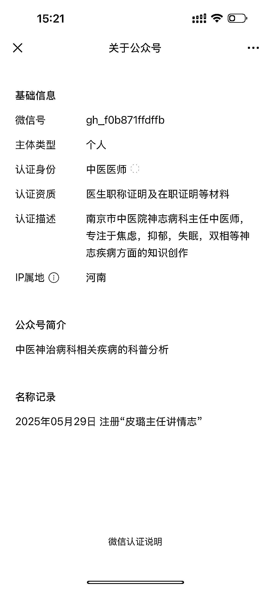
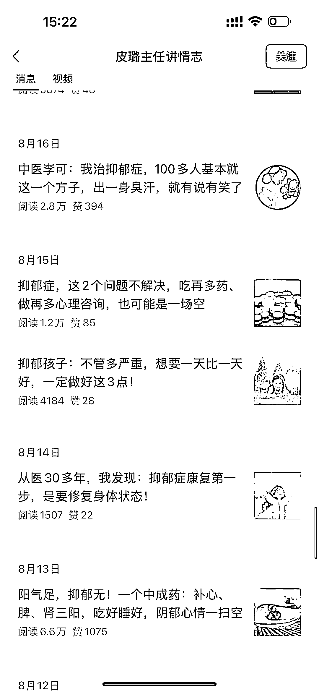
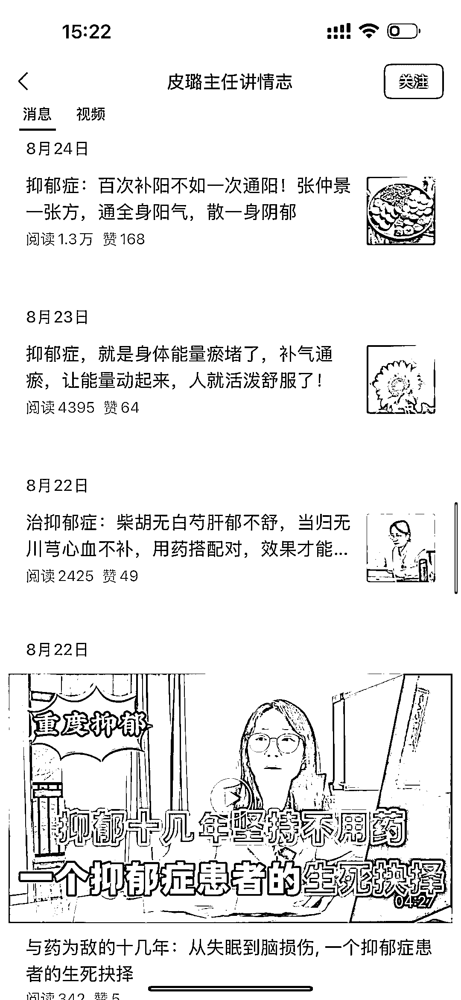
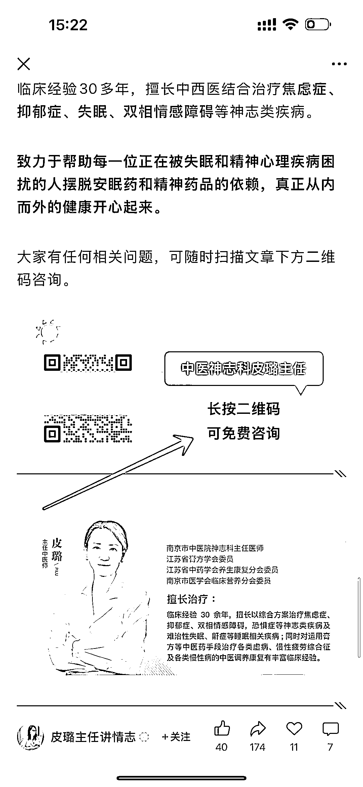

# 心理治疗垂直小号：980 的课程成交率 10%

> 原文：[`www.yuque.com/for_lazy/wind/cucgtht0gl0hk4g0`](https://www.yuque.com/for_lazy/wind/cucgtht0gl0hk4g0)

作者： 吴泽承

日期：2025-09-02

点赞数：**15**

* * *

正文：

公众号垂直小号/心理治疗：抑郁症 案例描述 账号@皮璐主任讲情志
这个账号 25 年 5 月 29 日注册的，认真身份是中医医师，自从注册开始，就一直发布“抑郁症”相关的话题。文章是从那里来的？当然是抄的，因为我之前在小红书做过“抑郁症”相关的账号，我看到她的文章很熟悉，明显就是洗稿的文章，抑郁症的话题在小红书的流量是非常高的，没想到在公众号的浏览也这么高，这是我之前没有想到的，这种账号的变现方式，就是引流到微信，卖咨询，卖课程，有资质的还会卖药，而且成交率很高。我之前卖 980 的课程，成交率有 10%左右。
补充一点，生财有很多职业的心理咨询师，他们也有获客的需求，也可以把引流来的粉丝对接给他们，谈好分成就行，如果是合作模式的话，没有行业经验也可以做，只做获客就好了，成交和交付，交给专业的人。
数据/截图/来源 为什么是机会 1：互联网三大黄金赛道，创业、情感、养生，这个就属于情感 2：抑郁的人群越来越多
（31）[`mp.weixin.qq.com/s/c2Ut7HQMA1IHSdz_5-QJbg`](https://mp.weixin.qq.com/s/c2Ut7HQMA1IHSdz_5-QJbg)

* * *

评论区：

张姝 : 但是门槛高吧，得有中医执业证

吴泽承 : 我之前也做过“抑郁”这个赛道，你可以和其他咨询师合作

张姝 : 对，可以合作

亦仁 : 感谢分享，已中标

* * *

公众号懒人搜索，[懒人专属群分享](https://lazybook.fun/#/blog/group)