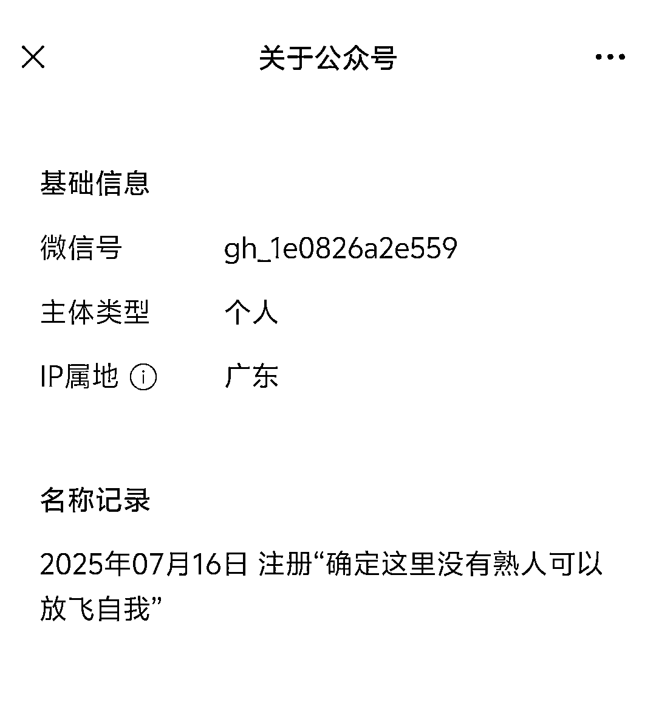
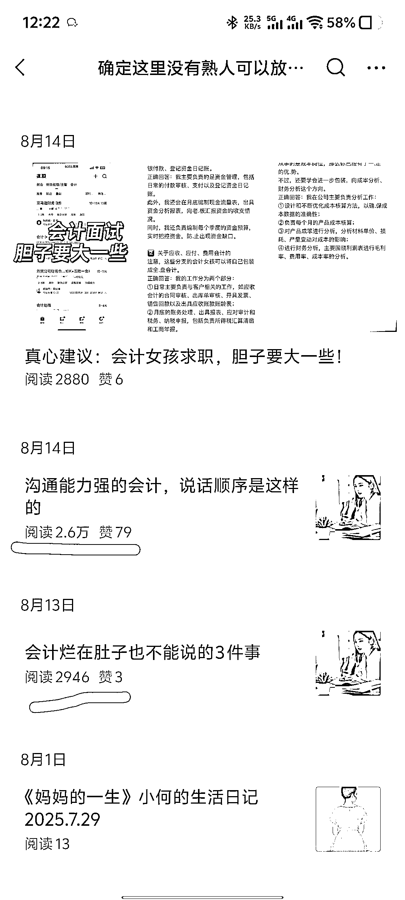
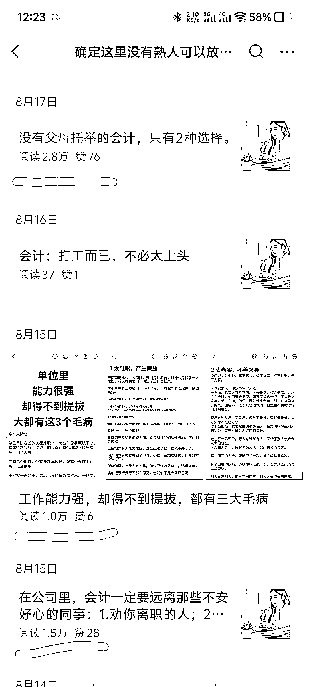
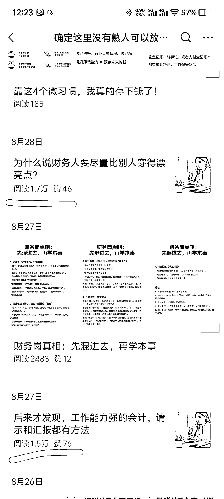

# 教育-职场赛道：素人账号转垂直，第二篇就过万

> 原文：[`www.yuque.com/for_lazy/wind/gqyb549iggrvg10n`](https://www.yuque.com/for_lazy/wind/gqyb549iggrvg10n)

作者： 嘻嘻姐

日期：2025-09-05

点赞数：**14**

* * *

正文：

结合考试热点，这个专业垂直小号半个月起号成功，航海人值得尝试！ 赛道：教育/职场➕专业 对标账号：确定这里没有熟人可以放飞自我
数据：7 月中旬注册，7 月 30 日开始发文，转教育领域 1 篇起号，第 2 篇过万，随后推文类数据都不错。 为什么是机会？
1.航海群中不少学员不懂如何结合自己的专业领域去做垂直小号，这个账号就很适合对标（素人、垂直、精细）；
2.中级会计师、中级经济师再过一两个月就考试了（我自己有经验），现在起号正是好时机，后续如果要转其他领域也 ok。
变现方式：网盘拉新、流量主、私域引流卖备考笔记或二手教材。

* * *

评论区：

亦仁 : 感谢分享，已中标

* * *

公众号懒人搜索，[懒人专属群分享](https://lazybook.fun/#/blog/group)