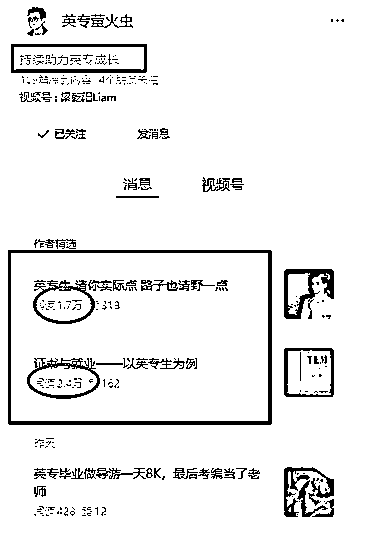
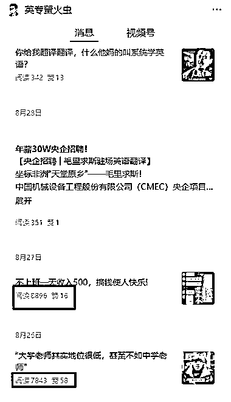
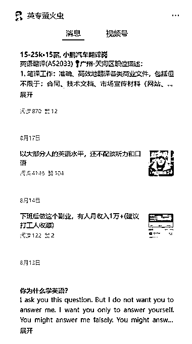
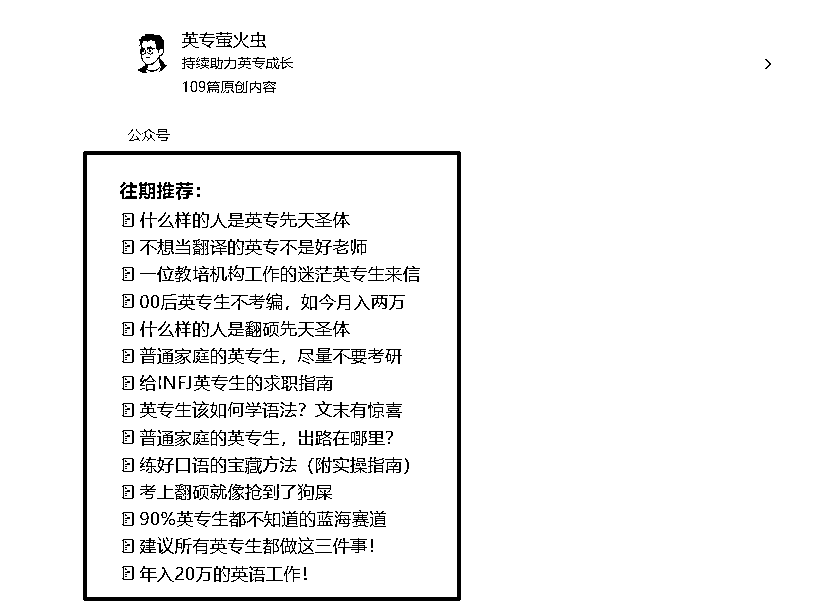
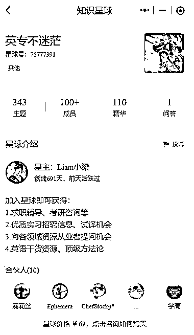

# 垂直小号：英语专业就业客单价 69，销量 100+

> 原文：[`www.yuque.com/for_lazy/wind/imd6n5wihfp73qys`](https://www.yuque.com/for_lazy/wind/imd6n5wihfp73qys)

作者： 赵高明·多行

日期：2025-09-05

点赞数：**12**

* * *

正文：

垂直小号【赛道方向】英语专业就业
【案例描述】:「英专萤火虫」，定位持续助力英语专业学生的成长，面向英语专业的大学生和毕业生，围绕他们的学习困惑、就业出路、职业规划、技能提升展开内容。
1.信息服务：招聘信息、岗位推荐 2.社群：客单价 69，目前 100+付费 3.流量主 【为什么是机会】
英语专业学生人群虽不算庞大，但规模稳定，且痛点高度集中：毕业出路迷茫、证书压力大、职业发展有限。这类人群对信息和指导的渴求度强，变现方向清晰。类似的，可以聚焦：法学生、会计专业、设计专业、医学生等。

* * *

评论区：

源源（急事语音） : 很新了

亦仁 : 感谢分享，已中标

* * *

公众号懒人搜索，[懒人专属群分享](https://lazybook.fun/#/blog/group)