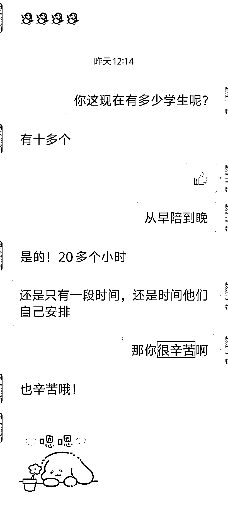
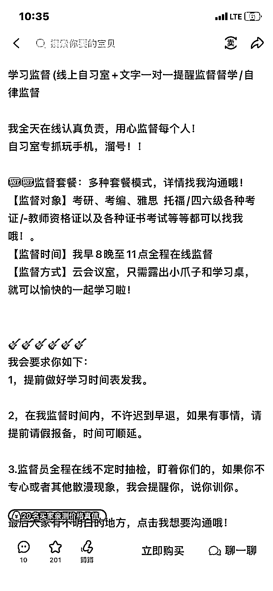
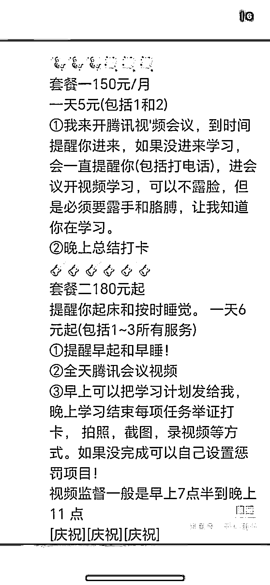

# 小红书、闲鱼用腾讯会议线上监督学习，单人付费 100+

> 原文：[`www.yuque.com/for_lazy/wind/qpyyg3snddfvk9pi`](https://www.yuque.com/for_lazy/wind/qpyyg3snddfvk9pi)

作者： 王小武

日期：2025-09-05

点赞数：**14**

* * *

正文：

陪伴学习，建立腾讯会议，线上监督人学习。
获客渠道可以从小红书、闲鱼上获客，一台手机开直播可以管理 5 到 15 人，单人每个月付费 100+，提醒起床，睡觉，喝水等可以作为额外服务
一台手机单月产出 1k+，矩阵来做也还不错

* * *

评论区：

亦仁 : 感谢分享，已中标

* * *

公众号懒人搜索，[懒人专属群分享](https://lazybook.fun/#/blog/group)